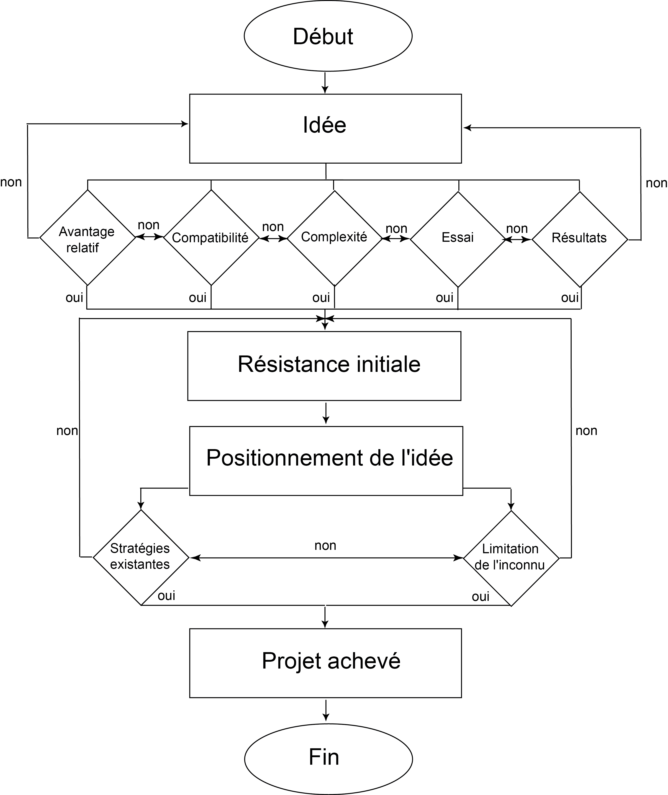

# Présentation de la géomatique et du semestre

- Présentation du contenu du cours (30 min)
- T.D. Mise en route 1 (30min)
	- Installation de l'environnement de travail (si besoin)
	- Constitution des groupes
	- Réflexion sur le projet à mener et à rendre

## Fiches métier

- [Fiche de l'Office national d'information sur les enseignements et les professions](https://www.onisep.fr/ressources/univers-metier/metiers/geomaticien-geomaticienne) (O.N.I.S.E.P.)
- [Fiche du Centre d'Information et de Documentation Jeunesse](https://www.cidj.com/s-orienter/metiers/geomaticien-geomaticienne) (C.I.D.J.)
- [Fiche de E.S.R.I.](https://www.esrifrance.fr/fr-fr/produits/en-savoir-plus/sig/en-detail/metiers)
- [Fiche de concepteurs d'avenir](https://www.concepteursdavenirs.fr/actualites/decouvrez-les-metiers-de-la-geomatique)

## Ressources

- [Abréviations](../Ressources/Abreviations.md)
- [Cours de Julie Djidji](https://juliedjidji.github.io/memocarto/)
- [E.S.R.I. France : fiches](https://education.esrifrance.fr/)
- [Sciences humaines](https://www.youtube.com/@profscienceshumaines/videos)
- [E.S.R.I. - Belgique](https://www.youtube.com/@EsriBeLux/videos)
- [Formations S.I.G.](https://www.youtube.com/@formationsigminesstatistiq6602/videos)

## Installation de son environnement de travail

- Ouverture d'un compte `ArcGIS On line` : [https://fl-su.maps.arcgis.com/home/index.html](https://fl-su.maps.arcgis.com/home/index.html)
- Téléchargement et installation de `Q-GIS` : [https://qgis.org/download/](https://qgis.org/download/)
- Téléchargement et installation de `Mozilla Developer` : [https://www.mozilla.org/fr/firefox/developer/](https://www.mozilla.org/fr/firefox/developer/)
- Téléchargement et installation d'un environnement de développement
    - Recommandation pour les débutants : [`NotePad++`](https://notepad-plus-plus.org/downloads/)
    - Recommandation pour les autres : [`Visual Studio Code`](https://code.visualstudio.com/download/)

## *Story Map*

- [Comment créer un *story map*](https://cartovista.com/fr/debuter-avec-les-story-maps-comment-creer-une-story-map/)
- [Exemple de *story map*](https://storymaps.arcgis.com/stories/)
- [Gestion de projet](https://www.youtube.com/watch?v=pB-JUTXGJSg&list=PLcOmJ-JvAV1f4OV0UiCKgdZohpf1xD7rf)

### Objectifs d'un *Story Map*

- Créer une histoire visuelle convaincante à partir de données géographiques
- Créer des expériences interactives et éducatives pour les utilisateurs

### Définition d'un *Story Map*

Un *story map* présente des informations géographiques étape par étape. Il combine des cartes avec des contenus multimédias.

Un *story map* est utilisé dans les projets :
- d'urbanisme ;
- de gestion des risques socio-économiques ;
- de tourisme ;
- d'infrastructures et de sécurité routière ;
- de projet de développement en cours ;
- concernant la gestion de l'environnement.

Les objectifs de la réalisation d'un *story map* pour une organisation sont triples.
1. **Sensibiliser**. Le *story map* permet de définir des priorités stratégiques.
- **Convaincre**. Le *story map* permet de développer des arguments.
- **Encourager à agir**. Le *story map* permet de conseiller non seulement sur les actions, mais également sur les impacts de ces actions.

Pour réaliser un bon *story map*, quatre éléments sont à prendre en considération.
1. **Le contexte**. Pour qui réalise-t-on le *story map* ? Quel message veut-on faire passer ? Il faut adapter le contenu géographique au public. Ici, le contexte est une analyse scientifique de type universitaire.
- **L'efficacité**. Il s'agit d'avoir des informations de qualité. Il faut transmettre les informations les plus simples possibles.
- **L'interaction**. Elle se matérialise avec des interactions multimédias (infobulles, graphiques, *etc*.). Il faut démontrer la significativité des informations.
- **Le *design***. Il faut une conception visuelle agréable.

> [!NOTE]
> La beauté étant très relative, il faut s'inspirer des *design* les plus utilisés au moment de la réalisation du projet.

**Exemple :** [https://storymaps.arcgis.com/stories/](https://storymaps.arcgis.com/stories/)

## Gestion de projet

La gestion de projet est une démarche générique. Il existe cinq processus clés communs à tout projet :
1. le démarrage : la revue des besoins utilisateur ou client ;
2. l'analyse, la conception et la planification ;
3. l'exécution, la construction de l'application ;
4. le suivi de l'avancée du projet avec des tests ;
5. la fin de projet.

> [!NOTE]
> Plus on avance dans les étapes d'un projet, plus l'investissement financier est important. Il vaut mieux une longue phase de conception, d'analyse que d'exécution du projet. La phase de conception coûte moins chère que celle de l'exécution du projet. Il faut impérativement lancer l'exécution uniquement si on connaît tous les aspects dans le moindre détail du projet à réaliser.

### Connaître les types de projet

Un **projet** est :
- un travail limité avec un début et une fin ;
- un travail avec des contraintes définies de coûts et de délais ;
- un travail visant à atteindre des résultats assignés.

Un projet entre généralement dans le cadre d'un **programme** qui regroupe tous les projets liés et alignés sur un même thème, objectif, *etc*. Un projet peut avoir des **sous-projets**.

> [!NOTE]
> L'organisation fixera le vocabulaire à vous de vous adapter.

Tout projet a un **cycle de vie**. Il est rigoureusement planifié en **lots de travail**. Chaque lot est divisé en **tâches**. L'ensemble doit être résumé dans un **organigramme des tâches**.

Dans une organisation, il existe quatre types de projets :
- le projet rapide, qui est minimaliste ;
- le projet simple, qui est le projet normal ;
- le projet « à tout prix », dont le coût importe peu ;
- le projet « longue durée ».

### Faire accepter un projet

Un projet peut être vue comme une idée. Selon le test d'Everett Rodgers (1931-2004), une idée est **acceptable** si :
- elle apporte un **avantage relatif**, c'est-à-dire que l'idée doit être perçue comme meilleure par rapport à ce qui existe déjà ;
- elle est **compatible**, c'est-à-dire logique par rapport au *statu quo* existant ;
- elle est **simple** à comprendre ;
- elle implique un **degré d'efforts ou d'investissements** à consentir rien que pour l'essayer ;
- elle doit avoir un avantage relatif **plus facile à mesurer** que les autres.

### Rédiger un dossier de conception

À partir de l'ensemble de ces éléments, vous devrez écrire un \textbf{dossier de conception} synthétisant votre proposition, votre projet. Elle doit être écrire en collaboration en web designer, un expert en sécurité et un architecte logiciel.

La proposition est un document très court de quelques pages, entre 1 et 5. Il contient les objectifs et les bénéfices attendus pour l'organisation. Il doit être cohérent par rapport à la stratégie de l'entreprise. Dans le cas d'une application, il faut développer une maquette complète à présenter au client ou au projet de projet.

Le dossier de conception doit également contenir une planification de l'ensemble du projet de géomatique.

> [!NOTE]
> Il s'agit d'une trame générale. Chaque entreprise possède sa propre culture.

### Planifier les tâches de conception et de développement

Il faut planifier le développement du projet et mettre en place les outils collaboratifs.

L'exécution du projet informatique contient quatre phases à planifier :
- l'exécution ;
- le développement ;
- les tests fonctionnels et techniques ;
- la mise en production.

#### Planifier les tâches en début de projet

Il existe de nombreuses techniques pour planifier un projet. L'une des plus utilisées est le **diagramme de Henry Laurence Gantt** (1861-1919), inventé en 1910.

Les objectifs d'un diagramme de Gantt sont :
- visualiser dans le temps les tâches composant un projet ;
- représenter l'avancement du projet.

Le diagramme permet de :
- déterminer les dates de réalisation d'un projet ;
- identifier les marges existantes sur certaines tâches ;
- visualiser d'un seul coup d'œil le retard ou l'avancement des travaux.

Sur le diagramme, en abscisse, on place le temps correspondant à la durée du projet. Il est exprimé en mois, semaines ou jours. En ordonnée, on liste les tâches une à une. Dans le diagramme, un rectangle symbolise la durée de la tâche dans le temps.

Il existe deux options au niveau des dates de début :
- soit on choisit la date au plus tôt. Dit autrement, il est impossible de commencer la tâche avant. Si tel était le cas, on gagnerait un peu de temps sur le planning, et ce sera positif ;
- soit on choisit la date au plus tard. Dit autrement, on retient la date la plus défavorable possible sans mettre en péril le planning de réalisation du projet.

Il existe un planning général du projet et un planning personnalisé, ce qui permet de pouvoir gérer plusieurs projets en même temps.

La pratique du diagramme de Gantt a permis de dégager un ordre de priorités dans les tâches planifiées lorsqu'elle rentre en conflit :
1. faire les réalisations dont la date de livraison est proche  ;
2. faire la première commande arrivée ;
3. faire les réalisations dont la durée totale est la plus courte ;
4. faire les réalisations qui utilisent au moins une ressource critique ;
5. faire les réalisations qui disposent du minimum de marge globale.

La plupart du temps, les outils de développement contiennent des logiciels pour réaliser un diagramme de Gantt, mais, pour entraîner, je vous conseille le logiciel [GanttProjet](https://www.ganttproject.biz/download).

#### Organiser le suivi des tâches

Le suivi du processus a lieu en parallèle de la phase d'exécution. Il se poursuit \textbf{tout au long du cycle de vie du projet}.

Ce suivi est opéré par les **indicateurs clés de performance** (I.C.P.)  (En anglais : *Key Performance Indicators* (K.P.I.)) basés sur :
1. le temps passé ;
2. les coûts ;
3. la qualité ;
4. l'efficacité ;
5. l'avancement.

Il faut men œuvre le suivi des tâches **tout au long** du projet suivant la **méthode de gestion choisie** :
- soit séquentielle (méthode en silos) ;
- soit itérative (méthode agile).

Le suivi consiste principalement **à organiser des réunions de travail en français ou en anglais**.

Il faut prévoir des procédures pour gérer les retards. Qui faut-il alerter ? le chef de projet ? le client ?

#### Rédiger des rapports d'activité, de comptes rendus de réunion, *etc*.

La rédaction doit être réalisée soit en français, soit en anglais. Cela doit être défini par le cahier des charges. La plupart des rapports d'activité sont courts (de quelques lignes à 2 pages). Les comptes rendus de réunion sont nécessaires afin de garder une trace écrite de ce qui a été dit. Cela permet de corriger les orientations du projet si nécessaire.

### Définir les livrables

La rédaction des livrables doit être réalisée soit en français, soit en anglais. Il peut s'agir de rapports, de notices, d'utilisation, *etc*.

Les livrables en géomatique sont très variés. 

### Clore le projet

La clôture d'un projet se prépare dès sa conception.

La clôture du projet peut renvoyer à deux réalités.
- Le projet a été **arrêté**, car il n'était pas viable.
- Le projet a été **achevé**.

Le chef de projet organise une **réunion post-projet** avec l'équipe pour évaluer les succès et les échecs du projet. Le bon chef de projet remercie son équipe.
- Objectif : \textbf{améliorer et rationaliser le flux de travail pour un prochain projet}.
- Ordre du jour :
	- les livrables
	- les problèmes non résolus
	- les bénéfices et le *business plan*
	-la revue post-implémentation
	- les remerciements
	- la clôture formelle
	- les leçons dégagées

Il faut réaliser :
- la mise en place d'équipes du support logiciel ;
- la formation des utilisateurs finaux ;
- le calcul du budget final du projet ;
- la préparation d'un rapport final de projet.

Le **rapport de clôture** contient :
- les objectifs ;
- la déclaration de clôture ;
- la mesure des bénéfices ;
- les problèmes non résolus et les livrables inachevés ;
- l'efficacité du projet ;
- les leçons dégagées ;
- les remerciements.

Dans le cadre de votre évalutation, vous devez me rendre un rapport complet de clôture.

## Notation

- Un oral de 10 min avec un diaporama ou un *story map* `ArcGIS Online`
- Un écrit faisant le rapport d'activité de votre projet
