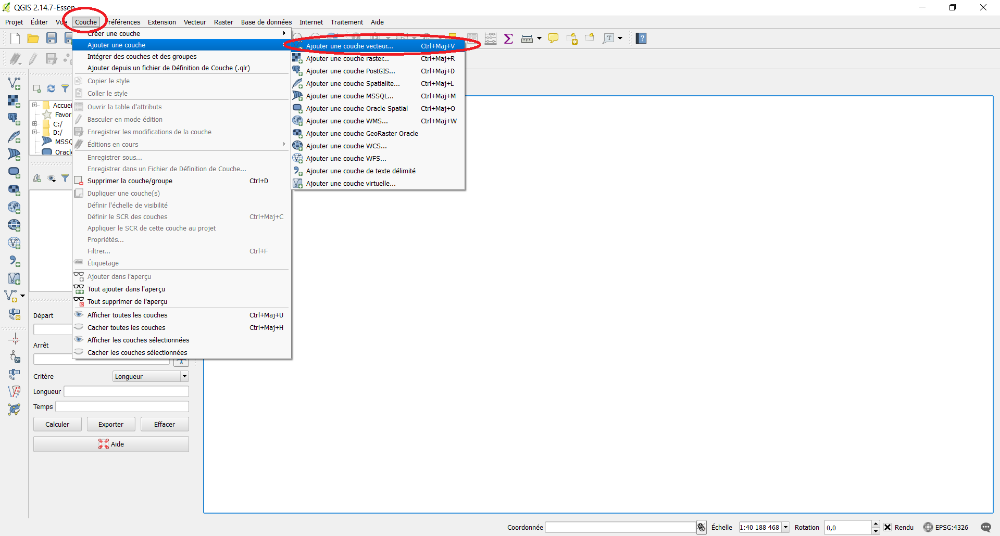
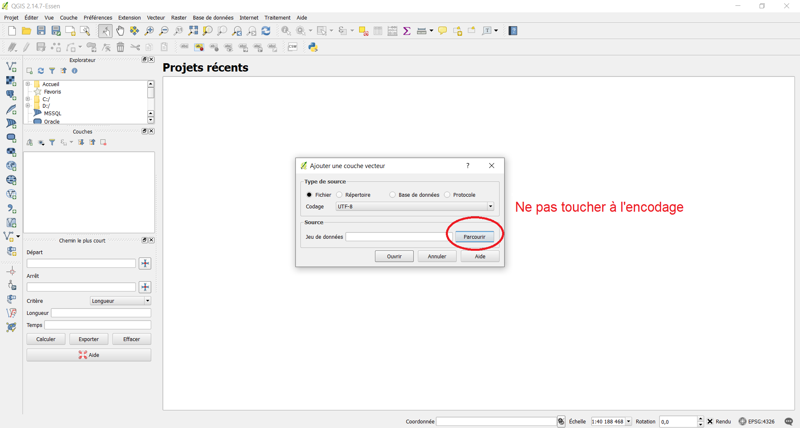
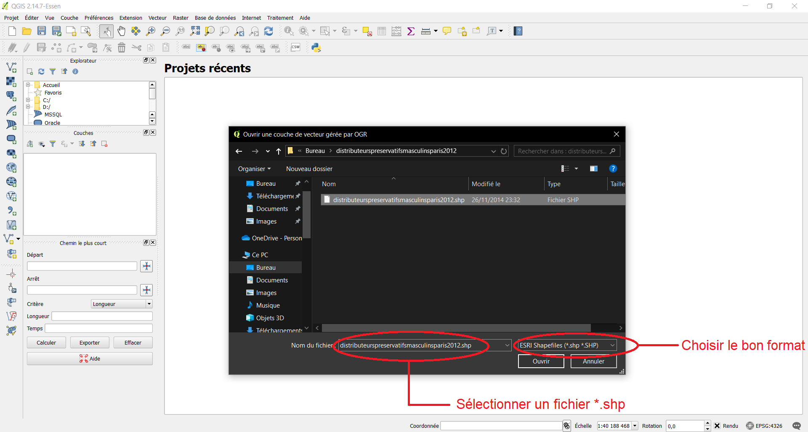
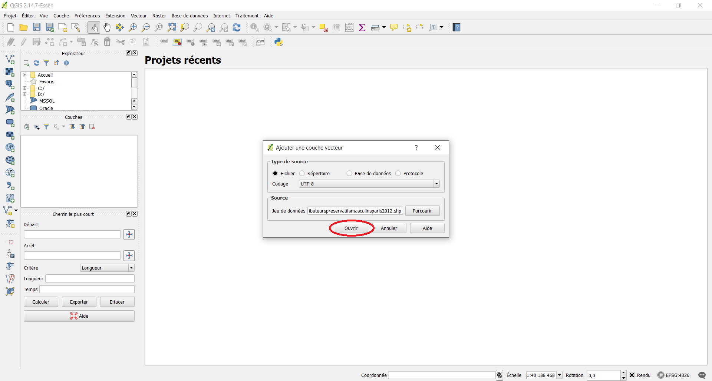
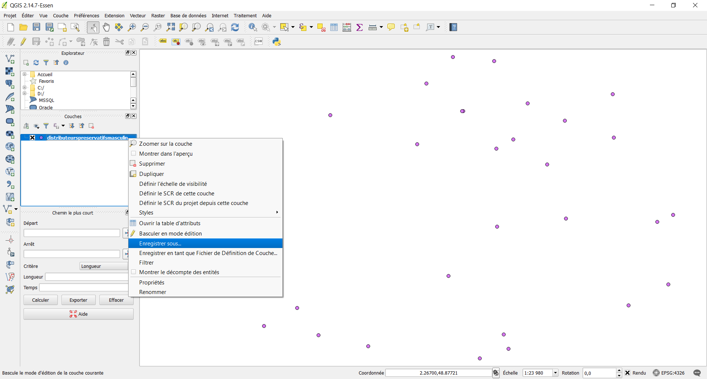
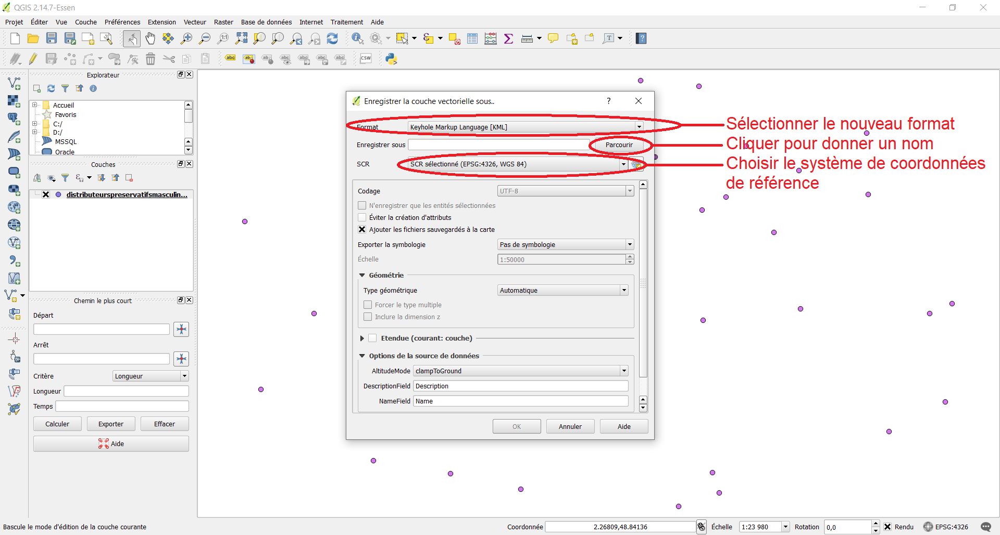
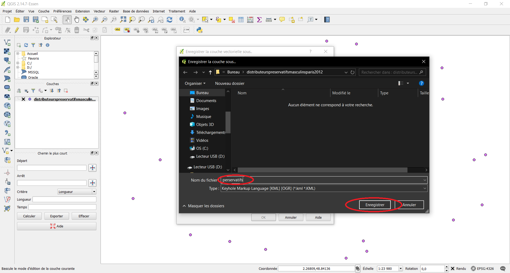
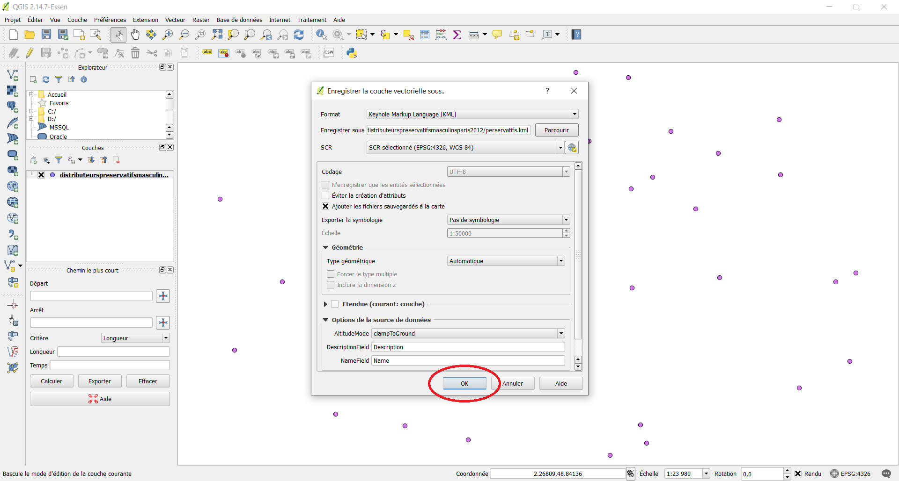

# Les systèmes d'information géographique

- C.M. Les systèmes d'information géographique (1h00)

- T.D. Mise en route 2 (1h00)

	- Prise en main des logiciels

		- `ArcGIS online`
	
		- `QuantumGIS` (Q-GIS)
	
		- `Notepad++`
	
		- `Mozilla Developer`

	- Choix des groupes
	
	- Choix du projet *story map*

## ArcGIS On line

- [`ArcGIS online` - Introduction](https://www.youtube.com/watch?v=bfLsGo37GlE)

- [`ArcGIS Online` - Premiers pas](https://www.youtube.com/watch?v=DrUzt7eRL0I)

- [`ArcGIS Online` - Premiers pas](https://www.youtube.com/watch?v=FPjv8hQjObI)

- [`ArcGIS Online` et les coordonnées géographiques](https://www.youtube.com/watch?v=-xtFy2fqZhk)

- [`ArcGIS Online` - Rejoindre un groupe de couches spatiales](https://www.youtube.com/watch?v=YjrWEKpimIM)

- [`ArcGIS Online` - Créer une enquête à l'aide de `Survey123`](https://www.youtube.com/watch?v=Y-V9Q8YjZ_8)

- [`ArcGIS Online` - Module 2 - Trouver des cartes](https://www.youtube.com/watch?v=vDhf0Yo6ias)

- [`ArcGIS Online` - Module 3 - Créer une bibliothèque de ressources à destination des élèves](https://www.youtube.com/watch?v=EYU3cQFOb-g)

- [`ArcGIS Online` - Module 4 - Construire un atlas numérique](https://www.youtube.com/watch?v=yMaq0LI8GVc)

- [Webinaire `ArcGIS Online` - Module 5 - Utiliser des atlas numériques en classe de géographie](https://www.youtube.com/watch?v=7MnjytDSCMI)

- [`ArcGIS Online` - Construire une carte collaborative utilisable sur smartphone](https://www.youtube.com/watch?v=yUJy6MWgz14)
- [Adapter les fonds de carte avec `ArcGIS Online`](https://www.youtube.com/watch?v=SFSwpZkhtNY)

- [Utiliser un atlas numerique en geographie](https://www.youtube.com/watch?v=WXxyvB_vTyM)

- [Construire un atlas numérique avec l'application instantanée `ArcGIS Online`](https://www.youtube.com/watch?v=HNJoBKCSnro)

- [Réaliser un *dashboard* - Une application `ArcGIS Online`](https://www.youtube.com/watch?v=wzKpI5ZFhJ8)

- [*Story Maps* - Insérer des observations du terrain](https://www.youtube.com/watch?v=vMUx05rtfk4)

## Autres ressources

- [Cours de géomatique 1](https://www.youtube.com/@profscienceshumaines/videos)

- [Cours de géomatique 2](https://www.youtube.com/@EsriBeLux/videos)

- [Cours de géomatique 3](https://www.youtube.com/@formationsigminesstatistiq6602/videos)

## Références spatiales

- [Spatial Reference](https://spatialreference.org/)

- [DoGeo](https://blog.dogeo.fr/)

- [Ressources E.S.R.I.](https://education.esrifrance.fr/)

## Outils de calcul

- [Coordonnées G.P.S.](https://www.coordonnees-gps.fr/)

- [DistanceFromTo](https://www.distancefromto.net/)

- [Conversion de coordonnées](https://tool-online.com/)

## Jeux de données

- [EducTice](http://eductice.ens-lyon.fr/EducTice/recherche/geomatique/veille/sig/Jeux-de-donnees)

- [*Global Administrative Area*](https://gadm.org/)

- [Organisation des Nations Unies pour l'alimentation et l'agriculture](https://data.apps.fao.org/?lang=fr)

- [Observatoire des territoires](https://www.observatoire-des-territoires.gouv.fr/outils/cartographie-interactive/#c=indicator&view=map9)

- [M.I.T. Libraries](https://libguides.mit.edu/c.php?g=176295&p=1161384#s-lg-box-wrapper-4119227)

- [ArcGIS Hub - World Cities](https://hub.arcgis.com/datasets/6996f03a1b364dbab4008d99380370ed_0/explore)

- [OpenRailwayMap](https://www.openrailwaymap.org/)

- [S.I.G. Cables](https://www.sigcables.com/index.php/cableliste/liste_complete/OPE_NOM/DESC)

- [Cartographie(s) numérique(s)](https://cartonumerique.blogspot.com/p/les-donnees.html)

- [Free GIS Data](https://freegisdata.rtwilson.com/)

- [ArcGIS](https://www.arcgis.com/home/webmap/viewer.html?url=https://services.arcgis.com/ue9rwulIoeLEI9bj/ArcGIS/rest/services/SilkRoad_KidsFair2015/FeatureServer/1&source=sd)

- [ArcGIS - Silk Road](https://www.arcgis.com/home/webmap/viewer.html?url=https://services.arcgis.com/ue9rwulIoeLEI9bj/ArcGIS/rest/services/SilkRoad_KidsFair2015/FeatureServer/1&source=sd)

- [Données de l'I.N.S.E.E.](http://www.progedo-adisp.fr/enquetes_donloc.php)

- [Cartographie statistique](https://www.cartostat.eu/)

- [OpenStreetMap](https://www.openhistoricalmap.org/#map=5/51.500/-0.100&layers=O&date=1866&daterange=1800,2022)

- [Fédération nationale des agences d'urbanisme (F.N.A.U.)](https://fnau.org/centre-ville/carte_interactive_07022023/)

- [Géo2France](https://www.geo2france.fr/portail/actualites/geopicardie-et-ppige-deviennent-geo2france)

- [B.D.N.B. Open Data](https://bdnb.io/download/)

- [data.gouv](https://www.data.gouv.fr/fr/)

- [Infoterre (B.R.G.M.)](https://infoterre.brgm.fr/viewer/MainTileForward.do)

- [Données de la ville de Paris](http://opendata.paris.fr/page/home/)

## Logiciels et langages de programmation

- [Plugins Q-GIS](https://plugins.qgis.org/plugins/)

- [ArcGIS et Python](https://pro.arcgis.com/fr/pro-app/latest/help/analysis/geoprocessing/basics/python-and-geoprocessing.htm)

## Prise en main de [`ArcGIS Online`](https://fl-su.maps.arcgis.com/home/index.html)

Après vous être connecté *via* votre compte, vous accédez à la page d'accueil.

En haut, il y a huit onglets :
1. Accueil
2. Bibliothèque
3. Carte
4. Scène
5. Notebook
6. Groupes
7. Contenu
8. Organisation

Tutoriel [« ArcGIS Online Premiers pas »](https://www.youtube.com/watch?v=DrUzt7eRL0I)

### La bibliothèque

La [bibliothèque](https://fl-su.maps.arcgis.com/home/gallery.html?sortField=relevance&sortOrder=desc) contient l'ensemble des données disponibles sur la plateforme.

À gauche, un filtre permet de rechercher les données en fonction~:
- du type d'élément ;
	- Les principaux types que vous allez utiliser sont : *Maps* (cartes), *Layers* (couches) et *Data Stores*.
- des catégories associées ;
	- Les catégories sont à renseigner lorsque vous créez votre couche, carte, *etc*.
- de la date de modification ;
- de la localisation ;
	- Elle permet de cibler un lieu précis.
- des balises ;
- du statut.

### La carte

La [carte](https://fl-su.maps.arcgis.com/apps/mapviewer/index.html) affiche une carte du monde centrée sur la France hexagonale.

À gauche, vous avez disponible les outils permettant de gérer la visualisation que vous souhaitez.
- Les couches
	- S'il n'existe pas de couches, il est possible d'en ajouter :
		- à partir d'un U.R.L. ;
		- à partir d'un fichier, dont les formats disponibles sont :
			- `*.csv`
			- `*.geojson`
			- `*.json`
			- `*.kml`
			- `*.kmz`
			- `*.gpkg`
			- `*.xls`
			- `*.xlsx`
			- `*.zip` qui sera utilisé pour lire les formats `*.shp`
		- en créant une couche dessin. Cela consiste à dessiner directement sur la carte ;
		- en créant une couche d'itinéraire ;
		- en ajoutant une couche multimédia.
- Les tables
- Les fonds de carte. Par défaut, Topographie est choisi, mais il est possible d'en changer.
- Les diagrammes permet de créer des statistiques à partir des données attributaires.
- La légende
- Les géosignets
- Enregistrer sous / Nouvelle carte / Ouvrir une carte
- Propriétés de la carte. Cela permet de gérer les métadonnées de la carte affichée.

> [!TIP]
> Vu la lenteur `ArcGIS Online`, si c'est possible, convertisser les données `*.shp` en un format plus léger comme `*.geojson`, `*.kml`, `*.kmz`, *etc*.

### La scène

La scène permet d'améliorer le *design* des cartes.

En cliquant sur l'onglet, il faut choisir un thème, *Topographic* par exemple.

À gauche, on retrouve les onglets de l'onglet Carte. En bas de ce menu, l'option Créer une application est disponible. Cela vous permet de créer un *story map*.

À droite, la barre de menu permet d'améliorer le *design* de la carte avec de nombreuses options. 

### Le *Notebook*

Le *Notebook* donne accès aux outils de programmation `Python`.

Sauf si vous savez coder en `Python`, l'usage de cet onglet est hors programme.

### Les groupes, le contenu et l'organisation

Les groupes, le contenu et l'organisation regroupent les informations concernant les utilisateurs et la licence.

## Prise en main de `Q-GIS`

[`Q-GIS` 4 arrive en octobre 2025](https://giscrack.com/qgis-4-a-renovated-version-on-the-way/).

## Exercice : Introduire des données

### Convertir des données avec `Q-GIS`

`ArcGIS Online` ne lit pas les données *shapefile* (`*.shp`). Il faut par conséquent les convertir. Le logiciel idéal pour le faire est `Q-GIS`.

#### Lire un fichier *shapefile*

1. Lire une couche vectorielle

2. Pour ouvrir une ou plusieurs couches, on faut **impérativement cliquer sur « Parcourir »**.

3. Aller dans le dossier contenant le fichier

4. Cliquer sur « Ouvrir »

#### Convertir les données

1. Faire un clic droit sur la couche que l'on souhaite convertir

2. Dans la fenêtre qui s'affiche, choisir le format et le système de coordonnées géographiques deréférence, puis cliquer sur « Parcourir » pour donner un nom au fichier converti.

3. Choisir le nom du fichier converti

4. Cliquer sur « OK »

### Intégrer une couche sur `ArcGIS Online`

1. À gauche, aller dans l'onglet « Couches », cliquer sur la flèche vers le bas « Ajouter », puis sélectionner « Ajouter une couche à partir d'un fichier »

2. Sélectionner « Votre appareil »

3. Choisir les données, ici `preservatifs.kml`, le fichier créé avec `Q-GIS`

4. La fenêtre « Ajouter une couche » s'ouvre. Paramétrer les métadonnées demandées.

5. Une fois validée, la couche `preservatifs.kml` s'affiche à l'écran.

## Gestion des données sur `ArcGIS Online` : supprimer les données non utilisées

1. Aller dans l'onglet en haut `Contenu`

2. Sélectionner les couches que l'on veut supprimer et cliquer sur « Supprimer »

3. Valider la suppression

4. À droite, cliquer sur « Corbeille »

5. Cliquer sur les fichiers à supprimer définitivement, cliquer sur « Plus » pour cliquer sur « Supprimer définitivement »

6. Valider la suppression définitive

