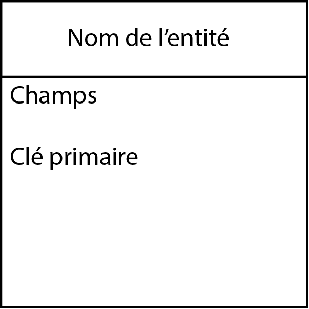
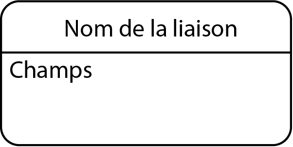
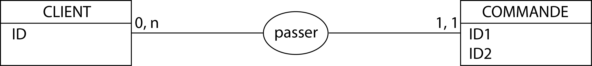
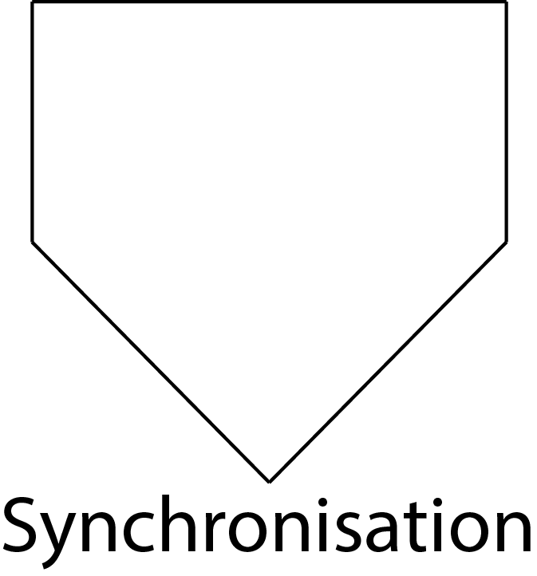
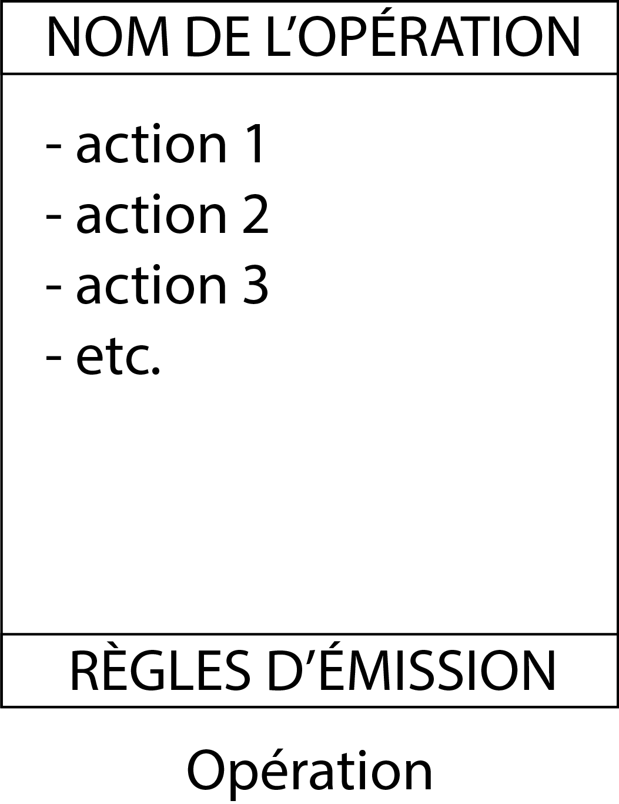
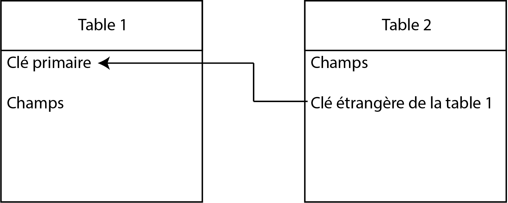

# La conception de base de données avec M.E.R.I.S.E.

Le C.M. cherche à être exhaustif. Il présente l'intégralité de la M.E.R.I.S.E. Toutefois, dans le cadre de vos projets, il n'est pas nécessaire de tout utiliser. Le plus important des modèles est le M.L.D.

- C.M. La conception de base de données avec M.E.R.I.S.E. (1h00)

- T.D. Application de M.E.R.I.S.E. à vos projets (1h00)

## Ressources

- [Cours M.E.R.I.S.E.](https://www.youtube.com/watch?v=2FMl28hPMwM&list=PL5v61AVkUtCa7RluR5Zmi2GuGH98mmyEv)

- [Cours M.E.R.I.S.E. (partie 1)](https://www.youtube.com/watch?v=NDAc-s415Fg&list=PLcOmJ-JvAV1e4kPuOxbavVsjPhtD6N2HN)

- [Cours M.E.R.I.S.E. (partie 2)](https://www.youtube.com/watch?v=mPMVspZryH4&list=PLcOmJ-JvAV1fedEvY-D8MnbvnHe7bR6k1)

- [Cours M.E.R.I.S.E. (partie 3)](https://www.youtube.com/watch?v=w4al5zI4h_Q&list=PLcOmJ-JvAV1dhlZrmJ3XiC_oLbeJCOg81)

## Introduction

### Réglementation sur les métadonnées

- *INfrastructure for SPatial InfoRmation in the European community* (INSPIRE) : **Directive 2007/2/CE du 25 avril 2007**, transposée en droit français par l'**ordonnance du 21 octobre 2010**, fixant l'infrastructure d'information géographique de l'Union européenne 

    - [Site officiel d'INSPIRE](https://knowledge-base.inspire.ec.europa.eu/index_en)

    - [Commission européenne](https://knowledge-base.inspire.ec.europa.eu/tools/inspire-your-country_en?prefLang=fr)

    - [Directive INSPIRE](../Ressources/INSPIRE.pdf) (Version française)

### Réglementation sur les données

- [Règlement général sur la protection des données](../Ressources/RGPD.pdf) (R.G.P.D.) : **règlement du 27 avril 2016 relatif à la protection des personnes physiques à l'égard du traitement des données à caractère personnel et à la libre circulation de ces données**, entré en vigueur en France le **25 mai 2018**.

Les dix-huit points essentiels du R.G.P.D.
1. Identifier les données à caractère personnel
2. Préparer son développement
3. Sécuriser son environnement de travail
4. Gérer son code source
5. Faire un choix éclairé de son architecture
6. Sécuriser le site web, l'application et les serveurs
7. Minimiser les données collectées
8. Gérer les profils utilisateur
9. Maîtriser les bibliothèques et les kits de développement
10. Veiller à la qualité du code et de sa documentation
11. Tester l'application
12. Préparer l'exercice des droits des personnes
13. Informer les utilisateurs
14. Gérer la durée de conservation des données
15. Prendre en compte les bases légales dans l'implémentation technique
16. Analyser les pratiques en matière de traceurs sur les sites web et les applications
17. Mesurer la fréquentation du site web et des applications
18. Se prémunir contre les attaques informatiques

Différence entre :
- données personnelles
- données sensibles

## L'analyse et la conception des systèmes d'information

### L'analyse

- Comprendre et modéliser le fonctionnement d'un domaine de gestion d'une organisation

- Concevoir la solution informatique adéquate

### La conception

- Définir **une** solution informatique

## Les quatre niveaux de compréhension

1. Le niveau conceptuel

2. Le niveau organisationnel

3. Le niveau logique (ou externe)

4. Le niveau physique (ou interne)

## Les modèles de la M.E.R.I.S.E.

[Les niveaux de compréhension](https://perso.univ-lemans.fr/ cpiau/BD/SQL_PAGES/SQL0.html).

[Outil pour réaliser facilement les schémas](https://app.diagrams.net)

### Les modèles au niveau conceptuel

#### Le modèle conceptuel de communication (M.C.C.)

Au niveau conceptuel, le  modèle conceptuel de communication représente les échanges d'informations entre les acteurs.
1. Modéliser les habitudes de travail dans l'organisation concernée, c'est-à-dire une étude de l'existant
2. Délimiter le domaine étudié
3. Réduire la complexité en identifiant des sous-problèmes traités individuellement
4. Identifier les acteurs externes et internes
5. Modéliser les échanges d'informations entre les différents acteurs

Le  modèle conceptuel de communication est une étude des systèmes présents dans le projet. La \textbf{systémique} est une méthode proposant :
1. une approche partant du général et allant vers le particulier, c'est-à-dire les sous-systèmes ;
2. des échanges entre systèmes ;
3. des domaines, c'est-à-dire des systèmes homogènes d'information (permettant de gérer la mémoire).

##### Les acteurs

Un acteur est un rôle, et non une personne.

Un acteur est représenté par un \textbf{cercle} libellé par son nom.
- Un acteur interne est représenté par un cercle plein (domaines, sous-domaines).
- Un acteur externe est représenté par un cercle en pointillés (partenaires, intervenants).

Un acteur peut émettre ou recevoir un flux d'information.

##### Les flux d'information

Un flux d'information entre deux acteurs est représenté par une **flèche** libellée par un nom.

Un flux d'information marque le passage d'un objet d'un acteur à un autre.

Si le flux d'information est un **message**, cela signifie qu'un ensemble d'informations est transmis. Il existe deux types de message :
1. les messages enclencheurs ;
2. les messages déclencheurs.

À la fin de la réalisation du M.C.C., il faut supprimer :
- les polysèmes ;
- les synonymes.

#### Le modèle conceptuel des données (M.C.D.)

Pour réaliser des modèles conceptuels des données, il existe un outil spécifique, le logiciel `Lopping`.

Le modèle conceptuel de données permet de réfléchir sur la **structure** de la base de données. Il définit trois éléments :
1. les \textbf{entités}, qui correspondent à un concept, une idée ;

2. les \textbf{associations} (ou liaison) entre entités ;

3. les \textbf{cardinalités} entre entité et association.

Le modèle conceptuel de données permet de décrire un ensemble de données relatives à un domaine défini afin de les intégrer dans une base de données. Il s'agit d'une représentation statique.

##### Construire un dictionnaire des données

Afin de ne pas se lancer en faisant n'importe quoi, il est conseillé de réaliser un \textbf{dictionnaire de données} (ou un référentiel de données). Il s'agit d'un \textbf{inventaire exhaustif} des données du domaine étudié. Il s'agit d'une collection de métadonnées nécessaire à la conception d'une base de données relationnelles. L'objectif est de \textbf{définir une vocabulaire commun}. Il s'agit du référentiel principal de l'organisation sur lequel s'appuie l'ensemble des décisions à prendre. Il correspond à un tableau à six entrées afin de définir les données :
1. un code. Il s'agit d'un identifiant ;
2. un libellé. Les noms choisis ne doivent pas être décomposables. Il faut éviter les homonymes et les synonymes ;
3. un type (entier, réel, date, chaîne de caractères, booléen) ;
4. une contrainte d'intégrité (C.I.). La donnée est-elle contrainte par une règle précise ? Par exemple, un intervalle d'existence, une règle juridique, \textit{etc}. Une contrainte d'intégrité est une règle à observer pour que chacune des valeurs que revêt une donnée soit correcte. Elle peut être :
    - statique. Elle doit se vérifier tout le temps ;
	- dynamique. Elle est validée à chaque mise à jour ;
	- référentielle. Elle est liée à des associations. Elle vérifie l'existence d'une occurrence de l'entité ;
	- liée à toutes les mises à jour du système d'information.
5. un mode (variable mémorisée, variable calculée, paramètre). La donnée peut-elle être calculée à partir d'autres données ?
6. un commentaire.

> [!WARNING]
> Il n'existe **aucune norme universelle** concernant la conception de ce dictionnaire.

> [!NOTE]
> Lors de la création des applications de base de données, une couche supplémentaire de logiciel de dictionnaire de données peut être introduite : le \textit{middleware}. Ce dernier communique avec le dictionnaire de données de la base de données sous-jacente.

Le dictionnaire de données remplit cinq grands objectifs :
1. **démocratiser l'accès à la données** ;
2. **assurer la fiabilité et l'actualité des informations** ;
3. **contrôler la qualité des données** ;
4. **collaborer effacement grâce à une vision unifiée des données dans l'organisation** ;
5. **faciliter la prise de décision à partir d'informations contextualisées et actionnables**.

Le dictionnaire de données permet de regrouper les données par paquets homogènes formant les entités.

| **Code** | **Libellé** | **Type** | **Contraintes** | **Mode** | **Commentaire** |
|:---:|:---:|:---:|:---:|:---:|:---:|
|  |  |  |  |  |  |
|  |  |  |  |  |  |
|  |  |  |  |  |  |
|  |  |  |  |  |  |
|  |  |  |  |  |  |

##### Définir les entités

Une **entité** (ou un individu) est un objet, une chose concrète ou abstraite qui peut être reconnue distinctement. Elle regroupe un identifiant et une suite d'informations (ou occurrences, ou  *tuple*). Une **entité type** est la représentation commune que l'on adapte pour des entités qui possèdent les mêmes caractéristiques. une entité est une **occurrence** (ou instance) d'une entité type.

En résumé, une entité doit :
- avoir un intérêt ;
- être distinguable ;
- avoir une existence propre ;
- être doté d'un ensemble unique de propriétés.

> [!NOTE]
> Il faut garantir une **unité sémantique** dans les noms retenus en évitant :
> - les redondances ;
> - les synonymes ;
- les polysèmes.

Une **propriété** (ou attribut) est une caractéristique associée à une entité type. Une propriété a une **valeur**. Chaque propriété est associée à un **domaine** qui définit l'ensemble des valeurs possibles que peut prendre la propriété.

Les liens logiques entre les entités forment des associations.

##### Définir les associations

Une **association** (ou une relation) est un lien entre plusieurs entités. Elle est matérialisée par un verbe. Une **association type** est une représentation d'un ensemble de relations qui possèdent les mêmes caractéristiques, lien entre plusieurs entités types. Une association type peut avoir une propriété. Il peut y avoir plusieurs associations types liant les mêmes entités si la sémantique est différentes.

> [!NOTE]
> Une association n'a pas d'existence propre. Elle n'est définie que par les entités auxquelles elle est rattachée.

La **dimension d'une association** est le nombre de branches de l'association. Elle peut être :
- binaire ;
- ternaire ;
- $ n $-aire.

###### L'association réflexive

Une **association réflexive** est une association dont plusieurs branches lient la même entité. Dans ce cas, plusieurs occurrences de la même entité seront associées. On peut alors étiqueter chaque branche par son rôle dans l'association.

###### L'association transitive

Une propriété (ou un groupe de propriétés) $ Y $ dépend fonctionnellement d'une autre propriété (ou un groupe de propriétés) $ X $ si, étant donnée une valeur de $ X $, il lui correspond une valeur unique de $ Y $. On note la **dépendance fonctionnelle** : $ X \rightarrow Y $, et elle se lit « $ X $ détermine $ Y $ ».

La relation est **transitive** si $ X \rightarrow Y $ et $ Y \rightarrow Z $, alors $ X \rightarrow Z $. Dit autrement, il faut supprimer la relation $ Y $.

##### Définir les identifiants

Un **identifiant** possède une ou plusieurs propriétés d'une entité ou d'une association qui ont une valeur unique pour chaque occurrence de l'entité ou de l'association. On souligne les identifiants d'une entité. L'identifiant d'une association est un sous-ensemble d'identifiants des entités liés.

##### Définir les cardinalités

La cardinalité d'une association est le nombre de fois minimal et maximal qu'une occurrence d'une des entités associée peut intervenir dans l'association.

La **cardinalité minimale** peut être :
- 0 si une occurrence de l'entité peut exister tout en n'intervenant dans aucune occurrence de l'association ;
- 1 si une occurrence de l'entité ne peut exister que si elle intervient dans au moins une occurrence de l'association ;
- $ n $ qui est un cas rare à éviter.
	
La **cardinalité maximale** peut être :
- 1 si une occurrence de l'entité ne peut pas être impliquée dans plus d'une occurrence de l'association ;
- $ n $ si une occurrence de l'entité ne peut être impliquée dans plus d'une occurrence de l'association.

Les **types d'association** se classent en fonction des cardinalités.
- La cardinalité *one-to-one* $ 1, 1 $ signifie que toutes les cardinalités maximales valent $ 1 $.
- La cardinalité *one-to-many* $ 1, n $ signifie qu'il existe au moins une cardinalité maximale à $ n $ et une autre à $ 1 $.
- La cardinalité *many-to-many* $ n, m $ signifie que toutes les cardinalités maximales valent $ n $.

**Exemple.** Une variable booléenne est définie :
- soit par « non » qui est représenté par une cardinalité minimale de 0 ;
- soit par « oui » qui est représenté par une cardinalité maximale de 1.

> [!NOTE]
> À chaque opération, on associe un modèle conceptuel de données **partiel**, appelé **vue externe des données** (V.E.D.). Le modèle conceptuel de données **global** est l'union de toutes les V.E.D.

**Exemple.** « Le client passe une commande ». Dans cette action, le client possède une cardinalité allant de 0 à $n$. En effet, le client peut ne pas passer une commande, et il peut en passer de $1$ à $n$. La commande n'existe que si le client passe une commande. Sa cardinalité minimale est par conséquent de $1$. L'entité « commande » renvoie les identifiants d'une liste de produit. Sa cardinalité maximale est par conséquent de $1$.

##### Respecter les règles générales

Les entités et les associations suivent dix règles.
1. Deux entités qui doivent être reliées entre elles le seront par le biais d'une relation.
2. Deux relations ne peuvent jamais être directement reliées entre elles.
3. Le nom de la relation doit représenter d'une manière concrète et significative l'information que l'on souhaite obtenir.
4 Un attribut est unique à une entité ou à une relation.
5. Les entités et les relations ne doivent contenir que des données élémentaires, donc ne pas contenir des résultats d'un calcul, d'un traitement.
6. Pour une occurrence donnée, une seule valeur doit être attribuée à chaque attribut de l'entité ou de la relation.
7. Pour conserver l'historique d'une donnée d'une entité, on forme une nouvelle entité avec cette donnée et on ajoute une période d'application.
8. Chaque fois qu'un attribut est un code ou un type. On forme un nouvelle entité avec ce code ou ce type, et sa description.
9. Lorsqu'une relation peut être déduite des autres relations, elle n'est pas représentée à moins qu'on veuille extraire une information spécifique à cette relation.
10. Seule une association de type *many-to-many* peut avoir des attributs. Dit autrement, $ 1, n $ ne peut pas avoir d'attributs.

Les entités peuvent être :
- **incluses** l'une dans l'autre ($V$) ;
- **exclues** l'une de l'autre ($X$) ;
- **partitionnées** l'une de l'autre) ;
- **incluses hiérarchiquement** l'une dans l'autre ($I$).

##### Les formes normales d'un modèle conceptuel de données

Au niveau des règles de normalisation des entités, on ne représente que les \textbf{dépendances fonctionnelles élémentaires}, c'est-à-dire non transitives. 

> [!NOTE]
> Les propriétés non identifiantes d'une entité dépendent de manière fonctionnelle de l'ensemble des identifiants.

> [!NOTE]
> L'identifiant d'une association type $ n, m $ dépend fonctionnement des identifiants des entités liées.

> [!NOTE]
> Une cardinalité $ 1, 1 $ ou $ 0, 1 $ est la source d'une dépendance fonctionnelle de l'identifiant du côté $ 1, 1 $ vers l'autre côté de l'association.

###### Première forme normale (1FN)

Toutes les entités et les associations possèdent un identifiant.

Aucune propriété n'est à valeurs multiples. Dit autrement, il doit exister uniquement des propriétés atomiques.

###### Deuxième forme normale (2FN)

Le modèle est en 1FN.

Toutes les dépendances fonctionnelles entre les propriétés sont élémentaires.
1. Toute propriété n'appartenant pas à une clé ne dépend pas seulement d'une partie de son identifiant.
2. Les propriétés d'une entité ne doivent dépendre que de l'identifiant de l'entité, et non d'une partie de cet identifiant.

###### Troisième forme normale (3FN)

Le modèle est en 2FN.

Toutes les dépendances fonctionnelles sont directes.
1. Les propriétés d'une entité doivent dépendre de l'identifiant de l'entité de manière directe.
2. Toute propriété n'appartenant pas à un identifiant ne dépend pas d'un attribut non identifiant.

###### Forme normale de Boyce-Codd (B.C.N.F.)

Le modèle est en 3FN. On le doit à Raymond F. Boyce (1946-1974) et à Edgar Franck Codd (1923-2003).

Les seules dépendances fonctionnelles élémentaires sont celles dans lesquelles un identifiant détermine une propriété. Pour les identifiants composés de plusieurs propriétés, ces dernières ne doivent pas être dépendantes d'une autre propriété de l'entité afin d'éviter les cycles de dépendances fonctionnelles.

> [!NOTE]
> Un modèle conceptuel de données ne doit pas nécessairement être en B.C.N.F.

**Pour une situation donnée, il n'existe pas de solution unique**.

#### Le modèle conceptuel des traitements (M.C.T.)

Le modèle conceptuel des traitements représente formellement les activités exercées par le domaine. Il s'agit d'un zoom sur le M.C.C. Il repose sur la prise en compte des flux (ou échanges) du domaine avec son environnement. Il s'effectue en faisant abstraction de l'organisation et des choix technologiques. Il répond à la question : « Quoi faire par rapport à un événement ? »

Le modèle conceptuel des traitements effectue un zoom sur le modèle conceptuel de communication. Dans le modèle conceptuel de communication, on représente les messages échangés entre les acteurs. Dans le modèle conceptuel des traitements, on représente la réaction d'un acteur de l'organisation lorsqu'il reçoit un message, c'est-à-dire l'opération qu'il doit effectuer.

Dans le modèle conceptuel des traitements, **on ne décrit que les règles fondamentales de gestion**.

Un **événement** est représenté par un cercle plein. Il existe trois types d'événement :
- les événements internes (entrées) ;
- les événements externes (entrées) ;
- les événements résultats (sorties).

Un **flux** est représenté par une flèche.

Par les opérateurs logiques « et » et « ou », une **synchronisation** permet de rassembler plusieurs flux. Une opération avec synchronisation a besoin de plusieurs messages reçus ou à recevoir.

> [!NOTE]
> Il peut y avoir une synchronisation des flux avant leur traitement.

> [!NOTE]
> Il faut simplifier les synchronisations.

Par opposition, une opération sans synchronisation a besoin de découper les opérations.

Une **opération** est une séquence continue d'actions non interruptibles. Elle est déclenchée par des événements et produit des événements. Toute opération a un nom. Elle est composée d'**actions**, c'est-à-dire de traitements appliqués aux données en entrée selon certaines règles. Elle se conclut par une ou des règles d'émission qui donnent les résultats possibles de l'opération.

> [!NOTE]
> **Une opération ne peut pas être interrompue par l'attente d'un événement externe**. Si tel est le cas, il faut décrire une seconde opération déclenchée par cet événement en attente.

> [!NOTE]
> Il peut y avoir plusieurs règles d'émission à la sortie, mais elles doivent être exclusives, c'est-à-dire que deux règles de la même opération ne peuvent pas être vraies en même temps.

> [!NOTE]
> Les règles d'émission doivent couvrir tous les cas possibles.

> [!NOTE]
> Il ne faut pas répéter les actions et les événements résultants.

> [!NOTE]
> Il faut éviter les chaînes d'opérations et les événements internes.

> [!NOTE]
> Il faut réduire les chaînes d'opérations en fusionnant une telle chaîne sous la forme d'actions.

### Les modèles au niveau organisationnel

#### Le modèle organisationnel de communication (M.O.C.)

Le modèle organisationnel de communication (M.O.C.) ne concerne que les communication entre sites stockant les données.

> [!WARNING]
> Il n'existe pas s'il n'existe qu'un unique site.

Le M.O.C. peut choisir trois architectures :
1. la centralisation totale (Fig. \ref{{td65fig1}}) ;
2. la centralisation sur plusieurs niveaux ;
3. la décentralisation totale.

#### Le modèle organisationnel des données (M.O.D.)

Le modèle organisationnel des données (M.O.D.) répond à quatre questions.
1. Quelles données sont stockées ?
2. Où sont stockées les données ?
3. Comment sont stockées les données ?
4. Quelle est le volume de données ?

#### Le modèle organisationnel des traitements (M.O.T.)

Le modèle organisationnel des traitements regroupe :
- un modèle conceptuel des traitements ;
- un acteur, lieu : qui exécuté ? (cf. modèle conceptuel de communication)
- un moment :
	- Quand exécute-t-on l'opération ?
	- Quel est l'agencement temporel ?
- un mode :
	- soit manuel ;
	- soit automatique ;
	- soit interactif.

Comment passer du modèle conceptuel des traitements au modèle organisationnel des traitements ?
1. Créer un tableau avec comme colonnes :
    - période
	- acteur A
	- acteur B
	- type
2. Importer la liste des acteurs du modèle conceptuel de communication
3. Importer le modèle conceptuel des traitements et le placer dans la colonne des acteurs effectuant la tâche
4. Répartir les opérations entre les acteurs et définir le type de mode
5. Diviser les traitements répartis entre plusieurs acteurs
6. Définir les périodes de traitement
7. Diviser les traitements répartis sur plusieurs périodes
8. Définir les types de traitements

### Les modèles au niveau logique

#### Les modèles logiques de communication (M.L.C.)

Le modèle logique de communication (M.L.C.) concerne essentiellement les outils de traitement **différé** (les *pipeline}*. Le M.L.C. peut être un sous-ensemble du M.O.C.

Trois architectures existent :
- la centralisation totale ;
- la centralisation sur plusieurs niveaux ;
- la décentralisation totale.

#### Les modèles logiques des données (M.L.D.)

Un **modèle relationnel** est un ensemble de schémas relationnels de la forme (clé 1, ..., clé $n$, attribut 1, ..., attribut $n$).

Le passage du modèle conceptuel de données au modèle logique des données relationnel s'effectue par l'intermédiaire de trois règles.
1. Toutes les entités du modèle conceptuel de données deviennent une **table**, sauf si elle n'a pas d'attributs. Les identifiants deviennent des **clés**. Les propriétés de l'entité deviennent les attributs de la table. L'identifiant devient la clé primaire de la table. tous les mots doivent être écrits en majuscules.
2. Les associations de type $1, 1$ se traduisent par une **clé étrangère sous contraintes**.
3. Les associations de type $1, n$ donnent lieu à l'ajout de l'identifiant côté 1 vers le côté $ n $ en tant qu'**attribut non clé**. Les associations de type $1, n$ se traduisent par une **clé étrangère**.
4. Les associations de type $n, m$ donnent lieu à la création de nouveaux schémas relationnels. Les associations de type $n, m$ se traduisent par une **table intermédiaire**.
	- **Les identifiants des entités liées deviennent des clés**.
	- **Les propriétés de l'association deviennent des attributs simples**.
5. La représentation des relations binaires de type $n, m$ et $n, 1$ s'effectue par la duplication de la clé primaire de la table basée sur l'entité à cardinalité $n, m$ dans la table basée sur l'entité à cardinalité $n, 1$. Cet attribut est appelé **clé étrangère**. Les deux tables sont liées par une flèche nommée selon la relation, qui pointe de la table à clé étrangère vers la table qui contient la clé primaire correspondante.
6. Pour les relations binaires du type $n, 1$ et $n, 1$, on distingue deux cas :
    - la relation binaire $0, 1$ et $1, 1$. On duplique le clé de la table basée sur l'entité à cardinalité $0, 1$ dans la table basée sur l'entité à cardinalité $1, 1$ ;
    - la relation binaire $0, 1$ et $0, 1$. On duplique la clé d'une des tables dans l'autre. Lorsque la relation contient elle-même des propriétés, celles-ci deviennent également attributs de la table dans laquelle a été ajoutée la clé étrangère.

> [!NOTE]
> La relation binaire $1, 1$ et $1, 1$ n'existe pas.

7. Avec une relation binaire du type $n, m$ et $n, m$, on crée une table supplémentaire ayant comme clé primaire une clé composée des clés primaires des deux tables. Lorsque la relation contient elle-même des propriétés, celles-ci deviennent attributs de la table supplémentaire. Une propriété de la relation qui est soulignée devra appartenir à la clé primaire composée de la table supplémentaire.
8. Avec des relations ternaires, on crée une table supplémentaire ayant comme clé primaire une clé composée des clés primaires de toutes les tables reliées. Cette règle s'applique de manière indépendante des différentes cardinalités. Lorsque la relation contient elle-même des propriétés, celles-ci deviennent attributs de la table supplémentaire. Une propriété de la relation qui est soulignée devra appartenir à la clé primaire composée de la table supplémentaire.
9. Avec des relations multiples (au-delà de trois) entre deux entités, les règles générales s'appliquent.
10. Avec des relations réflexives, les règles générales s'appliquent.
11. Avec un identifiant relatif, dans chaque cas, la table issue de l'entité dépendante contient comme clé étrangère, la clé primaire de l'autre table. L'identification relative est représentée par le fait que la table issue de l'entité dépendante contient une \textbf{clé primaire composée}, constituée de la clé primaire transformée de l'identifiant de cette entité et de la clé étrangère.

> [!WARNING]
> Il s'agit d'une formalisation des tables logiques, basée sur un modèle conceptuel de données donné.

Un modèle logique de données est essentiellement composé de tables logiques reliées entre elles par des flèches

#### Les modèles logiques des traitements (M.L.T.)

Le modèle logique des traitements (M.L.T.) décrit les :
- les moyens informatiques ;
- les outils de consultation informatique ;
- les outils d'écriture informatique.

Il existe deux types d'outil :
- l'**outil transactionnel** par lequel le traitement est immédiat et interactif ;
- l'**outil de traitement différé** ou par lot.

Ces outils sont des aides, et non un découpage de l'opération en sous-opérations ou tâches. Chaque opération peut être effectuée à l'aide d'un ou plusieurs outils.

> [!NOTE]
> Le **moniteur de transaction** est un macro-outil permettant de passer d'un outil à l'autre.

### Les modèles au niveau physique

#### Le modèle physique de communication (M.P.C.)

Le modèle physique de communication (M.P.C.) écrit un programme qui organise la télématique entre sites informatiques. Il n'existe pas de modèle propre à M.E.R.I.S.E.

#### Le modèle physique des données (M.P.D.)

Le modèle physique des données transforme en **tables** :
1. des entités et associations si on produit le modèle physique des données directement à partir du modèle conceptuel des données ;
2. des schémas relationnels si on produit un modèle logique des données.

Le modèle physique des données dépend de la base de données cible :
1. des types de données ;
2. des domaines des propriétés.

Comment passer du M.L.D. au M.P.D. ?
1. Tout enregistrement logique devient une **table**.
2. Deux chemins à $N$ arrivées entre deux enregistrements logiques deviennent **trois tables**.
3. Un chemin ayant une arrivée entre deux enregistrements logiques redonde **une clé** dans la table de départ.

Comment passer du M.O.D. au M.P.D. relationnel ?
1. Chaque entité se transforme en **table**.
2. Chaque relation $n, m$, $n, m$ se transforme en **table**.
3. Si la relation contient plus de deux entités, une table est créée. Elle contiendra les informations éventuelles de la relation.

Les attributs qui permettent d'indexer les tables sont des **clés primaires**.

Les attributs (non clés primaires) qui font référence aux clés primaires d'autres tables sont des **attributs secondaires** :
- les associations $n, m$ ;
- les associations $1, n$ ;
- les associations $1, 1$.

Le modèle physique des données est la traduction du modèle logique des données dans une **structure de données spécifique ou un système de gestion de bases de données** (S.G.B.D.) **utilisé**.

#### Le modèle physique des traitements (M.P.T.)

Le modèle physique des traitements (M.P.T.) décrit les traitements réalisés pour chaque transaction, c'est-à-dire chaque traitement effectué en temps réel, ou chaque unité de traitement, c'est-à-dire chaque traitement effectué en temps différé.

### Synthèse des modèles

| **NIVEAU** | **COMMUNICATION** | **DONNÉES** | **TRAITEMENTS** |
|:---:|:---:|:---:|:---:|
| Conceptuel | M.C.C. | M.C.D. | M.C.T. |
| Organisationnel | M.O.C. | M.O.D. | M.O.T. |
| Logique | M.L.C. | M.L.D. | M.L.T. |
| Physique | M.P.C. | M.P.D. | M.P.T. |

## Le coût de l'information

## Bibliographie

Le bibliographie est très complète, mais, dans le cadre de cette séance, seule la M.E.R.I.S.E. 2 est à approfondir. Les ouvrages concernant la M.E.R.I.S.E. 1 ne sont qu'indicatifs.

### M.E.R.I.S.E. 1 (1979-1992)

-    Banos, Didier & Malbosc, Guy, 1989, *MERISE pratique. 2. Informatiser la fonction achat*, Paris, Eyrolles, IV-330 p.

-    Basile, Jean-Pierre & Scheidt, Guy, 1989, *L'application de MERISE*, Paris, Eyrolles, XIX-250 p.

-    Chartier-Kastler, Cyrille, 1991, *Appliquer MERISE : exercices et études de cas*, Paris, Eyrolles, XIV-184 p

-    Collongues, Alain, 1989, *MERISE. 2. Études et exercices*, Paris, Dunod, XII-218 p.

-    Collongues, Alain, Hugues, Jean & Laroche, Bernard, 1986, *MERISE. Méthode de conception*, Paris, Dunod, XVI-212 p.

-    Collongues, Alain & Laroche, Bernard, 1991, *MERISE et le cahier des charges*, Paris, Bordas, XIX-302 p.

-    Diviné, Michel, 1992, *Parlez-vous MERISE ?*, Paris, Eyrolles, XXIV-240 p.

-    Mathelot, Pierre, Annonay, Henri, Briand, Henri, *et alii*, 1990-1993, *MERISE : exercices corrigés*, Paris, Éditions d'Organisation, 250 p.

-    Matheron, Jean-Patrick, 1987, *Comprendre MERISE : outils conceptuel et organisationnel*, Paris, Eyrolles, XVIII-222 p.

-    Matheron, Jean-Patrick, 1989, *Exercices et cas pour comprendre MERISE*, Paris, Eyrolles, XVI-292 p.

-    Matheron, Jean-Patrick, 1991, *Approfondir MERISE*, t. 1, *Modèles conceptuels des données ou la représentation statique du réel*, Paris, Eyrolles, XVIII-284 p.

-    Mounyol, Roger, 1991, *MERISE par l'exemple : modèles pour l'analyse d'organisation et d'information*, Paris, Ellipse, 204 p.

-    Pierreval, Henri, 1990, *Les méthodes d'analyse et de conception des systèmes de production*, Paris, Hermès, 62 p.

-    Rochfeld, Arnold & Morejon, José, 1989, *MERISE (mémento)*, Paris, Éditions d'Organisation, 48 p.

### M.E.R.I.S.E. 2 (depuis 1992)

-    Baptiste, Jean-Luc, 2012, *MERISE. Guide pratique. Modélisation des données et des traitements, manipulation avec le langage SQL*, Saint-Herblain, ENI Éditions, 280 p. [Ressources informatiques]

-    Bisson, Bertrand, 1997, *Modèles de données : étude conceptuelle et relationnelle*, Paris, Économica, 112 p.

-    Bouzeghoub, Mokrane & Rochfeld, Arnold, 2000, *OOM : la conception objet des systèmes d'information*, Paris, Hermès, 472 p.

-    Carlier, Alphonse, 2006, *Stratégie appliquée à l'audit des systèmes d'information. OSSAD, MERISE, AXIAL, MDA, UML, IDEFO, MEHARI, MARION*, Paris, Hermès, 432 p.

-    Dionisi, Dominique, 1998, *L'essentiel sur MERISE*, Paris, Eyrolles, VI-258 p.

-    Gabay, Joseph, 2004, *MERISE et UML. Pour la modélisation des systèmes d'information*, Paris, Dunod, XIV-290 p. [Études et développement]

-    Guedi, Gilles, 1996, *AMC Designer : mise en œuvre de MERISE. Conception d'applications client-serveur*, Paris, Eyrolles, VIII-328 p.

-    Kettani, Nasser, Mignet, Dominique, Paré, Pascal & Rosenthal, Camille, 1998, *De MERISE à UML*, Paris, Eyrolles, X-434 p.

-    Mounyol, Roger, 1995, *MERISE étendue : cas professionnel de synthèse*, Paris, Ellipses, 238 p.

-    Nanci, Dominique & Espinasse, Bernard, 1996, *Ingénierie des systèmes d'information : MERISE, deuxième génération*, Paris, Sybex, XXXVIII-892 p.

-    Tabourier, Yves, 1986, *De l'autre côté de MERISE : système d'information et modèles d'entreprise*, Paris, Éditions d'Organisation, 242 p.

-    Soutou, Christian, 2022, *Modélisation des bases de données*, Paris, Eyrolles, XII-362 p.

-    Tardieu, Hubert, Rochfeld, Arnold & Colletti, René, 2000, *La méthode MERISE. Principes et outils*, Paris, Éditions d'Organisation, 344 p.
