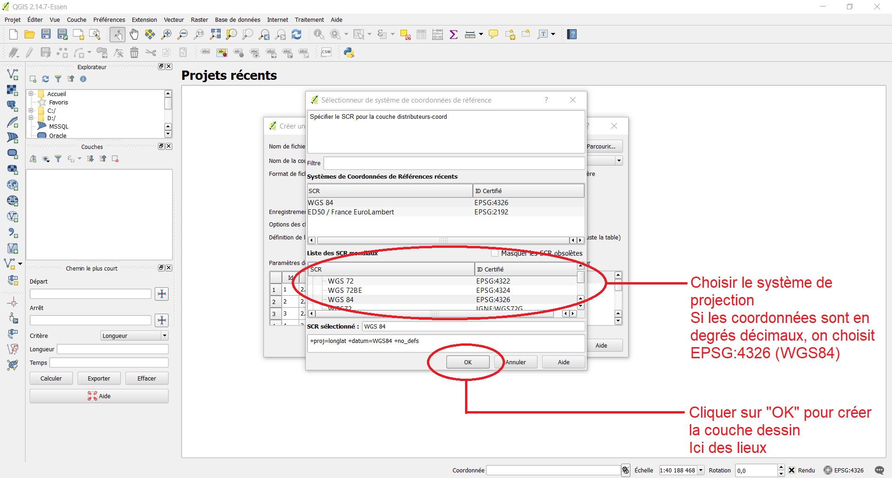
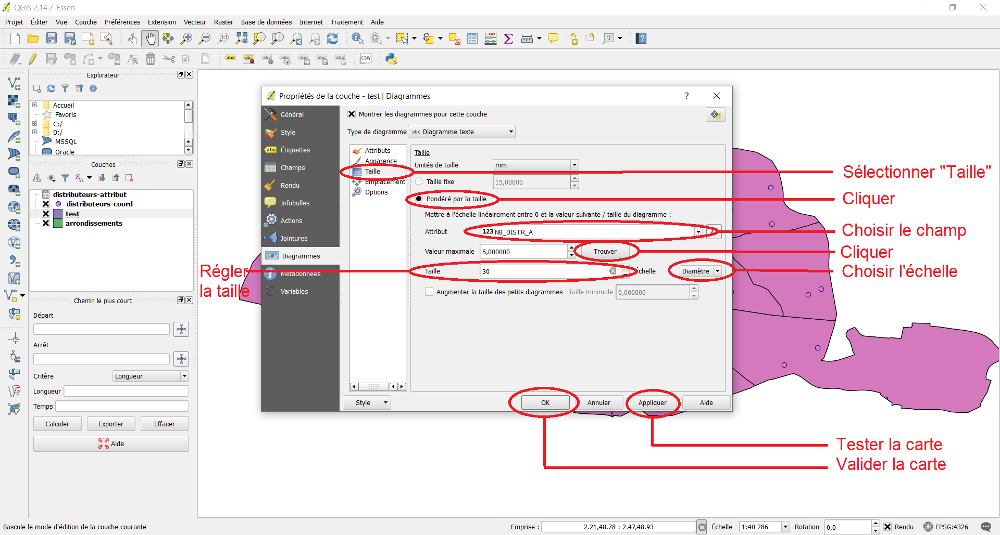

# Les requêtes S.Q.L.

- C.M. Les requêtes S.Q.L. (0h30)

- T.D. Manipulation des tables sous `Q-GIS` et `ArcGIS Online` (1h30)

	- Création d'une table à partir de points géolocalisés

	- Réalisation d'une jointure attributaire
	
	- Manipulation des tables avec des requêtes spatiales

	- Réalisation de statistique spatiale

Pour effectuer les savoir-faire que vous devez acquérir, cette présentation rapide des requêtes S.Q.L. par défaut sur n'importe quel logiciel de géomatique, vous montre comment faire sur `Q-GIS` et `ArcGIS Online`.

## Tâche 0 : Manipuler les fichiers `*.csv`

## Tâche 1 : Savoir-faire un géoréférencement

Le géoréférencement est la base de n'importe quel système d'information géographique. Lors de la séance 2, nous avons injecté des données sans distinguer la couche dessin des données attributaires. Comme expliquer en C.M., cette pratique est à éviter. De fait, il faut bien séparer informations géométriques et informations attributaires. Le géoréférencement permet de réaliser le traitement des informations géométriques.

Reprenons la répartition spatiale des distributeurs de préservatifs masculins dans Paris. J'ai opéré un nettoyage du fichier original qui présentait des problèmes d'encodage, puis, à partir de lui, générer deux nouveaux fichiers :
- `distributeurs-coord.csv` ;
- `distributeurs-attribut.csv`.

Pour le géoréférencement, on utilisera le fichier `distributeurs-coord.csv`.

### Avec `Q-GIS`

> [!WARNING]
> J'ai utilisé la version 2.14.7. Si vous utilisez une version plus récente, il est possible que les commandes ne soient pas placées au même endroit. Il faudra consulter l'aide pour trouver les nouveaux emplacements.

1. Sous `Q-GIS`, le géoréférencement s'opère avec l'ajout d'une couche de texte délimité.


2. Une fenêtre s'ouvre, vous devez compléter l'intégralité des options signalées dans l'image ci-dessous.


3. Après avoir tout complété et validé, une nouvelle fenêtre s'ouvre : « Sélectionneur de système de coordonnées de référence ». C'est l'étape la plus importante. En effet, les coordonnées géographiques sont de nature différente d'une carte à l'autre. Il faut choisir le bon système de projection. Par défaut, les données tests présentes dans ce cours sont **toutes** en **degrés décimaux**, mais il faut bien comprendre que de nombreux systèmes utilisent les données métriques comme les systèmes Lambert en France.

Les systèmes de coordonnées géographiques possèdent tous un **code E.P.S.G.**. Il faut connaître les codes principalement utilisés dans son État. Nous allons utilisé le système international `WSG84`, codé `EPSG:4326`.



Voilà votre carte est désormais géoréférencée sous la forme d'un ensemble de lieux.

> [!TIP]
> Convertissez toutes vos coordonnées en degrés décimaux dans votre système d'information géographique.

### Avec `ArcGIS Online`

D'un logiciel à l'autre les étapes d'une même action peuvent être plus ou moins longue. Si, en trois étapes, `G-GIS` permettait de valider un géoréférencement, `ArcGIS Online` en nécessite beaucoup plus.

On utilise toujours le fichier `distributeurs-coord.csv`.

1. Après avoir cliqué sur « Ajouter une couche à partir d'un fichier », comme on l'a vu en [séance 2](../Seance-02/Seance-2.md), vous sélectionnez ajouter une couche à partir de votre appareil.


2. Sélectionner le nouveau fichier `distributeurs-coord.csv`


3. Laisser l'option par défaut


4. Vous retrouvez les mêmes paramétrages présentés dans `Q-GIS`. Toutefois, `ArcGIS Online` vous impose de bien définir le type des variables. Par défaut, il prédétermine les bons types.


5. Vous passez à la détermination des champs : latitude (champ `Y`) et longitude (champ `X`).


6. La fenêtre suivante vous permet de remplir les métadonnées.


7. Une fois la dernière étape validée, la carte que vous connaissez bien s'affiche.


> [!NOTE]
> Comme vous le constatez, le format du dessin est différent par rapport à votre premier testé. Des cercles concentriques représentent les lieux des distributeurs, ce qui est une représentation cartographique plus conforme par rapport à la sémiologie graphique.

## Tâche 2 : Savoir-faire une jointure attributaire

Une fois le géoréférencement effectué, vous n'avez plus les données attributaires accessibles. Il faut de fait joindre une table géométrique avec une table attributaire.

Dans le nouveau fichier, `distributeurs-coord.csv`, vous avez certainement remarqué le nouveau champ `ID`. Si vous ouvrez le fichier `distributeurs-attribut.csv`, vous remarquez que ce nouveau champ `ID` est également présenté. L'idée d'une jointure est de faire correspondre les deux identifiants `ID` afin de lier les informations géométriques avec les informations attributaires.

### Avec `Q-GIS`

1. Visualisons les données attributaires sur `Q-GIS`, en faisant un clic droit sur la couche dont on veut les informations géographiques, puis en sélectionnant « Ouvrir la table des attributs »


2. La table des attributs s'ouvre. Vous constatez que les données ne comportent que trois champs `ID`, `X` et `Y`. De fait, il faut bien opérer une jointure attributaire afin de lier données géométriques et données attributaires.


3. Pour insérer vos données attributaires, on opère la même opération que pour des données géométriques.


4. Lors de l'ouverture de la fenêtre qui vous est maintenant familière, il faut bien sélectionner l'option « Pas de géométrie ».


5. Une fois validée, on opère de nouveau un clic droit sur la couche dessin sur laquelle on veut faire la jointure, et on sélectionne « Propriétés ».


6. La fenêtre « Propriétés » s'ouvre. 


7. Cliquer sur l'onglet « Jointure », puis le bouton « + ».


8. La fenêtre permettant de paramétrer la jointure apparaît. Dans le cas présent, vous n'avez que deux tables, opérer la liaison entre elles est relativement simple, mais, en cours de votre apprentissage en géomatique, vous serez amené à avoir plusieurs couches en même temps. De fait, il faut bien faire attention à réaliser la bonne liaison.


9. On vérifie que la jointure s'est correctement opérée.


10. Comme vous le voyez, la liaison entre couche dessin et table attributaire est désormais opérante. On peut maintenant travailler sur la couche.


### Avec `ArcGIS Online`

1. Ajouter une couche à partir d'un fichier


2. Sélectionner le fichier `distributeurs-attribut.csv`


3. Laisser le paramètre par défaut


4. Vérifier la pré-sélection des types pour les champs de table attributaire


5. La nouvelle fenêtre doit afficher l'absence de données spatiales.


6. Compléter les métadonnées de la table attributaire. Il faut changer le nom pour pouvoir valider la table.


7. Vérifier que, dans l'onglet « Tables », la table attributaire apparaisse.


8. Aller dans l'onglet à droite « Analyse »


9. Choisir l'option « Joindre des entités »


10. Paramétrer la jointure


11. Une fois exécutée, la requête n'affiche pas la couche. Il faut la rechercher dans l'onglet « Couches » en cliquant directement sur « Ajouter ».


12. La liste des couches enregistrées dans votre profil apparaît. Choisir celle de la jointure en cliquant sur « Ajouter »a.


> [!WARNING]
> Le chargement de la couche de la jointure peut prendre un certain temps.

13. Vous pouvez visualiser les champs la jointure en cliquant sur « Couches », puis « output layer ».


14. La liste des champs apparaît.


15. Dans « Couches », la couche jointe est disponible.


16. Vous pouvez visualiser la table attributaire jointe.


17. Dans la fenêtre qui s'est ouverte, vous pouvez vérifier votre jointure.


> [!NOTE]
> Il existe plusieurs sortes de jointures S.Q.L. Dans `ArcGIS Online`, deux sont disponibles :
> - la jointure interne : toutes les valeurs dans l'une ou l'autre des tables de la jointure, il existe strictement le même nombre de *tuple*, donc d'identifiant.
> - la jointure à gauche : la couche dessin peut avoir davantage de *tuple* que la table attributaire à lui joindre. Dans ce cas, les valeurs manquantes contiendront des champs `NULL`.

## Tâche 3 : Savoir-faire une requête spatiale 

La notion de requête spatiale permet d'utiliser à son plein potentiel le langage S.Q.L.

Pour réaliser une requête spatiale, il faut **au moins deux couches**. De fait, on va poser un problème nécessitant une nouvelle couche.

**Problème.** Les données brutes des distributeurs ne répondent pas à toutes les questions géographiques que l'on pourrait se poser. Par exemple, combien de distributeurs existent-ils dans un arrondissement donné ? Pour répondre à cette question, il est possible d'opérer une **requête spatiale**.

Téléchargeons la couche des arrondissements de Paris.

### Avec `Q-GIS`

1. Ouvrir la couche des arrondissements de Paris.


> [!TIP]
> Si la couche des arrondissements recouvre celle des distributeurs, il faut changer l'ordre des couches dans l'onglet des couches les glissant dans l'ordre voulu. Plus la couche est vers le haut, plus elle est en avant-plan.

2. Aller dans l'onglet « Vecteurs ». Sur `Q-GIS`, cet onglet contient toutes les requêtes spatiales possibles.


3. Il faut bien paramétrer la requête. Sur `Q-GIS`, il faut impérativement nommer et créer une nouvelle couche, ici `test.shp`, mais vous pouvez lui donner un nom plus clair.


4. La nouvelle couche apparaît en avant-plan. Il faut la placer sous la couche des distributeurs pour que vous voyez de nouveau les points.


5. Faire un clic droit sur la couche `Test` et cliquer sur « Ouvrir la table d'attributs »


6. Comme vous le constatez, le nouveau champ est apparu dans les données attributaires de la table des arrondissements de Paris originale.


> [!TIP]
> Chaque requête spatiale dépend à la fois de la forme géométrique :
> - point ;
> - polyligne ;
> - polygone.
> mais également de ce que l'on souhaite créer.

### Avec `ArcGIS Online`

Pour charger la couche sur les arrondissements de Paris sur `ArcGIS Online`, il faut convertir les données *shapefile* en `*.geojson` en appliquant la méthode sur `Q-GIS` que l'on a vue en [séance 2](../Seance-02/Seance-2.md). En effet, le fichier `GeoJSON` permet de mieux conserver les polygones de la couche initiale.

1. Charger la couche `arrondissements.geojson` que vous avez créée dans `Q-GIS`. Il faudra changer le nom de la couche, car il existe déjà des couches sur les arrondissements de Paris enregistrées dans l'application `ArcGIS Online`.

2. À droite, aller dans l'onglet « Analyses », cliquer sur « Synthétiser des localisation », puis sur « Joindre des entités »


3. Le menu obtenu vous est déjà connu.


4. On paramètre la requête spatiale. Ici, on souhaite que les polygones n'ayant pas de points affichent la valeur `0`. La jointure est de fait **à gauche**.


5. On clique sur la couche que l'on vient de créer, et un attribut `Join_Count` a été créé. Il matérialise le nombre de distributeurs par arrondissement.


## Tâche 4 : Savoir-faire une statistique spatiale

On a compté les distributeurs par arrondissement. Maintenant, peut-on spatialiser le résultat avec des cercles proportionnels par exemple ? La réponse est affirmative. Pour ce, on utilise des outils de statistique spatiale.

### Avec `Q-GIS`

1. Clic droit sur la couche, et ouvrir « Propriétés »


2. Aller dans l'onglet « Diagrammes »


3. Cliquer sur « Montrer les diagrammes pour cette couche »


4. Sélectionner les champs dont on veut faire la statistique


5. Paramétrer les cercles proportionnels



6. Une fois validée, une cartographie statistique a été opérée. Les cercles proportionnels avec la valeur de l'attribut est apparu. Toutefois, la position du cercle est par défaut légèrement décalé, ce qui peut être une source d'erreurs à la lecture de la carte produite. Il faut par conséquent modifier ce résultat.


7. Ouvrir les propriétés de la couche, et centrer la couche sur le centroïde. Ce dernier correspond mathématiquement au barycentre de la forme polygonale, ici un arrondissement.


8. Le résultat obtenu est plus conforme à la sémiologie graphique en cartographie.


### Avec `ArcGIS Online`

1. Aller sur l'onglet à droite « Style »


2. Sélectionner le champ `Join_Count`


3. Paramétrer vos cercles proportionnels. Automatiquement, `ArcGIS Online` sélectionne la bonne sémiologie graphique, mais vous devez obligatoirement vérifier le choix du logiciel.


4. Le résultat est directement visible sur la carte.


5. Organiser les couches


6. Afficher la légende grâce à l'onglet gauche « Légende »


## Tâche 5 : Faire une discrétisation statistique des données attributaires

La **discrétisation des données attributaires** découpe une série statistique en classes de valeurs, et la cartographie. Elle est en lien avec les méthodes statistiques. Elle est à la discrétion de celui qui crée la carte. Elle permet de créer des **seuils** soit naturels, soit observés. Elle induit le respect des représentations cartographiques (cercles proportionnels, gradients de couleur, *etc*.).

Il existe cinq méthodes possibles, disponibles en fonction du logiciel utilisé :
- la méthode des amplitudes égales, définie par $\frac{valeur maximale - valeur minimale}{étendue}$ ;
- la méthode des effectifs égaux, définie par des quantiles ;
- la méthode par discrétisation standardisée, définie par la moyenne et l'écart type ;
- les méthodes par progression géométrique ;
- la méthode de George Frederick Jenks (1916-1996), basée sur la ressemblance et dissemblance en minimisant la variance interclasse ou en maximisant la variance interclasse.

À vous de découvrir les commandes sous `Q-GIS` ou `ArcGIS Online`.

## Bonus : l'ensemble des requêtes spatiales possibles

- Utiliser les outils pour mesurer les distances. On peut mesurer un « effet distance » en créant des diagrammes mesurant une distance par rapport à un lieu en kilomètres ou en mesures de temps (abscisse) par rapport à une valeur attributaire (ordonnée).

- Réaliser une analyse de graphes

- Réaliser des agrégations spatiales. Les agrégations spatiales permettent de fusionner des objets géographiques. Il faut bien contrôler le comportement de l'agrégation des données attributaires (somme, moyenne, `NULL`, *etc*.).

- Créer des zones tampons. Les zones tampons (ou *buffer*) permettent de définir une enveloppe autour d'un point ou d'un objet par rapport à une distance.

- Découper les informations spatiales. Le découpe des informations spatiales s'effectue par l'intermédiaire d'un **pochoir** ou d'un **masque**.

- Créer une enveloppe. Une enveloppe d'un nuage de points permet de relier les points à l'extrémité du nuage considéré.

- Faire des analyses intégrant la distance
	- Aire d'attraction
	- Autocorrélation spatiale

- Réaliser des analyses de surface
	- Analyse de pente, de profil, d'exposition et de volume
	- Analyses de visibilité
	- Analyses hydrologiques

- Concevoir une analyse spatiale multicritère

## Conclusion : `Q-GIS` ou `ArcGIS Online` ?

Les manipulations sont rendues un peu plus complexes ou verbeuses sur `ArcGIS Online`, mais vous pouvez constater que l'on peut opérer les mêmes manipulations S.Q.L. que l'on soit sur `Q-GIS` ou sur `ArcGIS Online`.

## Approfondissement : les requêtes S.Q.L. en console

`ArcGIS Online` et `Q-GIS` donnent accès aux requêtes S.Q.L. sous la forme d'une console.

S.Q.L. signifie *Structured Query Language*.

### Ressources

- [Cours de `SQL`](https://www.youtube.com/playlist?list=PLjwdMgw5TTLXXpRlzDZq7d8iS6YXgnslt)

- [Cours de `SQL`](https://www.youtube.com/watch?v=3KwmNNucIjA&list=PLrSOXFDHBtfGl66sXijiN8SU9YJaM_EQg)

- [Approfondissement sur le `SQL`](https://www.youtube.com/watch?v=jxSgB4UQiY0&list=PLrSOXFDHBtfHxLnX_BvHrcKkLh8sBRcHe)

### Les références

- [https://www.1keydata.com/fr/sql}{https://www.1keydata.com/fr/sql](https://www.1keydata.com/fr/sql}{https://www.1keydata.com/fr/sql)

### Introduction

Pour introduire le langage S.Q.L., il faut dans un premier temps le définir correctement. 

Le `SQL` est un **langage informatique**, et non un langage de programmation tel que le `JavaScript`.

Le `SQL` se décompose en trois sous-ensembles :
1. **le langage de définition des données** (L.D.D.) :
	- création des objets ;
	- suppression des objets.
2. **le langage de contrôle des données** (L.C.D.) :
	- gestion des droits des objets.
3. **le langage de manipulation des données** (L.M.D.) :
	- recherche des données ;
	- insertion des données ;
	- mise à jour des données ;
	- suppression des données.

Il faut bien comprendre dans un second temps que le S.Q.L. n'est pas un langage universel. En réalité, il existe **des** langages S.Q.L. en fonction du moteur utilisé. Il en existe principalement trois :
- le `SQLite` pour les bases de données de petite taille ;
- le `MySQL`, le plus utilisé, pour les bases de données de taille moyenne ;
- le `PostGre` pour les bases de données de grande taille. `PostGIS` fonctionne avec ce moteur.

Dans le monde des systèmes d'information géographique, le moteur S.Q.L. utilisé est souvent propre au logiciel que l'on utilise. Il existe un moteur pour `ArcGIS`, un moteur pour `Q-GIS`, un moteur pour `MapInfo`, *etc*. Néanmoins, un certain nombre de mots-clés est commun à l'ensemble de ces moteurs. C'est ce que ce cours propose d'étudier, tout en gardant en tête que rien n'est universel et qu'il faudra vérifier les commandes au cas par cas des différents moteurs.

### Créer et gérer une base de données

À partir des bases de données précédentes, cette partie montrera comment réaliser les différentes étapes suivantes :
1. réaliser un schéma conceptuel des données ;
2. mettre en place la base de données à partir du schéma conceptuel établi ;
3. définir les utilisateurs et leurs droits d'accès ;
4. créer une base de données de test ;
5. gérer une base de données ;
6. utiliser des composants d'accès aux données ;
7. créer une base de données de sauvegarde ;
8. planifier et suivre les tâches.

#### Réaliser un schéma conceptuel des données

Pour réaliser un schéma conceptuel des données, il faut respecter :
- les règles des bases de données relationnelles ;
- les règles de nommage en vigueur dans l'entreprise

#### Mettre en place la base de données à partir du [schéma conceptuel](../Seance-04/Seance-4.md) établi

#### Gérer une base de données

Il existe deux modèles de gestion de base de données :
- le modèle C.R.U.D. : *Create*, *Read*, *Update* et *Delete* ;
- le modèle S.C.R.U.D. : *Search*, *Create*, *Read*, *Update* et *Delete*.

##### Créer des données (C)

###### Requêtes de base

- Créer une base de données

La commande est :
```
	CREATE DATABASES IF NOT EXISTS test;
```

> [!NOTE]
> `IF NOT EXISTS` est facultatif.

> [!NOTE]
> Le point-virgule indique la fin d'une requête.

- Visualiser les bases de données

La commande est :
```
	SHOW DATABASES;
```

- Utiliser une base de données

La commande est :
```
	USE test;
```

- Supprimer une base de données

La commande est :
```
	DROP DATABASES IF EXISTS test;
```

- Gérer le typage

Toute base de données a des tables munies de champs définies par un typage.

Concernant le typage des champs, la règle S.Q.L. est de choisir le type le plus limitant possible. Pour ce, il est possible de signer un type (nombres réels) ou non (nombres réels positifs).
1. Les types numériques (Tab. 1) :
	- `BOOLEAN` est équivalent à `TINYINT(1)`.
	- `DOUBLE`
	- `REAL`
	- `SERIAL`
2. Les types de chaînes de caractères (Tab. 2) :
	- `BINARY` ;
	- `VARBINARY`.
3. Les types pour les dates (Tab. 3).

> [!NOTE]
> `TIMESTAMP` correspond au temps écoulé depuis le 1<sup>er</sup> janvier 1970 0h00'00".

| **TYPE** | **TAILLE** | **LIMITE (signé)** | **LIMITE (non signé)** |
|---|---|---|---|
| BIT(*m*) | 1 octet | b’000000’ à b’111111’ | b’000000’ à b’111111’ |
| TINYINY(*m*) | 1 octect | -128 à 127 | 0 à 255 |
| BOOL BOOLEAN | - | - | - |
| SMALLINT(*m*) | 2 octets | -32 768 à 32 767 | 0 à 65 535 |
| MEDIUM(*m*) | 3 octets | -8 388 608 à 8 388 607 | 0 à 16 777 215 |
| INT(*m*) INTEGER(*m*) | 4 octets | -2 147 483 648 à 2 147 483 647 | 0 à 4 294 967 295 |
| BIGINT(*m*) | 8 octets | -2<sup>63</sup> à 2<sup>63</sup> - 1 | 0 à 2<sup>64</sup> - 1 |
| DECIMAL(*m*, *d*) DEC(*m*, *d*) NUMERIC(*m*, *d*) FIXED(*m*, *d*) | 8 octets | jusqu’à 65 chiffres significatifs | jusqu’à 65 chiffres significatifs |
| FLOAT(*m*, *d*) | 4 octets | -1,175494351 $\times$ 10<sup>38</sup> à 3,402823466 $\times$ 10<sup>38</sup> | 1,175494351 $\times$ 10<sup>38</sup> à 3,402823466 $\times$ 10<sup>38</sup> |

**Tableau 1. Les types numériques**

| **TYPE** | **TAILLE** | **LIMITE** |
|---|---|---|
| CHAR(*m*) BINARY(*m*) | *m* | 255 caractères / octets |
| VARCHAR(*m*) VARBINARY(*m*) | *m* + 1 | 255 caractères / octets |
| TINYTEXT TINYBLOB | *m* + 1 | 255 caractères / octets |
| TEXT(*m*) BLOB(*m*) | *m* + 2 | 65 535 caractères / octets |
| MEDIUMTEXT MEDIUMBLOB | *m* + 3 | 16 777 215 caractères / octets |
| LONGTEXT LONGBLOB | *m* + 4 | 4 294 967 295 caractères / octets |
| SET | 1, 2, 3 4 ou 8 octets | 8, 16, 24, 32 ou 64 octects |
| ENUM | 1 ou 2 octets | 255 ou 65 535 octets |

**Tableau 2. Les types de chaînes de caractères**

| **TYPE** | **TAILLE** | **LIMITE** |
|---|---|---|
| DATE | 3 octets | 1000-01-01 à 9999-12-31 |
| TIME | 3 octets | 00:00:00 à 23:59:59 |
| DATETIME | 8 octets | 1000-01-01 00:00:00 à 9999-12-31 23:59:59 |
| YEAR | 1 octet | 1901 à 2155 |
| TIMESTAMP | 4 octets |  19700101000000 à 20380119031407 |

**Tableau 3. Les types pour les dates**

- Insérer des commentaires

Pour insérer des commentaire, on utilise :
- sur une ligne : `--` ou `#` ;
- sur plusieurs lignes : `/* ... */`.

- Créer des tables (dans une base de données ouverte)

Les **anti-codes** ` ` ` (l'accent grave) permettent d'entourer les noms des bases de données et les champs. Ils sont vivement recommander si les noms utilisés sont ceux du langage S.Q.L.

```
	CREATE TABLE IF NOT EXISTS `Users`
	(
		`id_user` INT(9),
		`user_name` VARCHAR(65),
		`user_birthday` DATE
	);
```

Les champs sont définis par leur nom et leur typage.

> [!NOTE] Il existe deux types de tables :
> - **les tables liées** ;
> - **les tables indépendantes**.

- Visualiser les tables d'une base de données

La commande est :
```
	SHOW TABLES FROM `test`;
```

- Visualiser la description du contenu d'une table

La commande est :
```
	DESCRIBE `users`;
```

ou

```
	EXPLAIN `users`;
```

ou

```
	DESK `users`;
```

- Modifier une table
	- ```ALTER TABLE `users`;```
	- ```ADD `user_points``` *typage* `;` $\rightarrow$ ajout d'un champ
	- ```DROP `user_points`;``` $\rightarrow$ suppression d'un champ
	- ```MODIFY `user_points``` *typage* `;` $\rightarrow$ modification de typage
	- ```CHANGE `user_birthday` `user_birth` DATE;``` $\rightarrow$ modification du nom d'un champ

- Supprimer une table

La commande est :
```
	DROP TABLE IF EXISTS `users`;
```

-Visualiser une table

La commande est :
```
	SHOW TABLE STATUS;
```

###### Contraintes S.Q.L. sur les champs

Les **contraintes** définissent des règles logiques et cohérentes dans une base de données.

- Mettre des champs obligatoires avec `NOT NULL`
	- Si le champ n'existe pas :
		```
			CREATE TABLE `nom_de_la_table`
			(
				`id_user` SMALLINT(6) NOT NULL,
				...
			);
		```
	- Si le champ existe :
		```
			ALTER TABLE `users` MODIFY `id_user` SMALLINT(6) NOT NULL;
		```

- Mettre des valeurs par défaut dans les champs : `DEFAULT`

	- Si le champ n'existe pas :
		```
			CREATE TABLE `nom_de_la_table
			(
				...
				`user_name` VARCHAR(65) DEFAULT ""
				...
			);
		```
		La valeur par défaut par être une chaîne de caractères, une fonction, un nombre, *etc*.
	- Si le champ existe :
		```
			ALTER TABLE `users` SET DEFAULT "";
		```

- Vérifier une valeur : `CHECK`

	- Si le champ n'existe pas :
		```
			CREATE TABLE `nom_de_la_table`
			(
				`id_user` SMALLINT(6) NOT NULL CHECK(id_user <= 1000);
				...
			);
		```
	- Si le champ existe :
		```
			ALTER TABLE `users` ADD CHECK(id_user <= 10000);
		```
	- Si plusieurs champs sont concernés :
		```
			ALTER TABLE `users` ADD CONSTRAINT nom_de_la_contrainte CHECK (champ1 + contrainte1 AND champ2 + contrainte2);
		```
	- Suppression d'une contrainte :
		```
			DROP CHECK nom_de_la_contrainte;
		```

- Mettre une contrainte unique, c'est-à-dire une valeur de champ unique avec `UNIQUE`

Si la valeur n'est pas unique, donc elle existe déjà, il y a une erreur.
- Si le champ n'existe pas :
	```
		CREATE TABLE `nom_de_la_table`
		(
			...
			`user_name` VARCHAR(30),
			...
			UNIQUE (`id_user`, `user_name`, ...)
		);
	```
	
> [!NOTE]
> `UNIQUE` se place après les champs.

- Si le champ existe :
	```
		ALTER TABLE `users` ADD UNIQUE (`user_name`);
	```

> [!NOTE]
> Le champ `UNIQUE` est identifié comme une sorte de « clé primaire » (mais ce n'en est pas une).

- Si plusieurs champs sont concernés :
	```
		ALTER TABLE `users` ADD CONSTRAINT nom_de_la_contrainte UNIQUE (`id_user`, `user_name`, ...);
	```
- Suppression de la contrainte :
	```
		ALTER TABLE `users` DROP INDEX nom_de_la_contrainte;
	```

- Mettre une clé primaire `PRIMARY KEY`

La clé primaire est essentiellement utilisé pour les identifiants.
```
	CREATE TABLE `nom_de_la_table`
	(
		`id_user` INT,
		...
		PRIMARY KEY (`id_user`)
	);
```

- Mettre une auto-incrémentation de un en un avec `AUTO_INCREMENT`

La commande est :
```
	CREATE TABLE `nom_de_la_table`
	(
		`id_user` INT NOT NULL AUTO_INCREMENT(entier),
		...
		PRIMARY KEY (`id_user`)
	);
```

L'`entier` est facultatif. Il marque le premier nombre auto-incrémenté.

- Ajouter une clé primaire dans un champ existant

La commande est :
```
	ALTER TABLE `users` ADD PRIMARY KEY (`id_user`);
```

- Définir une clé primaire sur plusieurs champs

La commande est :
```
	ALTER TABLE `test` ADD CONSTRAINT nom_de_la_contrainte PRIMARY KEY (`id_user`, `user_name`);
```

- Effacer une clé primaire

La commande est :
```
	ALTER TABLE `users` DROP PRIMARY KEY;
```

> [!WARNING]
> **Il n'existe qu'une clé primaire par table. Elle peut se définir sur plusieurs champs**.

- Lier des identifiants entre tables pour faire des jointures (avec des clés étrangères d'autres tables)
	- Si les champs n'existent pas :
		```
			CREATE TABLE `nom_de_la_table`
			(
			...
				FOREIGN KEY (`nom_de_la_table`) REFERENCES `nom_de_l_autre_table` (`nom_du_champ_de_la_clé_de_l_autre_table`)
				options
			);
		```
		-  `FOREIGN KEY` se place après les champs.
		- Les options sont :
			- `ON DELETE CASCADE` $\rightarrow$ supprimer en cascade lorsque les tables sont liées ;
			- `ON DELETE RESTRICT` $\rightarrow$ empêcher la suppression de tables liées ;
			- `ON UPDATE CASCADE` $\rightarrow$ cas de modification de la référence ;
			- `ON DELETE NO ACTION` ;
			- `ON DELETE SET NULL` $\rightarrow$ mettre `NULL` dans les valeurs sans clés.
	- Si les champs existent :
		```
			ALTER TABLE `users` FOREIGN KEY (`nom_du_champ_de_la_table`) REFERENCES `nom_de_l_autre_table` (`nom_du_champ_de_la_clé_de_l_autre_table`);
		```
	ou

		```
			ALTER TABLE `users` ADD CONSTRAINT `nom_de_la_contrainte` FOREIGN KEY (`nom_du_champ_de_la_table`) REFERENCES `nom_de_l_autre_table` (`nom_du_champ_de_la_clé_de_l_autre_table`);
		```
	
	- Suppression de la clé étrangère :
		```
			ALTER TABLE `users` DROP FOREIGN KEY `nom_de_la_contrainte`;
		```

> [!NOTE]
> Il faut casser les clés étrangères, sinon la suppression de la table n'est pas possible.

- Utiliser un index qui enregistre l'arborescence de la table

On peut mettre un index sur l'ensemble des champs comme sur un seul.

> [!NOTE]
> **L'index sert à la lecture et à la recherche**.

- Création d'un index :
	```
		CREATE INDEX `nom_de_l_index` ON `users` (`champ1`, `champ2`, ...) 
	```
- Suppression d'un index :
	```
		ALTER TABLE `users` DROP INDEX `nom_de_l_index`;
	```

##### Consulter les données (R)

###### Lecture des données

On peut sélectionner :
- un champ : ```SELECT `champ` FROM `table`;```
- une table (avec tous les champs) : ```SELECT * FROM `table`;```

> [!NOTE]
> `*` est un symbole appelé **joker**. Il sélectionne tout, ici, tous les champs.

- plusieurs champs en les séparant par une virgule : ```SELECT `champ1`, `champ2` FROM `table`;```
- plusieurs tables : ```SELECT * FROM `table1`, `table2`;```

On peut supprimer les doublons dans une sélection en lecture seule :
```
	SELECT DISTINCT `champ` FROM `table`;
```

> [!NOTE]
> `Oracle` utilise pour supprimer les doublons dans une sélection en lecture seule :
> ```
>	SELECT UNIQUE `champ` FROM `table`;
> ```

On peut donner des **alias** aux champs et aux tables.
```
	SELECT `champ` AS `nom_du_champ_abrégé` FROM `table` AS `nom_de_la_table_abrégée`;
```

Les alias permettent d'abréger les requêtes longues.

###### Filtrage des données avec WHERE

La commande est :
```
	SELECT `champ` FROM `table` WHERE conditions;
```

Les conditions prennent la forme :
- *champ* `=` *valeur recherchée*			
- *champ* `!=` *valeur recherchée*
- *champ* `>` *valeur recherchée*
- *champ* `<` *valeur recherchée*
- *champ* `>=` *valeur recherchée
- *champ* `<=` *valeur recherchée*

Les conditions ont pour opérateurs :
- `AND`
- `OR`

Les conditions `OR` peut être abrégées, pour un même champ, par :
```
	SELECT `champ` FROM `table` WHERE `champ` IN (`valeur1`, `valeur2`);
```

ou
```
	SELECT `champ` FROM `table` WHERE `champ` = `valeur1` OR `champ` = `valeur2` OR ...;
```

Les conditions peuvent rechercher un intervalle de valeurs pour un champ :
```
	SELECT `champ` FROM `table` WHERE `champ` BETWEEN `valeur1` AND `valeur2`;
```

ou
```
	SELECT `champ` FROM `table` WHERE `champ` > `valeur1` AND `champ` < `valeur2`;
```

Les conditions peuvent rechercher une chaîne de caractères dans le champ en suivant un modèle.
```
	SELECT `champ` FROM `table` WHERE `champ` LIKE modèle;
```

Les principaux modèles sont :
- `'chaîne%'` qui recherche une chaîne de caractères commençant par la chaîne testée ;
- `'chaîne_'` qui recherche une chaîne de caractères commençant par la chaîne testée en ajoutant le caractère suivant.

Il est possible de tester si la valeur est nulle avec :
- `IS NOT NULL`
- `IS NULL`

Il est possible de trier par ordre croissant (`ASC`) ou décroissant (`DESC`).
```
	SELECT * FROM `table` WHERE conditions ORDER BY `CHAMP` ASC;
```

Il est possible de limiter le nombre d'enregistrements à afficher.
```
	SELECT `champ` FROM `table` LIMIT 0, 10;
```

Ici, les dix premiers résultats sélectionnés sont affichés.

On peut également fixer le nombre d'enregistrement.
```
	SELECT * FROM `table` LIMIT nombre_d_enregistrements;
```

Il est possible de déterminer la ligne à partir de laquelle le choix est pris en compte.
```
	SELECT * FROM `table` LIMIT nombre_d_enregistrements OFFSET ligne_de_départ;
```
> [!NOTE]
> La première ligne a pour indice `0`.

- Tous les énièmes (nombre de `OFFSET`), on affiche les données suivantes.

##### Modifier les données (U)

###### Enregistrement des données

La commande est :
```
	INSERT INTO `table` (`champ1`, `champ2`, `champ3`) VALUES (valeur1, valeur2, valeur3);
```

> [!NOTE]
> L'ordre des valeurs suit l'ordre des champs **dans** la requête, et non celui de la base de données.

Il est possible d'opérer plusieurs enregistrements en même temps.
```
	INSERT INTO `table` (`champ1`, `champ2`, ...) VALUES (`valeur11`), (`valeur21`), ...;
```

###### Modification des données

```
	UPDATE `table`
	SET `champ1`
	WHERE conditions;
```

> [!NOTE]
> `WHERE` est une option. Sans la condition `WHERE`, on modifie tous les enregistrements.

##### Supprimer des données (D)

###### Effacer des entrées

La commande est :
```
	DELETE FROM `table` WHERE conditions;
```

> [!NOTE]
> `WHERE` est une option qu'il faut éviter de mettre.

###### Supprimer les données d'une table

La commande est :
```
	TRUNCATE TABLE `table`;
```

ou
```
	TRUNCATE `table`;
```

###### Supprimer une table

La commande est :
```
	DROP TABLE `table`;
```

##### Rechercher des données (S)

###### Les fonctions d'agrégation

- Compter les entrées d'un champ

La commande
```
	SELECT COUNT(`champ`) FROM `table`;
	SELECT COUNT(*) FROM `table`;
```

permet de fournir le nombre d'enregistrements d'une table.

- Les fonctions d'agrégation

`AVG(...)` calcule la moyenne d'un champ contenant des nombres.

`SUM(...)` additionne les valeurs.

`MIN(...)` retourne la valeur minimale.

`MAX(...)` retourne la valeur maximale.

> [!NOTE]
> `MIN` et `MAX` peuvent être utilisés sur les chaînes de caractères.

`SELECT AVG(`champ`) FROM `table`;`

`SELECT SUM(`champ`) FROM `table`;`

`SELECT MIN(`champ`) FROM `table`;`

`SELECT MAX(`champ`) FROM `table`;`

###### Le groupement des résultats

- Grouper les données

La commande est :
```
	SELECT `champ1`, SUM(`champ2`) FROM `table` GROUP BY `champ1`;
```

- Grouper les données d'un résultat avec des fonctions agrégées

La commande
```
	SELECT COUNT(*), `champ` FROM `table` GROUP BY `champ`;
```

permet de compter le nombre de champ, dont la valeur est identique.

La commande
```
	SELECT SUM(`champ1`), `champ2` FROM `table` GROUP BY `champ2` WITH ROLLUP;
```

ajoute la valeur du `champ1` et la valeur du `champ2`.

> [!NOTE]
> `WITH ROLLUP` est facultatif. Il ajoute la somme totale des valeurs du `champ2`.

La commande
```
	SELECT `champ1`, SUM(`champ2`) FROM `table` GROUP BY `champ2` HAVING SUM(`champ2`) = valeur;
```

permet de filtrer un regroupement. `HAVING` permet de filtrer les données. L'exemple utilise un `=`, mais il est possible d'utiliser également :
- `>` ;
- `<` ;
- `>=` ;
- `<=`.

- Grouper les données regroupées

La commande est :
```
	SELECT `champ1`, SUM(`champ2`) FROM `table` GROUP BY `champ1` HAVING conditions de la fonction;
```

###### Les unions et les intersections

Il faut au moins deux tables avec le même nombre de colonnes, suivant le même ordre et ayant le même type de données.

- Unir deux tables

La commande est :
```
	SELECT * FROM `table1` UNION SELECT * FROM `table2`;
```

L'union supprime les doublons.

> [!WARNING]
> Les enregistrements doivent être strictement identiques.

- Unir deux tables entièrement

La commande est :
```
	SELECT * FROM `table1` UNION ALL SELECT * FROM `table2`;
```

L'union conserve tous les doublons.

- Intersecter deux tables

La commande est :
```
	SELECT * FROM `table1` INTERSECT SELECT * FROM `table2`;
```

L'intersection fournit les enregistrements strictement identiques.

- Obtenir le complément de deux tables

La commande est :
```
	SELECT * FROM `table1` MINUS SELECT * FROM `table2`;
```

`MINUS` peut être remplacé dans certains moteurs par `EXCEPT`.

Le complément supprime tous les éléments présents dans la `table1` et dans la `table2`. Il conserve tous les autres.

> [!NOTE]
> La requête n'est pas universelle. Par exemple, elle n'existe pas dans `MySQL`.

###### Les sous-requêtes

La commande est :
```
	SELECT * FROM `table` WHERE `champ` = (sous-requête);
```

> [!NOTE]
> On peut ajouter un `HAVING`, un `IN`, *etc*.

La commande
```
	SELECT * FROM `table` WHERE ANY(sous-requête);
```

impose qu'il existe au moins une valeur pour la sous-requête appliquée. `ANY` peut être remplacé par `SOME` dans certains moteurs S.Q.L.

La commande
```
	SELECT * FROM `table` WHERE EXISTS(sous-requête);
```

impose qu'il existe de l'information dans la sous-requête.

###### Les jointures

Il faut utiliser le **moteur** `InnoDB` afin d'utiliser les clés externes pour créer des **bases de données relationnelles**.

Les **jointures internes** ne sélectionnent que les données qui ont une correspondance entre les deux tables.

Les **jointures externes** sélectionnent toutes les données, même si certaines n'ont pas de correspondances dans l'autre table.

La jointure externe est plus complète, car elle est capable de récupérer plus d'informations, tandis que la jointure interne est plus stricte, car elle ne récupère que les données qui ont une équivalence dans l'autre table.

- La jointure naturelle

La commande est :
```
	SELECT * FROM `table1` NATURAL JOIN `table2` ON `nom_du_champ_1` = `nom_du_champ_2`;
```

> [!NOTE]
> Les deux noms des champs doivent être identiques.

> [!NOTE]
> Les tables doivent avoir un nom de champ identique et avoir le même type de données.

- Les jointures internes

La commande est :
```
	SELECT `champ1`, `champ2` FROM `table1`, `table2` WHERE conditions;
```

ou
```
	SELECT `champ1`, `champ2` FROM `table1` INNER JOIN `table2` ON conditions ORDER BY `champ3` ASC LIMIT 0, 10;
```

> [!NOTE]
> `ON` peut être remplacé par `WHERE`, mais cela est à éviter, car il existe un risque de conflits.

- Les jointures externes

**Les jointures externes simples**

La commande `LEFT JOIN` est :
```
	SELECT `champ1`, `champ2` FROM `table1` LEFT JOIN `table2` ON conditions WHERE `table2` IS NULL;
```

 `WHERE `table2` IS NULL` est facultatif.
- `LEFT JOIN` liste les éléments de la `table1` même s'ils ne sont pas présents dans la `table2`.

> [!NOTE]
> Si les noms des champs sont identiques, alors on utilise : ``` `table`.`champ` ```.

La commande `RIGHT JOIN` est :
```
	SELECT `champ1`, `champ2` FROM `table1` RIGHT JOIN `table2` ON conditions;
```
- `RIGHT JOIN` liste les éléments de la `table2` même s'ils ne sont pas présents dans la `table1`.

**Les jointures externes pleines**

La commande est :
```
	SELECT * FROM `table1` FULL JOIN `table2` ON conditions WHERE `table1`.id IS NULL OR ... IS NULL;
```

prend en compte tous les éléments des deux tables.

> [!NOTE]
> ```WHERE `table1`.id IS NULL OR ... IS NULL``` est facultatif. La clause `WHERE` exclut les champs contenant des valeurs `NULL`.

> [!NOTE]
> On peut créer `FULL JOIN` sur `UNION` sur `MySQL`.

- La jointure croisée

La commande est :
```
	SELECT * FROM `table1` CROSS JOIN `table2`;
```

donne le produit cartésien des deux tables.

###### Les fonctions sur les chaînes de caractères

La commande :
```
	SELECT `champ` CHAR_LENGTH(`champ`) FROM `table`;
```

compte le nombre de caractères. `CHAR_LENGTH` peut être remplacé par `LENGTH` ou `LEN` dans certains moteurs S.Q.L.

La commande :
```
	SELECT CONCAT(`champ1` 'chaîne_de_caractères' `champ2`) FROM `table`;
```

concatène les chaînes de caractères.

La commande :
```
	SELECT UPPER(`champ`) FROM `table`;
```

met tous les noms en majuscules dans le champ.

La commande :
```
	SELECT LOWER(`champ`) FROM `table`;
```

met tous les noms en minuscules dans le champ.

La commande :
```
	SELECT UPPER(`champ`) FROM `table` AS `champ_majuscule`;
```

permet de créer un alias.

La commande :
```
	SELECT REVERSE(`champ`) FROM `table`;
```

inverse l'ordre des caractères d'une chaîne de caractères.

La commande :
```
	SELECT TRIM(`champ`) FROM `table`;
```

supprime les espaces blancs dans les chaînes de caractères.

La commande :
```
	SELECT REPLACE(`champ`, `élément_à_rechercher`, `élément_le_remplaçant`) FROM `table`;
```

remplace des chaînes de caractères.

La commande :
```
	SELECT LOCATE(`élément_à_rechercher`, `champ`) FROM `table`;
```

détermine la position dans une chaîne de caractères.

La commande :
```
	SELECT `champ` SUBSTR(`champ`, `début_de_la_position`, `nombre_de_caractères_à_extraire`) FROM `table`;
```

extrait des sous-chaînes.

> [!NOTE]
> Les fonctions sur les chaînes de caractères sont des **fonctions scalaires** qui sont temporaires. Il est conseillé de créer un champ spécifique.

###### Les fonctions de gestion des dates

- Le format des dates
	- `%d` $\rightarrow$ jour
	- `%m` $\rightarrow$ mois
	- `%Y` $\rightarrow$ année
	- `%H` $\rightarrow$ heure
	- `%i` $\rightarrow$ minute
	- `%S` $\rightarrow$ seconde
	- *etc*.

- Les dates
	- `DATE` $\rightarrow$ `AAAA-MM-JJ`
	- `TIME` $\rightarrow$ `HH:MM:SS`
	- `DATETIME` $\rightarrow$ `AAAA-MM-JJ HH:MM:SS`
	- `TIMESTAMP` $\rightarrow$ `AAAAMMJJHHMMSS`
	- `YEAR` $\rightarrow$ `AA` ou `AAAA`

- Les fonctions de gestion des dates
	- `NOW()` $\rightarrow$ obtenir la date et l'heure
	- `DAY()` $\rightarrow$ extraire le jour
	- `MONTH()` $\rightarrow$ extraire le mois
	- `YEAR()` $\rightarrow$ extraire l'année
	- `HOUR()` $\rightarrow$ extraire les heures
	- `MINUTE()` $\rightarrow$ extraire les minutes
	 `SECOND()` $\rightarrow$ extraire les secondes

Exemples d'utilisation :
	
`SELECT NOW();` (pour `MySQL`) ;
	
*etc*.

Les commandes ne sont pas universelles :
- `SELECT SYSDATE` ;
- `DATE('now')` ;
- `GETDATE()`.

### Les données spatiales

`MySQL` implémente les données spatiales en suivant les spécifications de l'*Open G.I.S. Consortium* (O.G.C.). Il propose des **types géométriques** pour le S.Q.L. De plus, le langage possèdent des fonctions permettant leur création et leur analyse.
- [http://www.opengis.org](http://www.opengis.org)

Un **lieu géographique** (ou géospatial) représente tout ce qui dispose d'une localisation dans le monde. Il possède une **géométrie** : point, ligne, surface, volume... Ainsi, une géométrie est un ensemble de points représentant un endroit dans le monde.

#### Les types géométriques

Les types géométriques constituent un *Spatial Reference System* (S.R.S.) ou un *Coordinate Reference System* (C.R.S.). S'ils existent, l'O.G.C. indique `SQL with Geometry Types`.

Les classes géométriques sont hiérarchisées. Elles ne sont supportées que pour les moteurs `MyISAM` et `InnoDB`.

`GEOMETRY` (objet non instanciable)
- `POINT` (objet instanciable)
- `CURVE` (objet non instanciable)
	- `LINESTRING` (objet instanciable)
		- `LINE` (objet instanciable) $\rightarrow$ composé de deux points
		- `LINEARRING` (objet instanciable) $\rightarrow$ fermé et simple avec plusieurs points
- `SURFACE` (objet non instanciable)
		- `POLYGON` (objet instanciable)
- `GEOMETRYCOLLECTION` (objet instanciable)
	- `MULTIPOINT` (objet instanciable)
	- `MUTICURVE` (objet non instanciable)
		- `MULTILINESTRING` (objet instanciable)
	- `MULTISURFACE` (objet non instanciable)
		- `MULTIPOLYGON` (objet instanciable)

##### Les propriétés de `GEOMETRY`

Un objet `GEOMETRY` a un **type** parmi les classes instanciables.

Il possède un **identifiant de référence spatiale** (ou *Spatial Reference Identifier* (S.R.I.D.) qui définit le système spatial de référence, précisant l'espace de coordonnées dans lequel l'objet est défini.

Il possède des **coordonnées** (ou *coordinates*) au sein du S.R.S., représentées par des nombres à virgule flottante en double précision (`8 octets`).
- Tous les objets non vides contiennent au moins une paire de coordonnées $ \left( X, Y \right) $.
- Les formes géométriques vides ne contiennent pas de coordonnées.
- Les coordonnées sont relatives au S.R.I.D.
	- soit une distance plane (carte avec une projection) ;
	- soit une distance géocentrique (surface courbe de la Terre).

Il se définit par un **intérieur**, une **frontière** et un **extérieur**. Touts les formes géométriques occupent une position dans l'espace.
1. L'extérieur (*exterior*) de la forme est l'espace.
2. L'intérieur (ou *interior*) de la forme est l'espace occupé par la géométrie.
3. La frontière (ou *boundary*) de la forme est l'interface entre l'intérieur et l'extérieur de la forme.

La forme géométrique définit une **enveloppe** correspondant à la forme géométrique la plus petite formée par les coordonnées minimales et maximales, le rectangle minimal d'enveloppe (R.M.E.) (ou *Minimum Bounding Rectangle* (M.B.R.))
```
	POLYGON((MIX MINY, MAXX MINY, MAXX MAXY, MINX MAXY, MINX MINY ))
```

L'objet possède un **attribut simple ou non simple**.

il a un **attribut fermé** (ou *closed*) **ou non fermé** (ou *not closed*).

Il a une dimension :
- vide : -1 ;
- point : 0 ;
- ligne : 1 ;
- surface : 2.

##### Les formes géométriques supportées

Il existe deux formats :
- *Well-Known Text* (W.K.T.) ;
- *Well-Known Binary* (W.K.B.).

Le W.K.T. est une représentation conçue pour effectuer des échanges au format A.S.C.I.I.
- un point : `POINT(x, y)` ;

>[!NOTE]
> Il n'y a pas de séparateur entre $x$ et $y$, juste un espace.

- une ligne : `LINESTRING(x1 y1, x2 y2, ...)` ;
- un polygone : `POLYGON((x11 y11, x12 y12, ...), (x21 y21, x22 y22, ...))` ;
- un groupe de points : `MULTIPOINT(x1 y1, x2 y2, x3 y3, ...)` ;
- un groupe de lignes : `MULTILINESTRING((x11 y11, x12 y12, ...), (x21 y21, x22 y22, ...))` ;
- un groupe de polygones : `MULTIPOLYGON(((x11 y11, x12 y12, ...)), ((x21 y21, x22 y22, ...)))` ;
- un groupe géométrique constitué de deux points et d'une ligne : `GEOMETRYCOLLECTION(POINT(x1 y1), POINT(x2 y2), LINESTRING(x3 y3, x4 y4))`.

Le W.K.B. est une représentation binaire obéissant au standard `OpenGIS` des valeurs géométriques.

#### La création des objets géographiques

##### Les fonctions permettant de créer des objets géographiques

###### Les fonctions W.K.T.

`GeomFromText(` *type de géométrie* `,` *S.R.I.D.* `)` (ou `GeometryFromText(...)`) constitue une forme géométrique. Le S.R.I.D. est facultatif.

`PointFromText(...)`

`LineFromText(...)` ou `LineStringFromText(...)`

`PolyFromText(...)` ou `PolygonFromText(...)`

`MPointFromText(...)` ou `MultiPointFromText(...)`

`MLineFromText(...)` ou `MultiLineStringFromText(...)`

`MPolyFromText(...)` ou `MultiPolygonFromText(...)`

`GeomCollFromText(...)` ou `GeometryCollectionFromText(...)`

###### Les fonctions W.K.B.

`GeomFromWKB(...)` ou `GeometryFromWKB(...)`

`PointFromWKB(...)`

`LineFromWKB(...)` ou `LineStringFromWKB(...)`

`PolyFromWKB(...)` ou `PolygonFromWKB(...)`

`MPointFromWKB(...)` ou `MultiPointFromWKB(...)`

`MLineFromWKB(...)` ou `MultiLineStringFromWKB(...)`

`MPolyFromWKB(...)` ou `MultiPolygonFromWKB(...)`

`GeomCollFromWKB(...)` ou `GeometryCollectionFromWKB(...)`

###### Les fonctions spécifiques de `MySQL`

Le résultat de ces fonctions peut être utilisé comme premier argument de toute fonction de la famille W.K.B.
- `Point(x, y)`
- `MultiPoint(point1, point2, ...)`
- `LineString(point1, point2, ...)`
- `MultiLineString(linestring1, linestring2, ...)`
- `Polygon(linestring1, linestring2, ...)`
- `MultiPolygon(polygone1, polygone2, ...)`
- `GeometryCollection(geometry1, geometry2, ...)`

##### La création de champs géométriques

###### Créer une table géométrique

La commande est :
```
	CREATE TABLE `nom_de_la_table` (`champ` geom(g GEOMETRY, options))
```

Les options sont :
- ```SRID:` ``` *code E.S.P.G.*``` `, ```
- ```SPATIAL INDEX(` ``` *nom de l'alias* ``` `), ```
- `NOT NULL`

###### Créer un point

La commande est :
```
	ALTER TABLE geom ADD `nom_de_la_forme` type_de_géométrie;
```

Le type de géométrie peut être un `POINT` par exemple.

###### Supprimer un point

La commande est :
```
	ALTER TABLE geom DROP `nom_de_la_forme`;
```

###### Appliquer la commande

La commande est :
```
	INSERT INTO `nom_de_la_table` (`champ`) VALUES(ST_GeoFromText('POINT(latitude, longitude)'));
```

> [!NOTE]
> Pour insérer les formes, on peut utiliser une variable.
> ```
>	SET @forme = 'type_de_forme_avec_ses_paramètres';
>	INSERT INTO geom VALUES(@forme);
> ```

#### La lecture des données géographiques

##### Lire au format `MySQL`

La commande est :
```
	CREATE TABLE `nom_de_la_table_2` (g GEOMETRY) SELECT g FROM `nom_de_la_table_1`;
```

##### Lire au format W.K.T.

La commande est :
```
	SELECT AsText(g) FROM `nom_de_la_table`;
```

##### Lire au format W.K.B.

La commande est :
```
	SELECT AsBinary(g) FROM `nom_de_la_table`;
```

#### L'analyse des données géographiques

##### Convertir les formes de format

```GeomFromText(` ``` *format W.K.T.*, *S.R.I.D.* ``` `) ```

> [!NOTE]
> S.R.I.D. est une option facultative.

```GeomFromWKB(` ``` *format W.K.T.*, *S.R.I.D.* ``` `) ```

> [!NOTE]
> S.R.I.D. est une option facultative.

`AsText(...)` $\rightarrow$ `MySQL` vers W.K.T.

`AsBinary(...)` $\rightarrow$ `MySQL` vers W.K.B.

##### Analyser les formes `GEOMETRY`

```GeometryType(` ``` *géométrie* ``` `) ``` retourne le type de forme sous la forme d'une chaîne de caractères.

```Dimension(` ``` *géométrie* ``` `) ``` retourne le nombre de dimensions de l'objet $ \left( -1, 0, 1, 2 \right) $.

```SRID(` ``` *géométrie* ``` `) ``` retourne un entier indiquant l'identifiant du système de coordonnées de la forme.

```Envelope(` ``` *géométrie* ``` `) ``` retourne le rectangle de l'enveloppe de la forme.

> [!NOTE]
> Il existe d'autres fonctions non implémentées dans `MySQL`.
> - ```Boundary(` ``` *géométrie* ``` `) ``` $\rightarrow$ retourne la forme de la frontière.
> - ```IsEmpty(` ``` *géométrie* ``` `) ``` $\rightarrow$ trois réponses possibles :
> 	- `-1` : `NULL`
> 	- `0` : non vide
> 	- `1` : vide
> - ```IsSimple(` ``` *géométrie* ``` `) ``` $\rightarrow$ trois réponses possibles :
> 	- `-1` : `NULL`
> 	- `0` : anomalie(s)
> 	- `1` : OK

###### Les points

`x(` *point* `)` retourne l'abscisse sous la forme d'un nombre à virgule en double précision.

`y(` *point* `)` retourne l'ordonnée sous la forme d'un nombre à virgule en double précision.

###### Les lignes

`EndPoint(` *ligne* `)` retourne le dernier point de la ligne.

`GLength(` *ligne* `)` retourne la longueur de la ligne sous la forme d'un nombre à virgule en double précision.

> [!NOTE]
> Cela marche également avec une multiligne.

`IsClosed(` *ligne* `,` *n* `)` retourne :
- `-1` si la ligne est fermée ;
- `0` si elle est ouverte ;
- `1` si `NULL`.

> [!NOTE]
> Cela marche également avec une multiligne.

`NumPoints(` *ligne* `)` retourne le nombre de points de la ligne.

`PointN(` *ligne* `,` *n* `)` retourne le point à la position $n$ de la ligne.

> [!NOTE]
> L'indice commence à 1.

`StartPoint(` *ligne* `)` retourne le premier point de la ligne.

> [!NOTE]
> Il existe d'autres fonctions non implémentées dans `MySQL`.
> - `IsRing(` *ligne* `)` retourne :
>	- `1` si la ligne est un anneau ;
>	- `0` si elle n'est pas un anneau ;
>	- `-1` si `NULL`.

###### Les polygones

`Area(` *polygone* `)` retourne un nombre en double précision.

> [!NOTE]
> Cela marche également avec une multipolygones.

`NumInterRings(` *polygone* `)` retourne le nombre d'anneaux intérieurs du polygone.

`InteriorRingN(` *polygone* `,` *n* `)` retourne l'anneau placé à la position $n$ sous la forme d'une ligne à l'intérieur du polygone.

###### Les fonctions particulières à `GeometryCollection`

`NumGeometrics(` *géométries* `)` retourne le nombre de formes géométriques contenues dans l'objet `GeometryCollection+.

`Geometry(` *géométries* `,` *n* `)` retourne la forme située à la position $n$ de l'objet `GeometryCollection`.

##### La génération de formes géométriques

###### Les fonctions

`Envelope()`

`StartPoint()`

`EndPoint()`

`PointN()`

`ExteriorRing()`

`InteriorRing()`

`GeometryN()`

###### Les opérateurs géométriques

Les opérateurs géométriques ne sont pas implémentés dans `MySQL`.
- `Intersection(` *forme 1* `,` *forme 2* `)` retourne l'ensemble des points qui représentent l'intersection des deux formes.
- `Union(` *forme 1* `,` *forme 2* `)` retourne l'ensemble des points qui représentent l'union des formes.
- `Difference(` *forme 1* `,` *forme 2* `)` retourne l'ensemble des points qui représentent la différence des deux formes.
- `SymDifference(` *forme 1* `,` *forme 2* `)` retourne l'ensemble des points qui représentent la différence symétrique des deux formes.
- `Buffer(` *forme* `,` *distance* `)` retourne l'ensemble des points dont la distance à la forme est inférieure ou égale à la distance.
- `ConvexHull(` *forme* `)` retourne l'enveloppe connexe de la forme.

###### Les relations avec les enveloppes entre deux formes

`MBRContains(` *forme 1* `,` *forme 2* `)` retourne `0` et `1` pour indiquer que l'enveloppe de la forme 1 contient l'enveloppe de la forme 2.

`MBRWithin(` *forme 1* `,` *forme 2* `)` retourne `0` et `1` pour indiquer que l'enveloppe de la forme 1 est à l'intérieur de l'enveloppe de la forme 2.

`MBRDisjoint(` *forme 1* `,` *forme 2* `)` retourne `0` et `1` pour indiquer que les enveloppes des formes 1 et 2 sont disjointes.

`MBREquals(` *forme 1* `,` *forme 2* `)` retourne `0` et `1` pour indiquer que les deux enveloppes sont identiques.

`MBRIntersects(` *forme 1* `,` *forme 2* `)` retourne `0` et `1` pour indiquer que les enveloppes des formes 1 et 2 ont une intersection non vide.

`MBROverlaps(` *forme 1* `,` *forme 2* `)` retourne `0` et `1` pour indiquer que l'enveloppe de la forme 1 recouvre l'enveloppe de la forme 2.

`MBRTouches(` *forme 1* `,` *forme 2* `)` retourne `0` et `1` pour indiquer que l'enveloppe de la forme 1 tocuhe l'enveloppe de la forme 2.

###### Les tests concernant les relations géométriques entre deux formes

`Contains(` *forme 1* `,` *forme 2* `)`

`Crosses(` *forme 1* `,` *forme 2* `)`

`Disjoint(` *forme 1* `,` *forme 2* `)`

`Equals(` *forme 1* `,` *forme 2* `)`

`Intersects(` *forme 1* `,` *forme 2* `)`

`Overlaps(` *forme 1* `,` *forme 2* `)`

`Touches(` *forme 1* `,` *forme 2* `)`

`Within(` *forme 1* `,` *forme 2* `)`

`Distance(` *forme 1* `,` *forme 2* `)`

`Related(` *forme 1* `,` *forme 2* `)`

> [!NOTE]
> Elles n'existent pas en `MySQL`. Il faut ajouter `ST_` devant les fonctions pour les tester en `MySQL`.

#### Les systèmes de coordonnées géographiques

La commande est :
```
	SELECT * FROM INFORMATION_SCHEMA.ST_SPATIAL_REFERENCE_SYSTEMS WHERE SRS_ID = code EPSG\G;
	PROJCS["projection / UTMZone ...",
	GEOGCS["projection",
	DATUM["projection",
		SPHEROID["type", nombre, nombre]
	],
	PRIMEM["Greenwich", 0],
		UNIT["degree", 0.0174532925199433]
	],
	PROJECTION["nom_de_la_projection"],
	PARAMETER["latitude_of_origin", 0],
	PARAMETER["central_meridian", -123],
	PARAMETER["scale_factor", 0.9996],
	PARAMETER["false_easting", 500000],
	PARAMETER["false_northing", 0],
	UNIT["metre", 1]
	];
```

> [!NOTE]
> On peut lier la base `MySQL` avec un `ShapeFile`.

### Le langage `NoSQL`

Depuis les années 2000, les systèmes d'information géographique suivent la tendance du *Not only S.Q.L.*. Cela consiste à organiser les données, non pas sous une forme strictement relationnelle, mais sous une forme beaucoup plus souple.

Dans ce domaine, le *JavaScript Object Notation* (J.S.O.N.) est le format qui domine. Dans le cadre des systèmes d'information géographique, un format spécifique a été créé, le `GeoJSON`.
