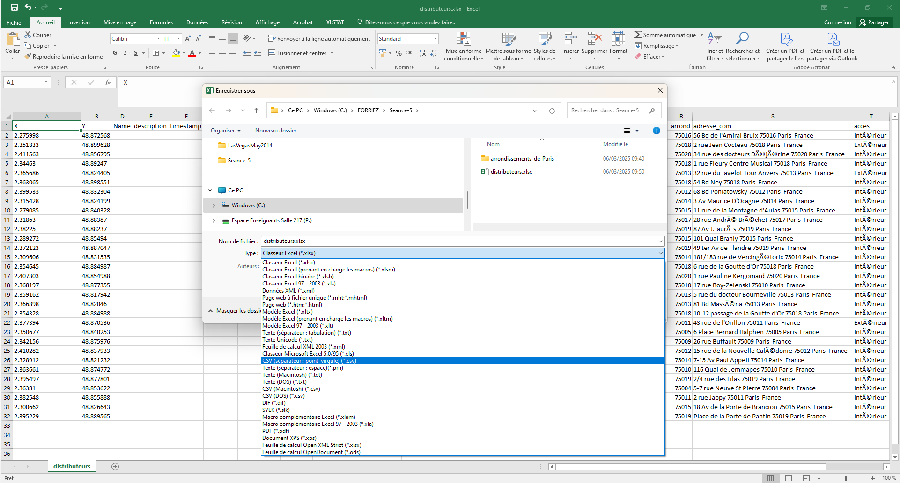
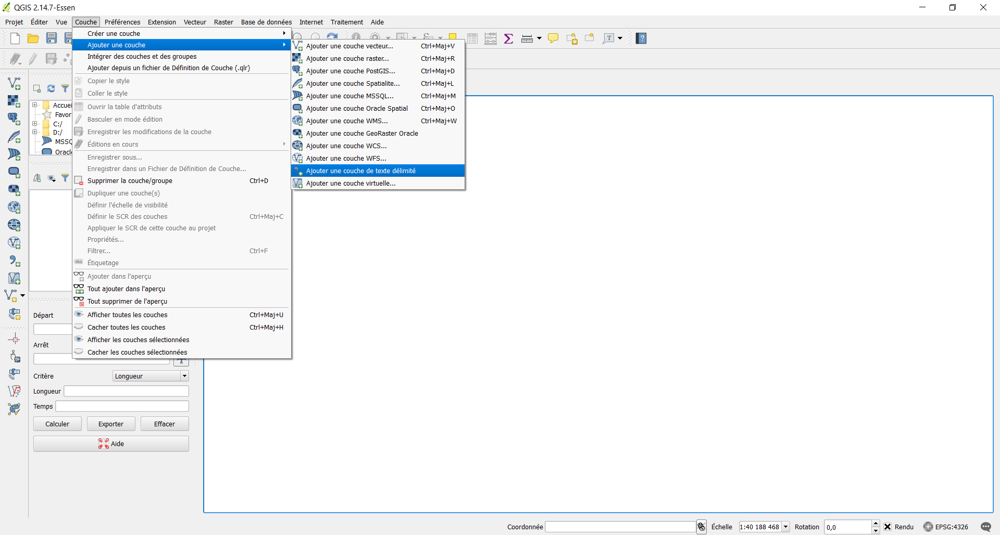

# Les requêtes S.Q.L.

- C.M. Les requêtes S.Q.L. (0h30)

- T.D. Manipulation des tables sous `Q-GIS` et `ArcGIS Online` (1h30)

	- Création d'une table à partir de points géolocalisés

	- Réalisation d'une jointure attributaire
	
	- Manipulation des tables avec des requêtes spatiales

	- Réalisation de statistique spatiale

Pour effectuer les savoir-faire que vous devez acquérir, cette présentation rapide des requêtes S.Q.L. par défaut sur n'importe quel logiciel de géomatique, vous montre comment faire sur `Q-GIS` et `ArcGIS Online`.

> [!NOTE]
> Ne jamais travailler directement sur les données d'origine. Toujours travailler sur une copie.

## Ressources

- `Q-GIS` : [https://tutoqgis.cnrs.fr](https://tutoqgis.cnrs.fr)

- Plugins de `Q-GIS` : [https://plugins.qgis.org/plugins](https://plugins.qgis.org/plugins)

## Tâche 0 : Utiliser `ChatGPT` correctement

[https://chatgpt.com](https://chatgpt.com)
1. « Agis comme un géomaticien »
2. « Écrire un projet en géomatique sur les pierres tombales »
3. « Créer un *story map* ArcGIS Online sur les pierres tombales dans le cadre d'une approche géomatique »

> [!WARNING]
> L'intelligence artificielle peut écrire n'importe quoi. On appelle ce phénomène une **hallucination**.
> Exemple : [https://www.youtube.com/watch?v=MtucJ2MnUh4](https://www.youtube.com/watch?v=MtucJ2MnUh4)

« Dans la société de l'information, personne ne pense. Nous avons cru élimner le paper, mais c'est la réflexion que nous avons bannie. » (Ian Malcolm, *in* Michael Crichton, 1992, *Jurassic Parc*, trad. Patrick Berthon, Paris, Robert Laffont, p. 101)

## Tâche 0 : Manipuler les fichiers `*.csv`

Pourquoi manipuler les fichiers `*.csv` plutôt que `*.xls` ?

C.S.V. signifie « *Common-Separated Values* ».

Les fichiers C.S.V. sont des fichiers universels, tandis que les fichiers Excel sont un format propriétaire. Ce statut dernier n'est pas pratique pour manipuler les données.

Prenons l'exemple de coordonnées géographiques compilées avec un mot-clé, ici `coordinates("...")`.

1. Sélectionner la colonne dans laquelle les données sont agrégées.

2. Cliquer sur « Recherche et sélectionner », puis « Remplacer par... »

3. Ici, on va modifier trois éléments :
	- `coordinates("` par rien, car on veut supprimer les valeurs ;
	- `")` par rien, car on veut supprimer les valeurs ;
	- `" "`, l'espace entre la latitude et la longitude par un `;`.

4. Changer le titre du champ `Coordonnées` par `Latitude;Longitude`.

Pour enregistrer les données du tableur en C.S.V., il faut :

1. Aller dans « Fichier »

2. Cliquer sur « Exporter », puis « Modifier le type de fichier »

3. Sélectionner « C.S.V. (séparateur : point-virgule) (.csv) », puis sur « Enregistrer sous »

4. Choisir le type de fichier « (séparateur : point-virgule) (.csv) »

5. Cliquer sur « Enregistrer »

## Tâche 1 : Savoir-faire un géoréférencement

Le géoréférencement est la base de n'importe quel système d'information géographique. Lors de la séance 2, nous avons injecté des données sans distinguer la couche dessin des données attributaires. Comme expliquer en C.M., cette pratique est à éviter. De fait, il faut bien séparer informations géométriques et informations attributaires. Le géoréférencement permet de réaliser le traitement des informations géométriques.

Reprenons la répartition spatiale des distributeurs de préservatifs masculins dans Paris. J'ai opéré un nettoyage du fichier original qui présentait des problèmes d'encodage, puis, à partir de lui, générer deux nouveaux fichiers :
- `distributeurs-coord.csv` ;
- `distributeurs-attribut.csv`.

Pour le géoréférencement, on utilisera le fichier `distributeurs-coord.csv`.

### Avec `Q-GIS`

> [!WARNING]
> J'ai utilisé la version 2.14.7. Si vous utilisez une version plus récente, il est possible que les commandes ne soient pas placées au même endroit. Il faudra consulter l'aide pour trouver les nouveaux emplacements.

1. Sous `Q-GIS`, le géoréférencement s'opère avec l'ajout d'une couche de texte délimité.

2. Une fenêtre s'ouvre, vous devez compléter l'intégralité des options signalées dans l'image ci-dessous.

3. Après avoir tout complété et validé, une nouvelle fenêtre s'ouvre : « Sélectionneur de système de coordonnées de référence ». C'est l'étape la plus importante. En effet, les coordonnées géographiques sont de nature différente d'une carte à l'autre. Il faut choisir le bon système de projection. Par défaut, les données tests présentes dans ce cours sont **toutes** en **degrés décimaux**, mais il faut bien comprendre que de nombreux systèmes utilisent les données métriques comme les systèmes Lambert en France.

Les systèmes de coordonnées géographiques possèdent tous un **code E.P.S.G.**. Il faut connaître les codes principalement utilisés dans son État. Nous allons utilisé le système international `WSG84`, codé `EPSG:4326`.

Voilà votre carte est désormais géoréférencée sous la forme d'un ensemble de lieux.

> [!TIP]
> Convertissez toutes vos coordonnées en degrés décimaux dans votre système d'information géographique.

### Avec `ArcGIS Online`

D'un logiciel à l'autre les étapes d'une même action peuvent être plus ou moins longue. Si, en trois étapes, `G-GIS` permettait de valider un géoréférencement, `ArcGIS Online` en nécessite beaucoup plus.

On utilise toujours le fichier `distributeurs-coord.csv`.

1. Après avoir cliqué sur « Ajouter une couche à partir d'un fichier », comme on l'a vu en [séance 2](../Seance-02/Seance-2.md), vous sélectionnez ajouter une couche à partir de votre appareil.

2. Sélectionner le nouveau fichier `distributeurs-coord.csv`

3. Laisser l'option par défaut

4. Vous retrouvez les mêmes paramétrages présentés dans `Q-GIS`. Toutefois, `ArcGIS Online` vous impose de bien définir le type des variables. Par défaut, il prédétermine les bons types.

5. Vous passez à la détermination des champs : latitude (champ `Y`) et longitude (champ `X`).

6. La fenêtre suivante vous permet de remplir les métadonnées.

7. Une fois la dernière étape validée, la carte que vous connaissez bien s'affiche.

> [!NOTE]
> Comme vous le constatez, le format du dessin est différent par rapport à votre premier testé. Des cercles concentriques représentent les lieux des distributeurs, ce qui est une représentation cartographique plus conforme par rapport à la sémiologie graphique.

## Tâche 2 : Savoir-faire une jointure attributaire

Une fois le géoréférencement effectué, vous n'avez plus les données attributaires accessibles. Il faut de fait joindre une table géométrique avec une table attributaire.

Dans le nouveau fichier, `distributeurs-coord.csv`, vous avez certainement remarqué le nouveau champ `ID`. Si vous ouvrez le fichier `distributeurs-attribut.csv`, vous remarquez que ce nouveau champ `ID` est également présenté. L'idée d'une jointure est de faire correspondre les deux identifiants `ID` afin de lier les informations géométriques avec les informations attributaires.

### Avec `Q-GIS`

1. Visualisons les données attributaires sur `Q-GIS`, en faisant un clic droit sur la couche dont on veut les informations géographiques, puis en sélectionnant « Ouvrir la table des attributs »

2. La table des attributs s'ouvre. Vous constatez que les données ne comportent que trois champs `ID`, `X` et `Y`. De fait, il faut bien opérer une jointure attributaire afin de lier données géométriques et données attributaires.

3. Pour insérer vos données attributaires, on opère la même opération que pour des données géométriques.

4. Lors de l'ouverture de la fenêtre qui vous est maintenant familière, il faut bien sélectionner l'option « Pas de géométrie ».

5. Une fois validée, on opère de nouveau un clic droit sur la couche dessin sur laquelle on veut faire la jointure, et on sélectionne « Propriétés ».

6. La fenêtre « Propriétés » s'ouvre. 

7. Cliquer sur l'onglet « Jointure », puis le bouton « + ».

8. La fenêtre permettant de paramétrer la jointure apparaît. Dans le cas présent, vous n'avez que deux tables, opérer la liaison entre elles est relativement simple, mais, en cours de votre apprentissage en géomatique, vous serez amené à avoir plusieurs couches en même temps. De fait, il faut bien faire attention à réaliser la bonne liaison.

9. On vérifie que la jointure s'est correctement opérée.

10. Comme vous le voyez, la liaison entre couche dessin et table attributaire est désormais opérante. On peut maintenant travailler sur la couche.

### Avec `ArcGIS Online`

1. Ajouter une couche à partir d'un fichier

2. Sélectionner le fichier `distributeurs-attribut.csv`

3. Laisser le paramètre par défaut

4. Vérifier la pré-sélection des types pour les champs de table attributaire

5. La nouvelle fenêtre doit afficher l'absence de données spatiales.

6. Compléter les métadonnées de la table attributaire. Il faut changer le nom pour pouvoir valider la table.

7. Vérifier que, dans l'onglet « Tables », la table attributaire apparaisse.

8. Aller dans l'onglet à droite « Analyse »

9. Choisir l'option « Joindre des entités »

10. Paramétrer la jointure

11. Une fois exécutée, la requête n'affiche pas la couche. Il faut la rechercher dans l'onglet « Couches » en cliquant directement sur « Ajouter ».

12. La liste des couches enregistrées dans votre profil apparaît. Choisir celle de la jointure en cliquant sur « Ajouter »a.

> [!WARNING]
> Le chargement de la couche de la jointure peut prendre un certain temps.

13. Vous pouvez visualiser les champs la jointure en cliquant sur « Couches », puis « output layer ».

14. La liste des champs apparaît.

15. Dans « Couches », la couche jointe est disponible.

16. Vous pouvez visualiser la table attributaire jointe.

17. Dans la fenêtre qui s'est ouverte, vous pouvez vérifier votre jointure.

> [!NOTE]
> Il existe plusieurs sortes de jointures S.Q.L. Dans `ArcGIS Online`, deux sont disponibles :
> - la jointure interne : toutes les valeurs dans l'une ou l'autre des tables de la jointure, il existe strictement le même nombre de *tuple*, donc d'identifiant.
> - la jointure à gauche : la couche dessin peut avoir davantage de *tuple* que la table attributaire à lui joindre. Dans ce cas, les valeurs manquantes contiendront des champs `NULL`.

## Tâche 3 : Savoir-faire une requête spatiale 

La notion de requête spatiale permet d'utiliser à son plein potentiel le langage S.Q.L.

Pour réaliser une requête spatiale, il faut **au moins deux couches**. De fait, on va poser un problème nécessitant une nouvelle couche.

**Problème.** Les données brutes des distributeurs ne répondent pas à toutes les questions géographiques que l'on pourrait se poser. Par exemple, combien de distributeurs existent-ils dans un arrondissement donné ? Pour répondre à cette question, il est possible d'opérer une **requête spatiale**.

Téléchargeons la couche des arrondissements de Paris.

### Avec `Q-GIS`

1. Ouvrir la couche des arrondissements de Paris.

> [!TIP]
> Si la couche des arrondissements recouvre celle des distributeurs, il faut changer l'ordre des couches dans l'onglet des couches les glissant dans l'ordre voulu. Plus la couche est vers le haut, plus elle est en avant-plan.

2. Aller dans l'onglet « Vecteurs ». Sur `Q-GIS`, cet onglet contient toutes les requêtes spatiales possibles.

3. Il faut bien paramétrer la requête. Sur `Q-GIS`, il faut impérativement nommer et créer une nouvelle couche, ici `test.shp`, mais vous pouvez lui donner un nom plus clair.

4. La nouvelle couche apparaît en avant-plan. Il faut la placer sous la couche des distributeurs pour que vous voyez de nouveau les points.

5. Faire un clic droit sur la couche `Test` et cliquer sur « Ouvrir la table d'attributs »

6. Comme vous le constatez, le nouveau champ est apparu dans les données attributaires de la table des arrondissements de Paris originale.

> [!TIP]
> Chaque requête spatiale dépend à la fois de la forme géométrique :
> - point ;
> - polyligne ;
> - polygone.
> mais également de ce que l'on souhaite créer.

### Avec `ArcGIS Online`

Pour charger la couche sur les arrondissements de Paris sur `ArcGIS Online`, il faut convertir les données *shapefile* en `*.geojson` en appliquant la méthode sur `Q-GIS` que l'on a vue en [séance 2](../Seance-02/Seance-2.md). En effet, le fichier `GeoJSON` permet de mieux conserver les polygones de la couche initiale.

1. Charger la couche `arrondissements.geojson` que vous avez créée dans `Q-GIS`. Il faudra changer le nom de la couche, car il existe déjà des couches sur les arrondissements de Paris enregistrées dans l'application `ArcGIS Online`.

2. À droite, aller dans l'onglet « Analyses », cliquer sur « Synthétiser des localisation », puis sur « Joindre des entités »

3. Le menu obtenu vous est déjà connu.

4. On paramètre la requête spatiale. Ici, on souhaite que les polygones n'ayant pas de points affichent la valeur `0`. La jointure est de fait **à gauche**.

5. On clique sur la couche que l'on vient de créer, et un attribut `Join_Count` a été créé. Il matérialise le nombre de distributeurs par arrondissement.

## Tâche 4 : Savoir-faire une statistique spatiale

On a compté les distributeurs par arrondissement. Maintenant, peut-on spatialiser le résultat avec des cercles proportionnels par exemple ? La réponse est affirmative. Pour ce, on utilise des outils de statistique spatiale.

### Avec `Q-GIS`

1. Clic droit sur la couche, et ouvrir « Propriétés »

2. Aller dans l'onglet « Diagrammes »

3. Cliquer sur « Montrer les diagrammes pour cette couche »

4. Sélectionner les champs dont on veut faire la statistique

5. Paramétrer les cercles proportionnels

6. Une fois validée, une cartographie statistique a été opérée. Les cercles proportionnels avec la valeur de l'attribut est apparu. Toutefois, la position du cercle est par défaut légèrement décalé, ce qui peut être une source d'erreurs à la lecture de la carte produite. Il faut par conséquent modifier ce résultat.

7. Ouvrir les propriétés de la couche, et centrer la couche sur le centroïde. Ce dernier correspond mathématiquement au barycentre de la forme polygonale, ici un arrondissement.

8. Le résultat obtenu est plus conforme à la sémiologie graphique en cartographie.

### Avec `ArcGIS Online`

1. Aller sur l'onglet à droite « Style »

2. Sélectionner le champ `Join_Count`

3. Paramétrer vos cercles proportionnels. Automatiquement, `ArcGIS Online` sélectionne la bonne sémiologie graphique, mais vous devez obligatoirement vérifier le choix du logiciel.

4. Le résultat est directement visible sur la carte.

5. Organiser les couches

6. Afficher la légende grâce à l'onglet gauche « Légende »

## Tâche 5 : Faire une discrétisation statistique des données attributaires

La **discrétisation des données attributaires** découpe une série statistique en classes de valeurs, et la cartographie. Elle est en lien avec les méthodes statistiques. Elle est à la discrétion de celui qui crée la carte. Elle permet de créer des **seuils** soit naturels, soit observés. Elle induit le respect des représentations cartographiques (cercles proportionnels, gradients de couleur, *etc*.).

Il existe cinq méthodes possibles, disponibles en fonction du logiciel utilisé :
- la méthode des amplitudes égales, définie par $\frac{valeur maximale - valeur minimale}{étendue}$ ;
- la méthode des effectifs égaux, définie par des quantiles ;
- la méthode par discrétisation standardisée, définie par la moyenne et l'écart type ;
- les méthodes par progression géométrique ;
- la méthode de George Frederick Jenks (1916-1996), basée sur la ressemblance et dissemblance en minimisant la variance interclasse ou en maximisant la variance interclasse.

À vous de découvrir les commandes sous `Q-GIS` ou `ArcGIS Online`.

## Bonus : l'ensemble des requêtes spatiales possibles

- Utiliser les outils pour mesurer les distances. On peut mesurer un « effet distance » en créant des diagrammes mesurant une distance par rapport à un lieu en kilomètres ou en mesures de temps (abscisse) par rapport à une valeur attributaire (ordonnée).

- Réaliser une analyse de graphes

- Réaliser des agrégations spatiales. Les agrégations spatiales permettent de fusionner des objets géographiques. Il faut bien contrôler le comportement de l'agrégation des données attributaires (somme, moyenne, `NULL`, *etc*.).

- Créer des zones tampons. Les zones tampons (ou *buffer*) permettent de définir une enveloppe autour d'un point ou d'un objet par rapport à une distance.

- Découper les informations spatiales. Le découpe des informations spatiales s'effectue par l'intermédiaire d'un **pochoir** ou d'un **masque**.

- Créer une enveloppe. Une enveloppe d'un nuage de points permet de relier les points à l'extrémité du nuage considéré.

- Faire des analyses intégrant la distance
	- Aire d'attraction
	- Autocorrélation spatiale

- Réaliser des analyses de surface
	- Analyse de pente, de profil, d'exposition et de volume
	- Analyses de visibilité
	- Analyses hydrologiques

- Concevoir une analyse spatiale multicritère

## Conclusion : `Q-GIS` ou `ArcGIS Online` ?

Les manipulations sont rendues un peu plus complexes ou verbeuses sur `ArcGIS Online`, mais vous pouvez constater que l'on peut opérer les mêmes manipulations S.Q.L. que l'on soit sur `Q-GIS` ou sur `ArcGIS Online`.

## Approfondissement : les [requêtes S.Q.L. en console](../Seance-07/Seance-7.md)
