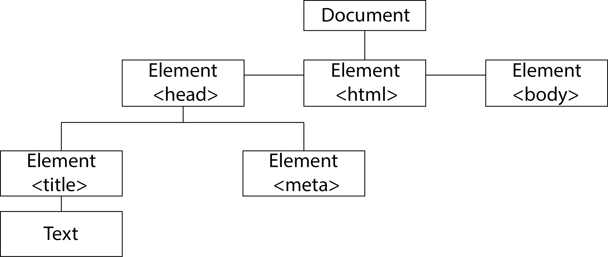
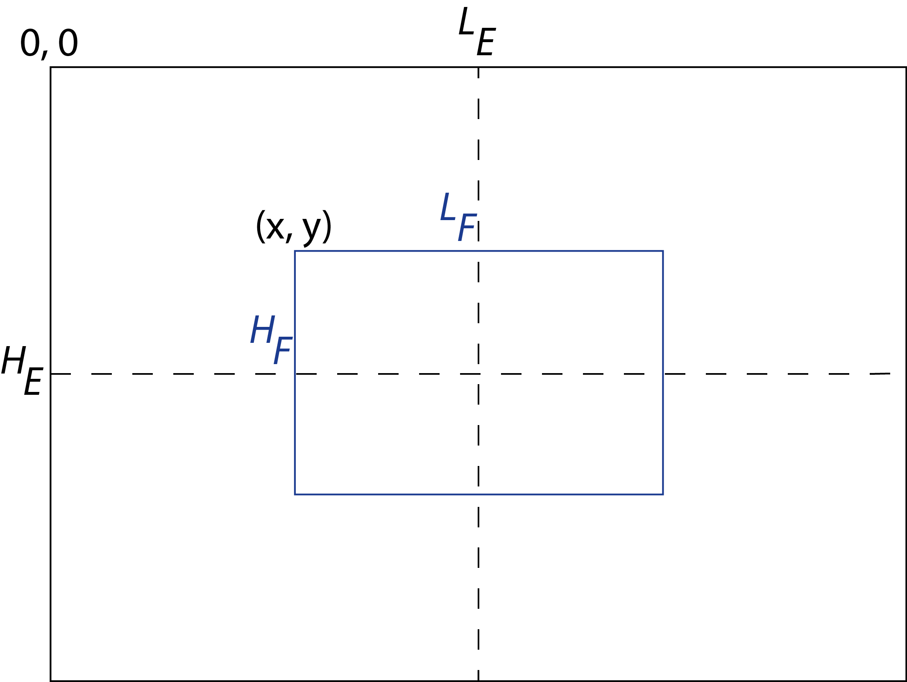
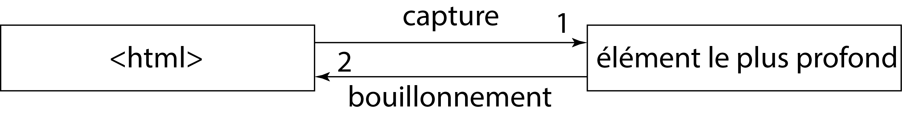

# Notions avancées du `JavaScript`

- C.M./T.D. Notions avancées du `JavaScript`

	- Formulaires et balises génériques du `HTML`

	- Principes du D.O.M. et du B.O.M.
		
	- Gestion des événements

	- Approfondissements (outils non utiles pour les `OpenLayers`, mais facilitant la programmation)

> [!WARNING] 
> Au terme de cette séance, vous connaîtrez l'essentiel du langage, mais il vous faudra apprendre en permanence de nouvelles fonctions, de nouveaux objets, de nouvelles techniques de codage, *etc*.

L'objectif de la séance est d'apprendre à manipuler les événements en `JavaScript`. Ils vous permettront de gérer des fonctionnalités de base sur vos cartes `OpenLayers` en utilisant les balises `HTML` d'un formulaire.

## Les balises `HTML` d'un formulaire

### Construire un formulaire

```
<form>
	method = "get"
	action = "URL de traitement"
	name = "..."
	target = "_self"
	autocomplete = "on"
	enctype = "multipart/form-data"
	accept-charset = "UTF-8"
	novalidate = "novalidate"
>

	éléments du formulaire
	
</form>
```

- `get` est la valeur par défaut. Vous pouvez également choisir `post+`.
	- `get` envoie les données *via* l'U.R.L. : `&champ1=...;`.
	- `post` envoie les données par l'intermédiaire d'un fichier.
- Si `action = ""`, alors les données sont envoyées à la page elle-même.
- L'attribut `name` donne un nom au formulaire.
- L'attribut `target = "_self"` est la valeur par défaut. Il fixe le contexte d'envoi du formulaire. Il existe également `_blank` ou `_top` ou `_parent`.
- L'attribut `autocomplete = "on"` est la valeur par défaut. On peut également lui mettre `off`. L'attribut active ou désactive l'autocomplétion du formulaire. En général, cela enregistre les choix précédents de l'utilisateur si l'ordinateur client l'a enregistré.
- L'attribut `enctype = "multipart/form-data"` envoie des fichiers d'attribut M.I.M.E.
- L'attribut `accept-charset = "UTF-8"` spécifie un ou plusieurs encodages.
- L'attribut `novalidate = "novalidate"` (ou `""`) désactive l'impératif de validation des données côté client lors de la soumission du formulaire.

### Les attributs universels des éléments du formulaire

`name = "..."` donne un nom à l'élément.

`value = "..."` renvoie la valeur à enregistrer. Elle peut être différente de l'affichage.

`id = "..."` donne un identifiant associé avec l'attribut `for` de `<label>`.
- La balise `<label>` est associée à un élément du formulaire. Elle se place avant celui-ci. Elle décrit le champ. `<label for = "nomDuLabel"><` *élément* `id = "nomDuLabel"></label>`
- `id` et `name` doivent être différents.

`placeholder = "..."` décrit la saisie demandée dans le champ de texte par exemple ; la valeur s'efface lors de la saisie de l'élément.

`disabled` permet de bloquer la saisie d'un élément du formulaire.
- La valeur ne peut être enregistrée sous cette forme.

- [Non standard] `required` permet de demander une saisie obligatoire.

- [Non standard] `maxlength = "..."` permet de fixer un nombre de caractères.

### Les éléments `<input>`

`<input type="text" name="..." id="..." size="..." placeholder="..." autocomplete="on" pattern="...">` : saisir une valeur dans un champ
- `size` : dimension du champ de saisie
- `pattern` : expression régulière

`<input type="password" name="..." id="..." size="..." placeholder="..." autocomplete="off" pattern="...">` : saisir une valeur en mode mot de passe

`<input type="tel" name="..." id="..." value="...">` : saisir un numéro de téléphone

`<input type="url" name="..." id="..." value="...">` : saisir un U.R.L. ou un U.R.I.

`<input type="email" name="..." id="..." value="..." multiple>` : saisir un courriel
- `multiple` signifie que l'on souhaite mettre plusieurs adresses.

`<input type="search" name="..." id="..." value="...">` : saisir un champ de recherche

`<input type="date" name="..." id="..." value="..." min="..." max="..." step="...">` : saisir une date

`<input type="time" name="..." id="..." value="..." min="..." max="..." step="...">` : saisir un horaire

`<input type="datetime" name="..." id="..." value="..." min="..." max="..." step="...">` : saisir une date et un horaire

`<input type="datetime-local" name="..." id="..." value="..." min="..." max="..." step="...">` : saisir une date et un horaire locaux

`<input type="month" name="..." id="..." value="..." min="..." max="..." step="...">` : saisir un mois

`<input type="week" name="..." id="..." value="..." min="..." max="..." step="...">` : saisir une semaine

`<input type="number" name="..." id="..." value="..." min="..." max="..." step="...">` : saisir une valeur numérique

`<input type="range" name="..." id="..." value="..." min="..." max="..." step="...">` : saisir une valeur numérique d'un intervalle

`<input type="color" name="..." id="..." value="...">` : saisir un couleur R.V.B.

`<input type="hidden" name="..." id="...">` : créer un élément caché

`<input type="radio" name="..." id="..." value="..." checked>` : créer un bouton radio
- `checked` pour cocher le bouton radio
- Pour lier plusieurs boutons radio, il faut leur mettre le même `name`.

`<input type="checkbox" name="..." id="..." value="..." checked>` : créer une case à cocher
- Pour lier plusieurs cases à cocher, il faut leur mettre le même `name`.

`<input type="file" name="..." id="..." accept="*.csv" multiple>` : faire télécharger un fichier
- `accept` définit le format de fichier demandé :
	- `application/und.ms-excel`
	- `application/und.openxmlformats-officedocument.spreadsheetml.sheet`
	- `sheet`
	- `text/plain`
	- `text/html`
	- `image/*` avec `*` signifiant tous les formats
	- `video/*`
	- `audio/*`
	- `.pdf`
	- *etc*.
- On peut en mettre plusieurs si on les sépare par une virgule.

`<input type="image" name="..." id="..." alt="..." src="...">` : créer une image cliquable
- Les attributs suivants sont obsolètes : `height`, `width`, `hspace`, `vspace` et `border`.
	\end{description}

`<input type="button" name="..." id="..." value="...">` : créer un bouton

`<input type="reset" name="..." id="..." value="...">` : créer un bouton effaçant les données saisies

`<input type="submit" name="..." id="..." value="...">` : créer un bouton soumettant les données saisies

### Les autres éléments

`<textarea name="..." rows="..." cols="..." placeholder="..." wrap="soft" minlength="..." maxlength="...">...</textarea>` : créer une zone de texte
- `rows` : fixer le nombre de lignes
- `cols` : fixer le nombre de colonnes
- `wrap` : gérer les retours à la ligne avec `"soft"` par défaut et `"hard"`
- `minlength` : fixer un nombre minimal de caractères
- `maxlength` : fixer un nombre maximal de caractères

```
	<select name="..." size="..." multiple>
		<optgroup label="...">
			<option selected label="..." name="..." value="...">...</option>
			<option>...</option>
			...
		</optgroup>
		<optgroup>
			<option>...</option>
			...
		</optgroup>
	</select>
```

- Si l'attribut `multiple` est autorisé, la saisie multiple s'opère avec `ctrl`.
- `<optgroup>` est une balise facultative.
- `selected` signifie que la valeur est sélectionnée.

`<button type="..." name="..." value="...">` : créer un bouton en-dehors d'un formulaire
- `type` a pour valeurs au choix : `button`, `reset` ou `submit`.
- Il possède quelques options empruntées aux formulaires :
	`formmethod="post"` ou `formmethod="get"` ;
	`formaction="page URL"`.

```
	<input list="nom">
	<datalist id="nom">
		<option value="...">valeur</option>
		...
	</datalist>
```

Elle permet d'ajouter un champ de saisie (`list`) en plus de valeurs proposées par défaut (`datalist`).
- Ce n'est pas standard. Le navigateur `Safari` refuse cette option.

`<keygen name="..." id="..." challenge="..." keytype="...">...</keygen>` : créer une clé cryptée.

```
	<fieldset name="..." id="..." form="nom de l'id" disabled>
		<legend>titre de la section</legend>
		éléments du formulaire
	</fieldset>
```

Cela permet de définir des sections. `form` assure la liaison avec le bon formulaire qui s'opère par l'`id` renseigné dans les balises `<form>`.

## Le *Document Object Model* (D.O.M.)

Le D.O.M. est séparé en trois parties :
- **le** `XML` ;
- **le** `HTML` ;
- **le cœur est accessible par les deux**.

Le D.O.M. est une interface, chargée dès l'ouverture de la page `HTML`. Il s'agit d'un arbre.

Dans le D.O.M. `HTML`, tout va être considéré comme un nœud (ou *node* en anglais). `Node` désigne tout objet contenu dans le D.O.M. :
- `document HTML`
- `elements HTML`
- `attributes HTML`
- `texts HTML`

Il existe de fait plusieurs types de nœuds :
- `ElementNode`
- `AttributeNode`
- `TextNode`

Le D.O.M. `HTML` est construit comme une hiérarchie de nœuds (Fig. \ref{td3fig9}).



> [!NOTE]
> Tous les navigateurs depuis quelques années ont le même D.O.M., ce qui facilite le codage en `JavaScript`.

## Les balises `<div>` et `<span>`

Les balises `<div>` et `<span>` permettent de structurer le code `HTML`, notamment dans sa mise en forme. C'est pour cela qu'elles sont souvent liées avec le `CSS`, mais elles permettent également de structurer le code `JavaScript` au sein du D.O.M.

### La balise `<div>`

Un fichier `CSS` est indispensable pour formater le contenu d'une balise `<div>`. *A minima*, la balise contient un identifiant `id`. Elle forme un **bloc de contenu**.
```
	<div id="div1">
		Contenu du <div>
	</div>
```

> [!NOTE]
> Il est possible de définir directement le style `CSS` avec l'attribut `style="` *code C.S.S.* `"`. Chaque instruction `CSS` est séparée par un point-virgule, et l'attribut est séparé de sa valeur par un deux points `:` Par exemple~:
```
	style="position:absolute;"
```

### La balise `<span>`

La balise `<span>` est dédié aux petits ensembles, notamment le contenu textuel. Elle dispose *a minima* d'un identifiant `id`.

> [!NOTE]
> Il est possible de définir directement le style `CSS` avec l'attribut `style="` *code C.S.S.` `"`.

### L'usage

`<div>` **et** `<span>` **sont indispensables dans la structuration d'une page** `HTML`.

## Les attributs universels des balises `HTML`

Certains attributs peuvent s'employer dans toutes les balises. Ils servent de repères au feuille de style `CSS` ou aux scripts `JavaScript`. D'autres permettent simplement de faciliter la navigation.

L'attribut `id="..."` donne un identifiant à la balise qui est **unique** dans toute la page. Il sert à la création d'une ancre appelée par un `#` dans la page `HTML` ou `CSS`. Il est très utile pour la programmation en `JavaScript`.

L'attribut `class="..."` aide à la mise en forme `CSS` et à la programmation en `JavaScript`. Plusieurs balises peuvent avoir la même classe.
- On peut mettre plusieurs noms séparés par un espace `nom1 nom2 nom3`.
- Les classes sont appelées par un point `.` en langage `CSS`.

L'attribut `style="..."` définit directement un style `CSS` dans une balise.
- Hormis les phases de tests, cet usage est à éviter.

L'attribut `title="..."` crée une infobulle.

L'attribut `lang="fr"` définit la langue du contenu.
- `"fr"` $\rightarrow$ français
- `"de"` $\rightarrow$ allemand
- `"ja"` $\rightarrow$ japonais
- `"en"` $\rightarrow$ anglais
- `"zh-Hant"` $\rightarrow$ chinois traditionnel
- `"zh-Hans"` $\rightarrow$ chinois simplifié
- `"sr-Cyr"` $\rightarrow$ cyrillique
- `"sr-Latn"` $\rightarrow$ latin
- `"en-US"` $\rightarrow$ anglais états-unien
- `"es-419"` $\rightarrow$ espagnol sud-américain
- *etc*.

L'attribut `dir="..."` indique le sens de la lecture d'un contenu.
- `"auto"`
- `"ltr"`
- `"rtl"`

L'attribut `tabindex="0"` introduit une numérotation caractérisant une navigation par la touche tabulation du clavier. Le numéro, unique, indique l'ordre de lecture des contenus, notamment des formulaires.

L'attribut `contenteditable="true"` indique si l'élément est éditable ou pas.

L'attribut `hidden="true"` permet de masquer l'élément sur le navigateur.

L'attribut `draggable="true"` autorise le déplacement d'un élément sur le navigateur.

[obsolète] L'attribut `accesskey="..."` n'accepte que des entiers.

Un certain nombre d'attributs sont en cours d'expérimentation. Par exemple, le navigateur `FireFox` utilise `contextmenu` dans sa balise `<menu>`, ou encore~:
- `itemid`
- `itemscope`
- `itemprop`
- `itemtype`
- `itemref`
- `slot`
- `spellcheck`
- `translate`
- `dropzone`

Pour finir, il faut noter qu'il est possible de **créer ses propres attributs**. Ils sont utilisés avec `JavaScript`.
- Exemple~: `data-location="Paris"`

## L'objet `document`

### Les propriétés d'affichage de l'objet `document`

`let doc = new Document();` permet de créer un objet `document`.

La première propriété d'affichage, largement utilisée, est `document.write(...)`. Elle permet d'afficher dans le `body` à peu près tous les éléments `HTML` générés par `JavaScript`, à l'exception de certains éléments comme les images.

### Les accès directs aux éléments

Le `document` contient un ensemble de nœuds, dont certains sont directement accessibles.

`document.head` renvoie à l'élément `head` du document courant.

`document.title` permet d'accéder ou de définir le titre du document courant.
```
	let docTitre = document.title;
	document.title = "Nouveau titre";
```

`document.body` renvoie le nœud `body` ou `frameset`.
- Il est possible de modifier ses attributs.
	- `document.body.id` permet de donner ou de modifier l'identifiant de `body`.
- Il est possible de modifier le corps lui-même.
	- `document.body.innerHTML = "..."` permet de modifier le code `HTML` de `body`.
- Même si `body` est modifiable, lui affecter une nouvelle valeur retire tous les éléments enfants du `body` existant.

Il existe un certain nombre de tables permettant de lister l'accès et de modifier certains éléments. Leur ordre suit leur insertion dans `body`.
- La balise `<a>` gère les liens internes au document, les **ancres**, et les liens externes, les **liens** :
	- [obsolète] [lecture seule] `document.anchors`
	- [lecture seule] `document.links`
La propriété d'instance `length` permet d'obtenir la taille de la table.
	- [obsolète] [lecture seule] `document.anchors.length`
	- [lecture seule] `document.links.length`
Il en existe d'autres affectées aux éléments de la table : `name` et `href`. Introduire un nouveau lien est simple. Il suffit d'utiliser :
	- `document.write("<a href=\"lien\" name=\"lien1\">nom du lien</a>");`
Le lien s'ajoute à la liste des `anchors` ou des `links`. Cela permet de contourner la lecture seule des tables. Toutefois, il est possible de modifier les attributs d'un lien existant.
	- `document.links[0].href = "...";`
	- `document.links[0].name = "...";`
> [!NOTE]
> `JavaScript` ne trouve que les liens placés avant la balise `<script>`.
- La balise `<form>` est accessible en lecture seule avec : `document.forms[...]`.
- La balise `` est accessible en lecture seule avec : `document.images[...]`.
	
`document.activeElement` renvoie l'objet `Element`, c'est-à-dire à l'élément qui possède le focus, `body`, ou `null` si aucun élément n'a le focus. Il contient uniquement les propriétés et méthodes communes à l'ensemble des éléments. Le focus détermine l'élément qui recevra les informations saisies. Il se différencie de la sélection, c'est-à-dire la partie actuellement surlignée dans le document.
> [!WARNING]
> Pour accéder à la sélection courante, on peut utiliser la méthode `window.getSelection()`.

`document.documentElement` renvoie l'objet `Element` correspondant à l'élément qui est un enfant direct du document. Cela fonctionne en lecture seule.

La plupart des propriétés de `document` sont quasiment toutes accessibles en **lecture seule**.
- `document.characterSet` renvoie le jeu de caractères utilisés par le document. Cela fonctionne en lecture seule.
- `document.docType` renvoie la définition type de document (ou en anglais : *Document Type Definition* (D.T.D.)) du document courant. Cela fonctionne en lecture seule.
- `document.fonts` renvoie l'interface `FontFaceSet` pour le document courant.
- `document.styleSheets` renvoie un objet `StyleSheetList` contenant les objets `CSSStyleSheet` pour les feuilles de style `CSS` liées explicitement ou embarquées dans le document. Cela fonctionne en lecture seule.
- `document.readyState` renvoie à l'état de chargement du document. Cela fonctionne en lecture seule. Si le document est chargé, la valeur renvoyée est `loading`.
- `document.hidden` renvoie une valeur booléenne qui indique si la page est considérée masquée ou non. Cela fonctionne en lecture seule.
- `document.domain` retourne ou définit la partie de l'origine du document courant, telle qu'utilisée par la politique d'origine (protocole, port et hôtes identiques).
- `document.URL` renvoie l'emplacement du document sous la forme d'une chaîne de caractères. Cela fonctionne en lecture seule.
- `document.URI` renvoie l'emplacement du document sous la forme d'une chaîne de caractères. Cela fonctionne en lecture seule.
- `document.location` renvoie l'U.R.I. du document courant. Cela fonctionne en lecture seule.
- `document.referrer` renvoie l'U.R.I. de la page qui a lié vers cette page. Cela fonctionne en lecture seule.
 `document.children` renvoie les éléments enfants pour le document courant. Cela fonctionne en lecture seule.
- `document.childElementCount` renvoie le nombre d'éléments enfants pour le document courant. Cela fonctionne en lecture seule.

Il existe de nombreuses propriétés et méthodes obsolètes.
- `document.height` renvoie la hauteur du document.
- `document.width` renvoie la largeur du document.
- `document.fullscreen` renvoie un booléen indiquant si l'écran est en mode « plein écran ».
- `document.linkColor(...)` définit la couleur des liens non visités
- `document.vlinkColor(...)` définit la couleur des liens visités.
- `document.alinkColor(...)` définit la couleur des liens lors de leur activation.
- `document.bgColor = "black"` permet de contrôler la couleur de fond du `body`.

> [!NOTE]
> Les méthodes hexadécimales vues auparavant permettant de gérer les codes couleurs des fonds, notamment avec la méthode `toString(16)`.

> [!NOTE]
> L'obsolescence de ces propriétés et méthodes s'explique par la généralisation de l'usage des feuilles et codes C.S.S.

#### L'accession aux éléments par les identifiants

Pour bien comprendre, on va utiliser la page `HTML` suivante jusqu'à la fin de la partie.
```
	<!DOCTYPE html>
	<html lang="fr">
		<head>
			<meta charset="utf-8">
			<title>Cours de JavaScript</title>
		</head>
		<body>
			<h1 id="titrePage">Gestion de l'objet document avec <span style="font-style:italic;">JavaScript</span></h1>
			<div>
				<p id="para1" class="para">Premier paragraphe</p>
				<p id="para2" class="para">Deuxième paragraphe</p>
			</div>
			<script src="..."></script>
		</body>
	</html>
```

Pour accéder à l'identifiant `"titrePage"`, il suffit d'écrire :
```
	let titre = document.getElementById("titrePage");
```

#### L'accession par les balises

```
	let tableauParagraphe = document.getElementsByTagName("p");
```

livre tous les éléments de la balise `<p>`. La méthode renvoie une table.

#### L'accession par les classes

```
	let tableauParagraphe = document.getElementsByClassName("para");
```

livre tous les éléments marqués par l'attribut classe `"para"`. La méthode renvoie une table.

#### L'accession par les sélecteurs `CSS`

```
	let p1 = document.querySelector("p");
```

affiche le premier élément `<p>` trouvé.

```
	let paragraphes = document.querySelectorAll(".para");
```

livre tous les éléments de la classe `"para"`. La méthode renvoie une table.

#### L'accession par la propriété `innerHTML`

`innerHTML` permet de récupérer les informations contenues dans un élément `HTML`, entre deux balises.
```
	let titre = document.getElementById("titrePage").innerHTML;
```

Résultat : `Gestion de l'objet document de JavaScript` (avec italique)

> [!WARNING]
> `innerHTML` est une propriété de `Element`.

> [!NOTE]
> `Internet Explorer` dispose de la propriété `innerText`.

#### L'accession par la propriété `textContent`

`textContent` permet de récupérer le texte, et uniquement le texte, contenu entre deux balises.
```
	let titre = document.getElementById("titrePage").innerHTML;
```

Résultat : `Gestion de l'objet document de JavaScript` (sans italique)

> [!WARNING]
> `textContent` est une propriété de `Element`.

> [!NOTE]
> Depuis sa version 9, `Internet Explorer` accepte la propriété `textContent` qui récupère le texte sans balises.

### La modification du contenu `HTML`

> [!NOTE]
> On utilise toujours la même page `HTML`.

#### Par la propriété `innerHTML` ou `textContent`

```
	document.getElementById("titrePage").innerHTML = "Gestion de l'objet document de JavaScript-v2";
```

ou

```
	document.getElementById("titrePage").textContent = "Gestion de l'objet document de JavaScript-v2";
```

#### Par l'attribut d'une balise

```
	let titre = document.getElementById("titrePage");
	titre.id = "titreV2";
```

Dans ce cas, les attributs sont **directement** accessibles.

> [!NOTE]
> On peut utiliser `getAttribute()`.
> ```
> 	titre.getAttribute("id");
> ```

puis `setAttribute()`
```
	titre.setAttribute("id", valeur de l'attribut);
```

Les méthodes sont celles de l'objet `Element`.

> [!WARNING]
> Les `class` dans les balises sont modifiées par un `className`, afin de ne pas confondre avec l'objet `JavaScript` du même nom.
> ```
> 	let tableauParagraphe = document.getElementsByTagName("p");
> 	tableauParagraphe[0].className = "para1";
> ```

> [!NOTE]
> On peut créer dans n'importe quelle balise un attribut `data-` *quelque chose* `=...`. Grâce à la propriété `dataset`, on peut récupérer l'attribut créé.
- *élément* `.dataset.` *quelque chose* `;`

#### Par les propriétés `CSS`

```
	titre.style.color = "red";
	titre.style.fontFamily = "Arial";
```

Voici la liste non exhaustive des propriétés C.S.S. accessibles en `JavaScript` :
- `background`
- `backgroundAttachment`
- `backgroundColor`
- `backgroundImage`
- `backgroundPosition`
- `backgroundPositionX`
- `backgroundPositionY`
- `backgroundRepeat`
- `border`
- `borderBottom`
- `borderBottomColor`
- `borderBottomStyle`
- `borderBottomWidth`
- `borderColor`
- `borderLeft`
- `borderLeftColor`
- `borderLeftStyle`
- `borderLeftWidth`
- `borderRight`
- `borderRightColor`
- `borderRightStyle`
- `borderRightWidth`
- `borderStyle`
- `borderTop`
- `borderTopColor`
- `borderTopStyle`
- `borderTopWidth`
- `clear`
- `color`
- `cssText`
- `cursor`
- `display`
- `filter`
- `font`
- `fontFamily`
- `fontSize`
- `fontStyle`
- `fontVariant`
- `fontWeight`
- `height`
- `left`
- `letterSpacing`
- `lineHeight`
- `listStyle`
- `listStyleImage`
- `listStylePosition`
- `listStyleType`
- `margin`
- `marginBottom`
- `marginLeft`
- `marginRight`
- `marginTop`
- `paddingBottom`
- `paddingLeft`
- `paddingRight`
- `paddingTop`
- `pageBreakAfter`
- `pageBreakBefore`
- `pixelHeight`
- `pixelLeft`
- `pixelTop`
- `pixelWidth`
- `posHeight`
- `position`
- `posLeft`
- `posTop`
- `posWidth`
- `styleFloat`
- `textAlign`
- `textDecoration`
- `textIndent`
- `textTransform`
- `top`
- `verticalAlign`
- `visibility`
- `width`
- `whiteSpace`
- `zindex`

Pour récupérer un style existant, on utilise `getComputedStyle(...)` ou `currentStyle`.
```
	getColor = getComputedStyle(titre, null).color;
```

> [!WARNING]
> `null` est obligatoire.

> [!NOTE]
> Avant la version 9 d'`Internet Explorer`, on devait utiliser :
> ```
> 	getColor = titre.currentStyle.color;
> ```

Certaines valeurs de positionnement ou de taille des éléments utilisent les propriétés `offset` :
- `offsetWidth`
- `offsetHeight`
- `offsetLeft`
- `offsetTop`
- `offsetParent`

qui contient l'objet de l'élément parent par rapport auquel est positionné l'élément courant.

On peut ajouter un style à l'élément sélectionné.
```
	const element = document.getElementById("id");
	element.classList.add("classe CSS");
```

> [!NOTE]
> On peut mettre plusieurs styles en les séparant par une virgule.

On peut supprimer un style à l'élément sélectionné.
```
	element.classList.remove("classe CSS");
```

On peut vérifier l'existence d'une classe C.S.S.
```
	element.classList.contains("classe CSS");
```

On peut ajouter ou retirer une classe C.S.S.
```
	element.classList.toggle("classe CSS");
```

On peut gérer le `padding` de l'écran client (largeur et hauteur).
```
	element.clientWidth;
	element.clientHeight;
```

On peut gérer le `border` (épaisseur).
```
	element.clientLeft;
	element.clientTop;
```

### L'ajout et l'insertion d'éléments `HTML`

#### Création d'un nouvel élément en fin de nœud

```
	let nouveauParagraphe = document.createElement("p");
```

crée un élément `<p>`.

```
	nouveauParagraphe.id = "paraV2";
	let texteNouveauParagraphe = document.createTextNode("Paragraphe inséré");
```

crée le contenu textuel de la balise `<p>`.

```
	nouveauParagraphe.appendChild(texteNouveauParagraphe);
```

insère dans le dernier élément enfant ciblé, ici le texte dans le paragraphe.

```
	document.body.appendChild(nouveauParagraphe)
```

insère la balise `<p>` et son contenu à la fin du `body`.

#### Création d'un nouvel élément placé avant un élément identifié

`insertBefore(` *objet à insérer*`,` *objet avec identifiant devant lequel il est inséré* `)` L'objet avec identifiant devant lequel il est inséré, doit être obtenu par un `getElementById`, **et seulement par cette méthode**.

> [!WARNING]
> `insertAfter` n'existe pas !

```
	let dernierParagraphe = document.getElementById("para2");
	let noeud = dernierParagraphe.parentNode; // ou childNodes, firstChild, lastChild, nextSibling
	let nouveauParagraphe = document.createElement("p");
	let texteNouveauParagraphe = document.createTextNode("Troisième paragraphe");
	nouveauParagraphe.appendChild(texteNouveauParagraphe);
	noeud.insertBefore(nouveauParagraphe, dernierParagraphe);
	nouveauParagraphe.id = "paragraphe4";
	nouveauParagraphe.className = "paragraphe";
	nouveauParagraphe.style = "";
```

### La modification ou la suppression des éléments `HTML`

#### Suppression d'un élément

```
	let parent = document.body;
	parent.removeChild(nouveauParagraphe);
```

#### Suppression d'un élément (ou d'un nœud)

```
	let nouveauTitre = document.create("h1");
	nouveauTitre.id = "titreV2";
	nouveauTitre.innerHTML = "Gestion de l'objet document de JavaScript - version 2";
	parent.replaceChild(nouveauTitre, titre);
```

Avec `replaceChild`, on place en premier la modification et en second l'ancien élément identifié par son `id`.

### La navigation dans le D.O.M. avec les nœuds

#### parentNode

```
	let paragraphe = document.querySelector(".para");
	let div = paragraphe.parentNode;
```

détermine la balise parente avant le premier paragraphe, ici `<div>`. Désormais, la variable `div` matérialise la balise en `JavaScript`. On peut en modifier ses attributs par exemple :

```
	div.style.color = "darkgreen";
	div.style.background = "yellow";
```

#### `childNodes` et `nodeValue`

```
	let corps = document.body;
	let div = corps.childNodes[3];
```

`childNodes` compte le nombre de nœuds et en fait une table accessible.

> [!WARNING]
> Tout espace dans le **code** `HTML` est compté comme un enfant, un nœud textuel, ici 3.

> [!NOTE]
> Comme toute table, le premier élément est 0.

```
	let paragraphe1 = div.childNodes[1];
	let paragraphe2 = div.childNodes[3];
	let texte1 =  paragraphe1.childNodes[0].nodeValue;
```

permet d'obtenir le texte contenu dans le premier paragraphe. `nodeValue` intervient toujours sur un indice 0.

```
	let texte2 = paragraphe2.childNodes[0].nodeValue;
```

#### `nodeType` et `nodeName`

Le type de nœuds retourne un nombre (propriété).
- $ 1 \longrightarrow $ nœud d'élément
- $ 2 \longrightarrow $ nœud d'attribut
- $ 3 \longrightarrow $ nœud de texte
- $ 4 \longrightarrow $ nœud pour passage CDATA (cf. XML)
- $ 5 \longrightarrow $ nœud pour référence d'entité
- $ 6 \longrightarrow $ nœud pour entité
- $ 7 \longrightarrow $ nœud pour instruction de traitement
- $ 8 \longrightarrow $ nœud pour commentaire
- $ 9 \longrightarrow $ nœud document
- $ 10 \longrightarrow $ nœud type de document
- $ 11 \longrightarrow $ nœud de fragment de document
- $ 12 \longrightarrow $ nœud pour notation

#### `cloneNode()`

`cloneNode(...)` requiert un paramètre booléen : `true` si on désire cloner un nœud avec ses enfants ; `false` si on désire cloner un nœud sans ses enfants.

> [!NOTE]
> Il faut insérer le nœud cloné dans le document.
> - *élément à cloner*`.parentNode.appendChild(` *élément à cloner* `);`

#### `hasChildNodes()`

`hasChildNodes()` renvoie un booléen qui vérifie s'il existe des nœuds.
- *élément*`.hasChildNodes();`

#### `firstChild` et `lastChild`

```
	let premierEnfant = paragraphe2.firstChild;
	let dernierEnfant = paragraphe2.lastChild;
```

Le `premierEnfant` est un texte, le `dernierEnfant` est un code `HTML`.

> [!NOTE]
> Pour que cela marche, il faut les balises `<span>` (ici, mais toute autre balise est valable).

`data` est une propriété qui permet d'obtenir la valeur du nœud.
```
	premierEnfant.data
	dernierEnfant.data
```

#### `nextSibling`

`nextSibling` permet un accès par les nœuds frères ciblant le nœud voulu. De même, tout espace dans le **code** `HTML` est compté. Il faut faire attention aux nœuds vides.

```
	let div = titre.nextSibling.nextSibling;
```

À partir du titre, identifié par `titre`, il existe un espace, puis la balise `<div>`.

```
	div.innerHTML = "<p>Troisième paragraphe</p>"
```

Le contenu de `<div>` est alors entièrement modifié.

> [!NOTE]
> Il existe également la propriété `previousSibling` pour accéder aux nœuds frères précédents.

> [!NOTE]
> Les nœuds vont rarement servir, mais cela reste utile à connaître.

### Le traitement des images

Dans le document, toute image est numérotée dans son ordre d'insertion à partir de l'indice 0.

Pour récupérer une image, on écrit :
```
	let img = document.images[0];
```

La récupération s'effectue en lecture seule. Toutefois, les propriétés d'instance de l'image choisie ne le sont pas.
- `img.src` permet de changer l'image par son nouvel U.R.L.
- `img.width` gère la largeur en pixels.
- `img.height` gère la hauteur en pixels. 
- `img.complete` renvoie un booléen indiquant si l'image est entièrement chargée.
- `img.border` contrôle la taille de la bordure externe.
- `img.name` contrôle le nom de l'image.

Il est possible pour `JavaScript` de créer un objet `Image` si l'image n'a pas été pré-créée.
```
	let img = new Image(largeur, hauteur);
	img.src = nom de l'U.R.L.;
	img.name = nom de l'image;
	img.border = 1;
```

L'image est créée, mais pas insérée dans le `body`. Pour y parvenir, on utilise la méthode `appendChild` ou `insertBefore`.
```
	document.body.appendChild(img);
```

L'image est insérée, ici, en fin du `body`.

### Les formulaires

Tout formulaire `<form> ... </form>` a ses éléments listés dans une table : `document.forms` qui donne accès aux éléments en **lecture seule**.

> [!WARNING]
> Une même page peut contenir plusieurs formulaires qui sont enregistrés dans la même base : `forms[0]` premier formulaire, *etc*.

`JavaScript` permet d'accéder à toutes les propriétés du formulaire et de les modifier.
- `forms[0].name` renvoie le nom du formulaire.
- `forms[0].length` ou `forms.elements.length` renvoie le nombre d'éléments dans le formulaire.
- `forms[0].action` renvoie l'U.R.L. de transmission.
- `forms[0].method` définit le protocole d'envoi : `"get"` ou `"post"`. 
- `forms[0].enctype` définit l'encodage de l'envoi du formulaire.
- `forms[0].autocomplete` définit l'autocomplétion, et accepte deux valeurs : `"on"` ou `"off"`.
- `forms[0].acceptCharset` définit l'encodage du serveur vers lequel est envoyé le formulaire.
- `forms[0].novalidate` accepte deux valeurs : `"novalidate"` ou `""`.
- `forms[0].target` définit la fenêtre affichant le résultat du formulaire.

`forms` dispose de deux méthodes.
- `forms[0].reset()` efface tous les saisies du formulaire
- `forms[0].submit()` transmet le formulaire sous la forme de courriel.

Tous les éléments contenus dans un `forms` peuvent être appelé par `elements`. Il s'agit d'une table regroupant tous les éléments du formulaire par ordre d'apparition. Il existe plusieurs propriétés statiques partagées par tous les éléments :
```
	forms[0].elements[0].type
	forms[0].elements[0].name
	forms[0].elements[0].value
```

En fonction des types d'éléments, il en existe d'autres.
- Pour `<input type="text">` ou `<input type="password">`, il existe `.size`.
- Pour `<input type="checkbox">` ou `<input type="radio">`, il existe `.checked` qui renvoie un booléen.
- Pour `<select>` ou `<select multiple>`, il existe :
	- `.options[...].selected` qui renvoie un booléen ;
	- `.options.length` qui renvoie le nombre d'options possibles ;
	- `.options[...].disabled` qui renvoie un booléen.
- Pour `<textarea>`, il existe :
	- `.rows` ;
	- `.cols`.

> [!NOTE]
> La rédaction des formulaires `HTML` change en permanence. Il convient de se tenir informé sur les évolutions du langage.

> [!NOTE]
> Les expressions régulières permettent de vérifier côté client que les données saisies sont correctes. Toutefois, il convient de valider les données côté serveur en `PHP`, car le client peut désactiver le `JavaScript` sur son navigateur.

> [!NOTE]
> La propriété `.validity.valueMissing` indique si la donnée a été saisie. Elle est associée à `Event.preventDefault()` pour indiquer l'erreur de saisie et stopper l'envoi du formulaire.

> [!NOTE]
> Il est possible de remettre à zéro le formulaire avec :
```
	for(let i = 0 ; i < document.forms[0].elements.length ; i++)
	{
		if(document.forms[0].elements[i].type == "text")
		{
			document.forms[0].elements[i].value = "";
		}
	}
```

## L'objet `window`

L'objet `window` est également appelé le *Browser Object Model*. Il contient les objets suivants :
- `document` ;
- `screen` ;
- `navigator` ;
- `history` ;
- `location` ;
- *etc*.

Le B.O.M. permet d'accéder au navigateur. **Il n'existe pas de standard B.O.M.**

L'objet `window` désigne la fenêtre du navigateur contenant un D.O.M. La propriété `document` pointe vers celui qui est chargé dans ladite fenêtre. Ainsi
```
	window.document = document
```

Une fenêtre pour un document donné peut être obtenu en utilisant la propriété **obsolète**.
```
	document.defaultView
```

L'objet `window` est **implicite**. Il n'a pas besoin de le mentionner pour en utiliser les propriétés et les méthodes.
```
	window.alert() = alert()
	etc.
```

### La création d'une fenêtre

`window.open(...)` ouvre une nouvelle fenêtre dans le navigateur.

> [!WARNING]
> Certains navigateurs comme `FireFox` bloque l'ouverture de nouvelles fenêtres, mais ils peuvent orienter l'action vers l'ouverture d'un nouvel onglet au sein de la même fenêtre.

`window.close(...)` ferme une fenêtre.

La méthode `window.open(...)` permet de créer une fenêtre sans faire appel à une page existante en utilisant pleinement l'objet `window`.
```
	let fenetre = window.open(
		"URL si la page existe" ou sinon "",
		"nouvelle fenêtre" ou "nom de la fenêtre",
		"options",
		true/false
	);
```

Le paramètre `true/false` permet de remplacer la fenêtre actuelle ou d'ajouter un nouvel onglet.

> [!NOTE]
> Il est possible d'ouvrir plusieurs fenêtres en même temps.

La fenêtre étant vide, on y écrit quelque chose.
```
	fenetre.document.write("Coucou !");
	fenetre.document.close();
```

> [!NOTE]
> `fenetre.document.close()` ferme l'écriture du document, et non de la fenêtre. Avec cette écriture, la fenêtre est acceptée sans aucun souci.

#### Les options d'une fenêtre

Les `options` sont écrites sous la forme de texte.
- `"width=250,height=250"`

> [!WARNING]
> Pour des raisons de sécurité, une fenêtre ne peut avoir une taille inférieure à $ 100 \times 100 $. Pour ouvrir une fenêtre plus petit, il faut utiliser :
> ```
>	"outerWidth=10,outerHeight=10"
> ```

> [!NOTE]
> La taille de la fenêtre est définie sans les bordures et sans la barre de titre.

> [!NOTE]
> `innerWidth` équivaut à `width`, et `innerHeight` à `height`.

- `"screenX=150,screenY=130"` définit la position de la fenêtre sur l'écran.


> [!TIP]
> Comment positionner une fenêtre au centre de l'écran.



Le point central vaut $ \left( \frac{L_E}{2}, \frac{H_E}{2} \right) $.
Centrer la fenêtre bleue revient à centrer son centre sur celui de l'écran, or il faut impérativement renseigner le point rouge, dont les coordonnées sont : $ \left( \frac{L_E}{2} - \frac{L_F}{2}, \frac{H_E}{2} - \frac{H_F}{2} \right) $.

> [!NOTE]
> Les pixels étant des entiers, il faut arrondir les nombres décimaux avec `Math.trunc(...)`
```
	function positionCentraleFenetre(largeur, hauteur)
	{
		//Mesure de l'écran utilisateur
		let largeurEcran = screen.width;
		let hauteurEcran = screen.height;
		//Récupération des arguments de la fonction avec mise en place d'une sécurité empêchant l'emploi d'une taille supérieure à l'écran
		if(largeur > largeurEcran)
		{
			this.largeur = largeurEcran;
		}
		else
		{
			this.largeur = largeur;
		}
		if(hauteur > hauteurEcran)
		{
			this.hauteur = hauteurEcran;
		}
		else
		{
			this.hauteur = hauteur;
		}
		//Calculer le point qui va centrer la fenêtre
		let posX = Math.trunc(largeurEcran/2) - Math.trunc(this.largeur/2);
		let posY = Math.trunc(hauteurEcran/2) - Math.trunc(this.hauteur/2);
		//Vérifications sur la console
		console.log("Largeur de la fenêtre : " + this.largeur);
		console.log("Hauteur de la fenêtre : " + this.hauteur);
		console.log("Largeur de l'écran : " + largeurEcran);
		console.log("Hauteur de l'écran : " + hauteurEcran);
		console.log("Position de X : " + posX);
		console.log("Position de Y : " + posY);
		//Attention ! Ne pas oublier les virgules de séparation
		return "width=" + this.largeur.toString() + ", height=" + this.hauteur.toString() + ", screenX=" + posX.toString() + ", screenY=" + posY.toString();
	}
```

- `"resizable=yes"` ou `no` permet ou empêche la mise à l'échelle de la fenêtre.
- `"dependent=yes"` ou `no` définit la dépendance de la fenêtre fille ouverte par rapport à sa fenêtre mère. Informatiquement, on parle de liens parent-enfant.

> [!NOTE]
> Les fenêtres filles peuvent dépendre ou non de la fenêtre mère. L'attribut `dependent` permet de définir cette liaison. La dépendance signifie que la fermeture de la fenêtre mère entraîne celle de sa fenêtre fille. Par défaut, `dependent=no`, il suffit d'écrire `"dependent=yes"` pour activer le lien.

- `"locationbar=yes"` active la combinaison de touches.
- [obsolète] `"personalbar=yes"` ou `directories=yes` affiche la barre d'outils. La valeur est récupérable en lecture seule par `JavaScript`.
- `"menubar=yes"` affiche la barre des menus. La valeur est récupérable en lecture seule par `JavaScript`.
- `"scrollbars=yes"` affiche en cas de besoin des barres de défilement. La valeur est récupérable en lecture seule par `JavaScript`.
- `"toolbar=yes"` affiche la barre d'outils de navigation. La valeur est récupérable en lecture seule par `JavaScript`.
- `"statusbar=yes"` affiche la barre d'état. La valeur est récupérable en lecture seule par `JavaScript`.

> [!NOTE]
> La plupart des options sont définies par l'utilisateur. De fait, il faut utiliser ces choix par défaut.

#### La fermeture automatique d'une fenêtre

Fermer automatiquement une fenêtre est possible en utilisant `setTimeout()`.

```
	let time = fenetre.setTimeout("window.close()", 3600);
```

> [!NOTE]
> `fenetre.clearTimeout(time)` interrompt une procédure `setTimeout()`.

#### Les boîtes de dialogue

`alert(...)` envoie une information et un bouton « Fermer ».

`prompt(...)` envoie une information, une boîte de saisie et un bouton « OK ».

> [!NOTE]
> Il faut lui affecter une variable afin de récupérer la saisie de l'utilisateur et la traiter.

> [!NOTE]
> La saisie renvoie un `string`.

`confirm(...)` envoie une boîte de dialogue avec une information et deux boutons « OK » et « Annuler ».

> [!NOTE]
> Il faut lui affecter une variable afin de récupérer la saisie de l'utilisateur et la traiter.

> [!NOTE]
> La saisie renvoie un booléen : `true` pour « OK » et `false` pour « Annuler ».

[obsolète] `window.openDialog("URL", "nom", "fonctionnalité", argument 0,` `argument 1, ...)` ouvre une nouvelle boîte de dialogue, mais la méthode n'est pas lisible par tous les navigateurs.

### Les propriétés d'instance de `window`

En utilisant la variable fenêtre `fenetre` créée, il est possible de modifier ou créer une couleur d'arrière-plan ou d'avant-plan.
- [obsolète] `fenetre.document.bgColor = "blue";` pour l'arrière-plan ;
- [obsolète] `fenetre.document.fgColor = "black";` pour l'avant-plan ;

> [!NOTE]
> Ces choix sont désormais gérés par les styles C.S.S.

La plupart des propriétés d'instance fonctionnent en **lecture seule**. Si c'est le cas, L.S. sera notée à côté de la propriété.
- [L.S.] `window.document` fait référence à l'objet `document`.
- [L.S.] `window.frames[...]` fait référence à la table de la balise `<frameset>`.
- [L.S.] `window.frameElement` renvoie l'élément dans lequel la fenêtre est intégrée ou renvoie sinon `null`.
- [L.S.] `window.parent` représente la fenêtre de niveau supérieur à laquelle appartient le cadre ou la fenêtre en cours.
- [L.S.] `window.self` fait référence à l'objet `window` lui-même. `self` est équivalent à `window`.
- [L.S.] `window.window` fait référence à l'objet `window` lui-même.
- [L.S.] `window.length` ou `window.frames.length` renvoie le nombre de cadres dans la fenêtre.
- `window.name` définit ou récupère le nom de la fenêtre.
- [L.S.] `window.navigator` fait référence à l'objet `navigator`.
- [L.S.] `window.history` fait référence à l'objet `history`.
- [L.S.] `window.console` renvoie une référence à l'objet `console` qui fournit l'accès à la console de débogage du navigateur.
- `window.location` fait référence à l'objet `location` qui récupère ou définit l'emplacement U.R.L. en cours de la fenêtre.
- `window.Math` fait référence à l'objet `Math`.
- [L.S.] `window.crypto` renvoie l'objet `crypto` du navigateur.
- [L.S.] `window.isSecureContext` indique si un contexte est capable d'utiliser des fonctionnalités nécessitant des contextes sécurisés.
- [L.S.] `window.localStorage` renvoie une référence à l'objet `storage` en local utilisé pour stocker les données accessibles uniquement par l'origine qui les a créées.
- [L.S.] `window.sessionStorage` renvoie un objet de stockage pour stocker des données dans une session de page unique.
- `window.offscreenBuffering` indique le type de tampon utilisé par le navigateur. Il renvoie trois valeurs : `true`, `false` ou `auto` (par défaut).
- `window.status` représente la barre d'état de la fenêtre ou la modifie.
- `window.opener` indique si la fenêtre en cours est fermée ou non.
- [L.S.] `window.screen` fait référence à l'objet `screen` associé à la fenêtre.
- `window.fullScreen` indique si la fenêtre est affichée en plein écran ou non.
- [L.S.] window.innerHeight` indique la hauteur de la partie visible d'une fenêtre avec la barre de défilement horizontale.
- [L.S.] `window.innerWidth` indique la largeur de la partie visible d'une fenêtre avec la barre de défilement verticale.
- [L.S.] `window.outerHeight` indique la hauteur de l'extérieur de la fenêtre du navigateur.
- [L.S.] `window.outerWidth` indique la largeur de l'extérieur de la fenêtre du navigateur.
- [L.S.] `window.pageXOffset` ou `window.scrollX` renvoie le nombre de pixels dont le document a déjà été décalé horizontalement.
- [L.S.] `window.pageYOffset` ou `window.scrollY` renvoie le nombre de pixels dont le document a déjà été décalé verticalement. 
- `window.clientInformation` équivant à `navigator`.
- `window.event` reçoit un objet `event`.
- [obsolète] `window.defaultStatus` indique le message par défaut de la barre d'état pour la fenêtre donnée.
- [L.S.] `window.top` représente la fenêtre de plus haut niveau à laquelle appartient un cadre ou à une hiérarchie de fenêtre.

### Les méthodes d'instance de `window`

`window.setInterval("instruction 1, instruction 2, ...", intervalle)` active l'exécution périodique d'un programme partiel.

`window.clearInterval(valeur du setInterval)` arrête l'exécution périodique d'un programme partiel.

`window.moveBy(x, y)` déplace une fenêtre relativement à sa position actuelle en pixels.

`window.moveTo(x, y)` déplace une fenêtre relativement à sa position absolue en pixels.

`window.resizeBy(x, y)` modifie la taille relative d'une fenêtre en pixels.

`window.resizeTo(x, y)` modifie la taille d'une fenêtre de façon absolue en pixels.

`window.scroll()` fait défiler la fenêtre à un endroit particulier dans le document en pixels.

`window.scrollBy(x, y)` déplace un document dans une fenêtre relativement à celle-ci en pixels.

`window.scrollTo(x, y)` déplace un document dans une fenêtre de façon absolue en pixels.

[obsolète] `window.back()` renvoie à la page précédente (équivaut aux boutons du navigateur).

[obsolète] `window.forward()` renvoie à la page suivante (équivaut aux boutons du navigateur).

[obsolète] `window.home()` renvoie à la page de démarrage (non standard).

`window.print()` imprime le document actuel.

`window.stop()` interrompt le chargement de la page ou de la fenêtre.

`window.blur()` déplace la focalisation hors de la fenêtre.

`window.focus()` donne la focalisation à la fenêtre en cours.

`window.dump()` écrit un message sur la console (non standard).

`window.getComputedStyle()` récupère un style calculé par l'élément donné. Un style calculé indique les valeurs de toutes les propriétés C.S.S. de l'élément.

`window.find()` recherche la chaîne de caractères donnée dans une fenêtre.

`window.fetch()` démarre le processus de récupération d'une ressource à partir du réseau.

`window.getSelection()` renvoie l'objet de sélection représentant les éléments donnés.

`window.postMessage()` fournit un moyen sécurisé pour une fenêtre d'envoyer une chaîne de données à une autre fenêtre, qui n'a pas besoin d'être dans le même domaine que la première.

`window.setImmediate()` exécute une fonction après que le navigateur a terminé d'autres tâches lourdes.

`window.clearImmediate()` annule l'exécution répétée définie en utilisant `setImmediate`.

[obsolète] `window.captureEvents(Event.action)` intercepte des événements.

[obsolète] `window.releaseEvents(Event.action)` libère les événements.

`window.handleEvents(Event.action)` exploite les événements.

[obsolète] `window.routeEvents(Event.action)` transmet des événements qui seront intercepté à la proche instance.

## La gestion des événements

Le programme réagit à des signaux particuliers, nommés `events`. En principe, un événement est déclenché par l'utilisateur. Pour y parvenir, il est possible d'installer un **gestionnaire d'événements**, c'est-à-dire une fonction (ou instruction `JavaScript` quelconque), exécutée dès que l'événement est déclenché.

Le gestionnaire le plus simple est `onclick` ; il intervient lorsque l'on clique sur un bouton.
- Dans le code `HTML`, on crée un bouton.
	- `<button name="bouton1" onclick="` *code* `JavaScript` `">Cliquer ici</button>`
- On place `onclick` dans la balise `HTML` `button`. À partir de là, plusieurs solutions sont possibles.
	- On place directement un code `JavaScript` dans la balise `HTML`.
		- Exemple : `onclick="alert('Coucou !')"` 
	- On crée une solution dans un partie `script` interne ou externe à la page.
```
	function coucou()
	{
		return alert("Coucou !");
	}
```

> [!NOTE]
> Le choix de l'intégration dans la balise ou par une fonction dépend du contexte, mais la fonction reste préférable dans la majorité des cas.
> - Dans la balise : `onclick="coucou();"`

> [!NOTE]
> Dans le code, il est intéressant de regrouper les gestionnaires d'événement au même endroit.

> [!NOTE]
> Il est possible d'utiliser `this` pour désigner le document. Par exemple :
```
	<p onclick="this.textContent='Ça marche !'">Premier paragraphe</p>
```

Vu la nature des événements, ils s'associent naturellement avec un formulaire `HTML`.

> [!NOTE]
> `onclick` = `onClick` = `OnClick` = `ONCLICK`. La casse n'a aucune importance.

### La liste des gestionnaires

| **Gestionnaire** | **Description** |
|---|---|
| `onabort` | déclenché lors de l'interruption du chargement d'une image |
| `onerror` | déclenché par une erreur lors du chargement d'un document ou d'une image |
| `onload` | déclenché à la fin du chargement du document |
| `onunload` | déclenché à la fermeture d'un document |
| `onmove` | déclenché par le déplacement d'une fenêtre ou d'un cadre |
| `onresize` | déclenché par la mise à l'échelle d'une fenêtre ou d'un cadre |
| `onkeydown` | déclenché par l'activation d'une touche |
| `onkeypress` | déclenché par le maintien d'une touche en position « appuyée » |
| `onkeyup` | déclenché par le relâchement d'une touche |
| `onclick` | déclenché par un clic sur un lien ou sur un élément de formulaire |
| `ondblclick` | déclenché par un double clic |
| `onmousedown` | déclenché par un clic sur un lien, un élément de formulaire, un document ou une image |
| `onmouseup` | déclenché par le relâchement du bouton de la souris |
| `onmouseover` | déclenché par le survol d'un lien par le pointeur de la souris |
| `onmouseout` | déclenché à l'abandon d'un lien par le pointeur |
| `onmousemove` | déclenché par le déplacement du pointeur |
| `onfocus` | déclenché si une zone de texte, une fenêtre ou un cadre vient le premier plan |
| `onblur` | déclenché si une zone de texte, une fenêtre ou un cadre quitte le premier plan |
| `onchange` | déclenché lorsque la valeur d'une zone de saisie d'une zone de texte ou d'un champ `select` est modifiée |
| `onselect` | déclenché lorsque l'utilisateur sélectionne un passage de texte dans une zone de texte |
| `onReset` | déclenché en cas d'activation du bouton `reset` |
| `onSubmit` | déclenché avant l'envoi d'un formulaire |

**Liste des principaux événements en `JavaScript`**

> [!NOTE]
> `onerror` sert dans la balise `script` pour afficher un message d'erreur.

> [!NOTE]
> `onload` ou `unonload` se placent souvent dans `body`.

> [!NOTE]
> `onresize` est utile avec les calques `<div>` et `<span>`.

> [!NOTE]
> `onmouseover` et `onmouseout` ont souvent utilisés pour changer d'image lorsque l'utilisateur survole un lien avec son pointeur.

### La construction d'un événement

#### Par une fonction anonyme

Cette méthode est à proscrire, car elle a d'importantes limitations. Il s'agit de la méthode historique du `JavaScript`.
1. Créer un paragraphe dans la page `HTML`
```
	<p id="para">...</p>
```
2. Dans le code `JavaScript`
```
	let p1 = document.getElementById("para");
	p1.onclick = function ()
	{
		this.innerHTML = "<span style='font-style:italic;'>Salut !</span>";
		this.style.color = "red";
	};
```

La fonction anonyme se déclenche dès que l'événement se produit. On peut également construire une vraie fonction.

```
	p1.onclick = bravo;
	function bravo()
	{
		this.innerHTML = "<span style='font-style:italic;'>Salut !</span>";
		this.style.color = "red";
	}
```

> [!NOTE]
> Dans `p1.onclick = bravo;`, on ne met pas de parenthèses, car on ne veut pas que la fonction se déclenche tant que l'événement ne se déclenche pas.	

#### Par la méthode `addEventListener`

```
	let p1 = document.getElementById("para");
	p1.addEventListener("click", changeTexte);
	function changeTexte()
	{
		this.innerHTML = "<span style='font-style:italic;'>Salut !</span>";
	}
```

`p1.addEventListener()` est appelé un **écouteur**.
- `p1.addEventListener(` *nom de l'événement sans* `on,` *fonction sans parenthèses* `)`

L'événement `load` guette l'exécution et le chargement de l'objet sur lequel on applique `addEventListener`.

> [!WARNING]
> Il faut faire attention aux `getElementById` employés.

On peut également utiliser une fonction fléchée.
```
	p1.addEventListener("click", (event) => {...});
```

`addEventListener` peut d'une part lier plusieurs événements de même type sur un élément `HTML`, tels que plusieurs messages en un clic, d'autre part plusieurs événements de type différent sur un élément `HTML`, tels que deux actions différentes sur un même élément `HTML`.

`p1` peut avoir **plusieurs écouteurs**.

> [!NOTE]
> `removeEventListener("click", changerTexte)` supprime l'écouteur. Il admet tous les arguments de `addEventListener`.

> [!NOTE]
> Sur `Internet Explorer`, on utilise avec la même syntaxe.
> - `attachEvent = addEventListener`
> - `detachEvent = removeEventListener`

Exemple de deux boutons qui ouvrent et ferment une fenêtre.
1.
```
	<button type="button" id="ouvrir">Ouvrir</button>
	<button type="button" id="fermer">Fermer</button>
```
2.
```
	let ouvrir = document.getElementById("ouvrir");
	let fermer = document.getElementById("fermer");
	let fenetre = "";
```

> [!WARNING]
> Ne pas oublier d'initier la valeur.

```
	ouvrir.addEventListener("click", ouvrirFenetre);
	fermer.addEventListener("click", fermerFenetre);
	function ouvrirFenetre()
	{
		fenetre = window.open("", "_blank", "width=300,height=300");
	}
	function fermerFenetre()
	{
		fenetre = window.close();
	}
```

On peut créer un troisième bouton pour modifier la taille de la fenêtre avec `resizeTo(x, y)`.

### La propagation des événements

La propagation des événements dans le D.O.M. s'effectue de la racine, la balise `<html>` jusqu'aux éléments les plus éloignés dans la hiérarchie. C'est la **phase de capture** (en anglais : *capture*) (étape n°1). L'élément le plus éloigné atteint, le flux remonte jusqu'à la racine. C'est la **phase de bouillonnement** (en anglais : *bubbling*) (étape n°2). Par défaut, les événements s'exécutent dans l'ordre du bouillonnement.



Il est possible de contrôler l'ordre d'exécution des événements :
- `addEventListener(... , ... , booléen)`
	_ `false` pour gérer l'événement lors de la capture ;
	_ `true` pour gérer l'événement lors du bouillonnement.

> [!NOTE]
> `removeEventListener` dispose également de cette option.

> [!NOTE]
> `attachEvent` et `detachEvent` ont également cette option.

## L'objet `Event`

Il est possible d'intercepter un événement à un niveau plus élevé en définissant un gestionnaire d'événements pour l'objet `document`, capable d'intercepter les événements pour l'ensemble du `document`.

L'objet `event` n'est accessible que lors du déclenchement de l'événement.

> [!NOTE]
> `event` est un objet `Event` instancié. On peut utiliser simplement `e`.

### Les propriétés d'instance

`event.x` livre la coordonnée de la largeur de l'événement.

`event.y` livre la coordonnée de la hauteur de l'événement.

`event.screenX` livre la coordonnée de la largeur relative à l'ensemble de l'écran.

`event.screenY` livre la coordonnée de la hauteur relative à l'ensemble de l'écran.

`event.type` livre le type d'événement dont il s'agit.

`event.width` livre la largeur de la fenêtre après modification.

`event.height` livre la hauteur de la fenêtre après modification.

`event.pageX` ou `event.clientX` livre la coordonnée de la largeur de l'événement relativement à la fenêtre.

`event.pageY` ou `event.clientY` livre la coordonnée de la hauteur de l'événement relativement à la fenêtre.

`event.target` livre la fenêtre, le document ou le calque. Il retourne le type de l'élément déclenchant l'événement.

`event.currentTarget` retourne la phase de propagation déclenchant l'événement.

> [!NOTE]
> `event.relatedTarget` ne s'utilise qu'avec `onmouseover` et `onmouseout`. Avec `onmouseover`, il équivaut à `fromElement`. Avec `onmouseout`, il équivaut à `toElement`.

`event.which` livre la touche ou le bouton de la souris qui a été activé.

`event.altKey` précise si la touche `alt` activée et renvoie un booléen.

`event.ctrlKey` précise si la touche `ctrl` a été activée et renvoie un booléen.

`event.shift` précise si la touche `maj` a été activée et renvoie un booléen.

`event.keyCode` retourne le code de la touche activée.

`event.button` indique quel bouton de la souris a été activé.

`event.fromElement` indique d'où vient le pointeur de souris.

`event.toElement` indique vers quoi pointe le pointeur de souris.

### Les méthodes d'instance

`event.stopPropagation()` stoppe la propagation des événements, utile lorsqu'il existe des événements emboîtés.

`event.preventDefault()` stoppe un événement, mais ne stoppe pas la propagation.

> [!NOTE]
> Ces deux méthodes sont utiles pour les formulaires.

### La capture d'un événement avec `event`

Il existe deux méthodes pour capturer un événement avec `event` :
1. soit directement avec `event` ;
2. soit avec une étape en ajoutant à la fonction un argument `event` qui est ici une variable.

La fonction appelée dans `addEventListener` reste sans parenthèses.
```
	p1.addEventListener("click", changeTexte);
	function changeTexte(event)
	{
		...
	}
```

Historiquement, il existait plusieurs méthodes de `window`, `document` ou `div` pour capturer des événements `event`.
- [obsolète] `captureEvents()`
```
	document.captureEvents(Event.MOUSEMOVE);
	document.onmousemove = function (event) { ... };
```
- [obsolète] `releaseEvents()` pour `window` libère les événements.
- [obsolète] `routeEvents()` pour `window` transmet les événements.
- `handleEvents()` pour `window` exploite les événements.

## L'introduction au `XML`

Le `XML` permet de structurer un document avec des noms de balises personnalisés. Il est par conséquent possible de réduire drastiquement le poids d'un transfert simplement grâce à l'utilisation de noms de balise plutôt courts et **explicites**.
```
	<?xml version="1.0" encoding="utf-8"?>
	<table>
		<line>
			<cel>...</cel>
			...
		</line>
		...
	</table>
```

En utilisant la requête appropriée, l'utilisation du `XML` est intéressante pour parcourir son code avec les méthodes que le D.O.M. `HTML`, comme `getElementByTagName()`
1. requête
2. lecture du fichier dans un **parseur** (ou analyseur syntaxique)
3. reconstitution du document `XML` sous la forme d'arbre D.O.M.

## Approfondissement du `JavaScript`

### La notion d'héritage dans les objets

Le `JavaScript` a des définitions particulières. `class` n'est pas une classe.  Il reste un prototype c'est-à-dire un constructeur par fonction. L'avantage du prototype est qu'il offre davantage de flexibilité.

Il existe une hiérarchie entre les objets natifs de `JavaScript`
- ... $\rightarrow$ `Object` $\rightarrow$ `null`

#### Héritage des prototypes

```
	function ClasseMere(nom = "Inconnu")
	{
		this.nom = nom;
		this.attaque = function () {return "pan !";};
	}
	function ClasseFille(nom = "Inconnu", arme = "pistolet")
	{
		ClasseMere.call(this, nom);
		this.arme = arme;
	}
```

La méthode `call()` permet d'effectuer un lien d'héritage entre une classe mère et sa classe fille.

##### Clonage

```
	Classe.Fille.prototype = Object.create(ClasseMere.prototype);
```

**Il s'agit d'un clonage direct**. L'héritage lie les prototypes sans hiérarchie.

##### Liaison entre deux prototypes

```
	Classe.Fille.prototype = ClasseMere.prototype;
	Classe.Fille.prototype.age = null;
```

**Il s'agit d'une liaison directe entre deux prototypes**. Tout ce qui est modifié sur l'un, le sera sur l'autre.

#### Héritage avec `class`

`class` permet de constituer une hiérarchie.

```
	class ClasseMere
	{
		constructor(nom = "Max")
		{
			this.nom = nom;
		}
	}
	class ClasseFille extends ClasseMere
	{
		constructor(nom = "Juju", arme = "pistolet")
		{
			super(nom);
			this.arme = arme;
		}
	}
	let test = new ClasseFille("Pascal", "carabine");
```

`super()` signifie supérieur.

### Les préférences du système client

Chaque ordinateur client dispose de préférences liées à son choix de navigateur, sa résolution de l'écran et ses *plug-in*.

#### L'objet `navigator`

Même si cela tend à s'homogénéiser, `JavaScript` est sensible au navigateur. L'interprétation du code d'un navigateur à l'autre peut être différente, même si cela devient de plus en plus rare.

Il s'agit de fait ici de pouvoir récupérer les principales informations du navigateur client afin d'adapter le code avec différentes conditions.

L'objet `navigator` indique ces choix *via* des propriétés d'instance.
- [obsolète] `navigator.appName` fournit le nom du navigateur
- [obsolète] `navigator.appVersion` fournit la version du navigateur
- `navigator.language` fournit la langue du navigateur
- [obsolète] `navigator.platform` fournit les renseignements sur le système d'exploitation
- `navigator.appCodeName` fournit le nom de code du navigateur
- `navigator.userAgent` fournit `appName`, `appVersion` et `platform` en un seul résultat

> [!NOTE]
> Certaines propriétés ne marchent pas dans tous les navigateurs.

- `navigator.systemLanguage` : langue du système d'exploitation
- `navigator.connection` fournit un objet contenant des informations quant à la connexion réseau de l'appareil.
- `navigator.cookieEnabled` renvoie un booléen indiquant si l'ajout d'un cookie sera pris en compte. 
- `navigator.geolocation` renvoie un objet `Geolocation` permettant l'accès à l'emplacement géographique de l'ordinateur.
- `navigator.keyboard` renvoie un objet `Keyboard` qui permet d'accéder à des fonctions pour récupérer des informations sur la disposition du clavier et la capture de touches du clavier. 
- `navigator.onLine` renvoie un booléen indiquant si le navigateur est en ligne.

> [!WARNING]
> Il faut être hors ligne (et non hors connexion).

- `navigator.presentation` renvoie à une référence de l'A.P.I.
- `navigator.permissions` renvoie un objet `Permissions` pouvant être utilisé pour demander où mettre à jour les informations de permissions pour les A.P.I. couvertes par l'`API Permissions`. 
- `navigator.serial` renvoie un objet `Serial` représentant le point d'entrée vers l'`API Web Serial` qui permet de contrôler les ports séries.
- `navigator.storage` renvoie le sigleton `StorageManager` utilisé pour la persistance des permissions et la gestion du stockage disponible site par site et application par application.
- `navigator.vendor` renvoie le nom de l'éditeur du navigateur courant.
- `navigator.webdriver` indique si l'agent utilisateur est contrôlé par un outil automatisé.
- `navigator.doNotTrack` indique le choix de l'utilisateur fourni pour la préférence `do-not-track`. Lorsque cette valeur vaut 1, l'application web ne devrait pas pister l'utilisateur.
- `navigator.maxTouchPoints` renvoie le nombre maximum de points de toucher simultanés possible par l'appareil courant.
- `navigator.deviceMemory` renvoie la quantité de mémoire de l'appareil, exprimée en gigaoctets. Cette valeur est une approximation calculée en prenant la plus proche puissance de 2, puis en divisant le résultat par 1024.
- `navigator.mediaSession` renvoie un objet `MediaSession` pouvant être utilisé afin de fournir des métadonnées utilisées par le navigateur pour présenter des informations sur le média en cours de lecture. 
- `navigator.mediaCapabilities` renvoie un objet `MediaCapabilities` qui peut exposer des informations sur le décodage et l'encodage d'un format donné.
- `navigator.mediaDevices` renvoie une référence vers un objet `MediaDevices` permettent d'obtenir des informations à propos des appareils médias disponibles, de déterminer les propriétés et contraintes prises en charge pour les médias sur cet agent utilisateur et cet ordinateur, de demander l'accès au média.
- `navigator.locks` renvoie un objet `LockManager` qui fournit des méthodes pour demander un nouvel objet `Look` ou s'enquérir d'un objet `Lock` existant.
- `navigator.credentials` renvoie l'interface `CredentialsContainer` qui expose des méthodes pour la demande d'informations d'authentification et qui notifie l'agent utilisateur lors d'événements particuliers tels que les connexions ou déconnexions.
- `navigator.serviceWorker` renvoie un objet `ServiceWorkerContainer` qui permet d'enregistrer, de supprimer, de mettre à jour ou de communiquer avec des objets `ServiceWorker` pour le document associé.
- `navigator.xr` renvoie un objet `XRSystem` qui représente le point d'entrée sur l'`API WebXR`.

#### L'objet `screen`

`screen.height` $\rightarrow$ hauteur de l'écran

`screen.width` $\rightarrow$ largeur de l'écran

`screen.pixelDepth` $\rightarrow$ profondeur de pixels (bits/px)

`screen.colorHeight` $\rightarrow$ profondeur de couleurs

`screen.availHeight` $\rightarrow$ hauteur disponible à l'écran

`screen.availWidth` $\rightarrow$ largeur disponible à l'écran

L'objet est complété par quelques propriétés d'instance de `window`.
- `screen.outerWidth` $\rightarrow$ largeur de la fenêtre actuelle, y compris toutes les barres
- `screen.outerHeight` $\rightarrow$ hauteur de la fenêtre actuelle, y compris toutes les barres
- `screen.innerWidth` $\rightarrow$ largeur de la fenêtre actuelle, à l'exception de toutes les barres, c'est-à-dire la largeur de la fenêtre de `document`
- `screen.innerHeight` $\rightarrow$ hauteur de la fenêtre actuelle, à l'exception de toutes les barres, c'est-à-dire la largeur de la fenêtre de `document`

### Les objets `plugins`

L'installation du navigateur s'est accompagné de celle de toute une série de *plug-in*.
- `navigators.plugins.length` livre le nombre de *plug-in* installés.
- `navigators.plugins[...].name` livre le nom du *plug-in* (de 0 à ...).
- `navigators.plugins[...].filename` livre le nom du fichier avec le chemin d'accès (de 0 à ...).

### Le traitement des cookies

Les cookies permettent de stocker des données temporaires sur le disque dur de l'utilisateur. Il s'agit d'enregistrer ses préférences afin de lui offrir une navigation personnalisée. Bien que les cookies disposent d'une date d'expiration, il est fortement déconseillé d'y stocker des données sensibles. Les cookies sont exploités par le protocole ou le langage du serveur web afin de garantir leur transfert. Toutefois, `JavaScript` peut enregistrer ou lire les cookies rattachés à une page web ou à un site entier.

Sur le navigateur `FireFox` en mode `Développement web`, les cookies sont stockés dans l'onglet `Stockage`. Ils sont rangés par pages et par ordre de création.

Un cookie dispose de plusieurs attributs :
- un nom spécifique servant d'identifiant `=` la valeur rattachée à ce nom
- `expires=` une date d'expiration de la forme suivante :
```
	Mon, 03 Oct 2022 00:00:00 UTC
```

> [!WARNING]
> S'il n'existe pas de date d'expiration, la durée de vie du cookie est limitée à la session actuelle.

- `domain=` le nom du site
- `path=` le chemin d'accès utilisant le cookie

> [!NOTE]
> En général, on met `/` qui informe le navigateur de le placer dans le dossier temporaire *ad hoc* et que le cookie est valable sur tout le site.

- `samesite=` spécifie l'usage du cookie.
	- `samesite=none` indique explicitement qu'aucune restriction ne sera appliquée. Le cookie sera envoyé dans toutes les requêtes.
	- `samesite=strict` empêche le cookie d'être envoyé par le navigateur au site cible dans tous les contextes de navigation inter-site, même lorsqu'il suit un lien régulier.
	- `samesite=lax` est la valeur par défaut des navigateurs récents. Le cookie pourra être utilisé pour toutes les requêtes d'un même site et les demandes de type `GET`. Cela est suffisant pour le suivi des utilisateurs. L'option permet d'éviter les attaques par falsification de requêtes inter-sites.
- `secure` indique que le cookie n'est transmis qu'en protocole H.T.T.P.S. Il s'agit d'un attribut sans valeur à renseigner.
- `HttpOnly` verrouille le langage au `HTML`.
- `comment=` indique un commentaire sur le cookie.
- `sessionId=` précise le nom de la session valable.
- `partitioned` indique que le cookie doit être stocké à l'aide d'un stockage partitionné.

**Tous** les attributs de cookies sont optionnels. L'identifiant doit être explicite afin de bien identifier la valeur associée.

Les cookies sont enregistrés par `document.cookie` de manière très simple par un `string` :
```
	document.cookie = "id=20220923;expires=Mon,03 Oct 2022 00:00:00UTC;path=.";
```

Les cookies suivants s'enregistrent de la même manière :
```
	document.cookie = "utilisateur=Maxime Forriez;expires=Mon,03 Oct 2022 00:00:00UTC;path=.";
	document.cookie = "dateDeNaissance=27/06/1983;expires=Mon,03 Oct 2022 00:00:00UTC;path=.";
```

Pour afficher les cookies de manière brute, il suffit d'écrire :
```
	document.write(escape(document.cookie));
```

> [!NOTE]
> `escape(string)` supprime tous les espaces, tandis que `unescape(string)` permet d'inclure des virgules, des points-virgules, des espaces, des sauts de lignes dans le cookies.

> [!NOTE]
> Seuls l'identifiant et sa valeur s'affichent.

Pour compter le nombre de cookies, on utilise `length`.
```
	document.cookie.length
```

`document.cookie` est une chaîne de caractères séparant les cookies avec un point-virgule, et les identifiants et les valeurs sont séparés par un égal.

> [!NOTE]
> Il est facile de créer un table en séparant d'abord `split(",")`, puis avec `split("=")`.

> [!NOTE]
> Lors de leur création, il est plus simple de gérer les dates automatiquement avec l'objet `Date` de `JavaScript`.

Pour supprimer un cookie, il faut le recréer avec le même identifiant vide et une date d'expiration passée, en général, on choisit le point de référence du temps universel.

Voici un exemple de fonctions pour gérer les cookies.
```
	function fabriquerUnCookie(nomCookie, valeurCookie, nbJour)
	{
		if(navigator.cookieEnabled == true)
		{
			let date = Date();
			//Enlever la partie illisible pour l'utilisation des propriétés et méthodes de Date
			let dateCor = date.substring(0,28);
			//Création d'une date au bon format de traitement
			date = new Date(dateCor);
			date.setDate(date.getDate() + nbJour);
			document.cookie =  nomCookie + " = " + valeurCookie + ";expires=" + date + ";path=/;samesite=lax;"
		}
		else
		{
			console.log("Votre navigateur ne supporte pas les cookies.");
		}
	}
```

```
	function supprimerUnCookie(nomCookie)
	{
		document.cookie = nomCookie + "=; expires=" + "01 Jan 1970 00:00:00 UTC;path=/";
		console.log("Le cookie a été supprimé !");
	}
```

```
	function lireTousLesCookies()
	{
		if(navigator.cookieEnabled == true)
		{
			let cookies = document.cookie.split(";");
			if(document.cookie != "")
			{
				for(let element in cookie)
				{
					let ligneCookie = cookies[element].split("=");
					document.write(ligneCookie[0] + " = " + ligneCookie[1] + "<br>");
				}
			}
			else
			{
				console.log("Aucun cookie n'a été enregistré.");
			}
		}
		else
		{
			console.log("Votre navigateur ne supporte pas les cookies.");
		}
	}
```

```
	function lireTableau()
	{
		if(navigator.cookieEnabled == true)
		{
			let cookies = document.cookie.split(";");
			let tableauNomsCookies =  new Array(cookies.length);
			let tableauValeursCookies =  new Array(cookies.length);
			if(document.cookie != "")
			{
				for(let element in cookies)
				{
					let ligneCookie = cookies[element];split("=");
					tableauNomsCookies[element] = ligneCookie[0];
					tableauValeursCookies[element] = ligneCookie[1];
				}
				let tableauCookie = new Array();
				for(let element in tableauNomsCookies)
				{
					tableauCookie.push([tableauNomsCookies[element].trim(), tableauValeursCookies[element].trim()])
				}
				return tableauCookie;
			}
			else
			{
				console.log("Aucun cookie n'a été enregistré.");
			}
		}
		else
		{
		console.log("Votre navigateur ne supporte pas les cookies.");
		}
	}
```

```
	function lireUnCookie(nomCookie)
	{
		if(navigatorr.cookieEnabled == true)
		{
			let tableauCookie = lireTableau();
			if(document.cookie != "")
			{
				for(let element in tableauCookie)
				{
					if(tableauCookie[element][0] == nomCookie)
					{
						return tableauCookie[element][1];
						break;
					}
					else
					{
						continue;
					}
				}
			}
			else
			{
				console.log("Aucun cookie n'a été enregistré.");
			}
		}
		else
		{
			console.log("Votre navigateur ne supporte pas les cookies."):
		}
	}
```

### L'objet `history`

L'objet `history` permet de naviguer dans la liste de tous les sites visités dans le même onglet ou la même fenêtre.

`history` a une propriété d'instance :
```
	history.length
```

Elle compte le nombre d'U.R.L. visité dans le même onglet.

`history` dispose de trois méthodes.
\item `history.back()` charge le document précédent.
\item `history.forward()` charge le document suivant.
\item `history.go(` *nombre* `)` charge un document précis. Le nombre à saisir est un entier relatif.


### L'objet `location`

#### Les propriétés d'instance

`location.hash` enregistre un lien `anchor` d'un U.R.L. sous la forme d'une chaîne de caractères (adresse avec `href="#"`).

`location.host` enregistre la partie « hôte » de l'adresse web (sans H.T.T.P.).

`location.hostname` enregistre les parties « hôte » (sans H.T.T.P.) et « port » de l'adresse web.

`location.href` enregistre toute l'adresse web (avec H.T.T.P.).

`location.pathname` enregistre le chemin d'accès d'un U.R.L. (sans H.T.T.P., sans `www.nonDuDomaine.com`).

`location.port` enregistre le port d'U.R.L.

`location.protocol` enregistre le protocole d'un U.R.L. (H.T.T.P. en général).

`location.search` enregistre une chaîne de recherche pour l'U.R.L. (adresse avec `?`). Cela vient du contenu d'une barre de recherche en général.

#### Les méthodes d'instance

`location.assign(nom de l'U.R.L.)` charge une page web. Le retour en arrière est possible.

`location.reload()` recharge le document actuel.

`location.replace(nom de l'U.R.L.)` remplace la page chargée par une autre page. Le retour en arrière est impossible.


### La gestion des exceptions

Il s'agit de gérer les problèmes externes au programme :
- **la connexion à un réseau** ;
- **l'ouverture d'un fichier externe** ;
- **la gestion des fichiers sensibles** (saisies de formulaire).

Il existe dix erreurs pouvant être capturées :
1. `Error` $\rightarrow$ erreur générale
2. `TypeError` $\rightarrow$ erreur de type (invalidité de type)
3. `InternalError` $\rightarrow$ erreur interne au `JavaScript`
4. `RangeError` $\rightarrow$ valeur hors de l'intervalle
5. `ReferenceError` $\rightarrow$ déréférencement d'un référence invalide
6. `AggregateError` $\rightarrow$ différentes erreurs agrégées par une opération
7. `SyntaxError` $\rightarrow$ erreur de syntaxe
8. `SystemError` $\rightarrow$ erreur système
9. `EvalError` $\rightarrow$ erreur en relation avec la fonction globale `eval()`
10. `URIError` $\rightarrow$ paramètres invalides dans un `encodeURI()` ou un `decodeURI()`

#### Lever une exception

Il est possible de créer une exception avec `throw` en introduisant dans une condition.
```
	throw new Error("...");
```

On dit qu'on lève une exception.

#### Capturer une exception

Lorsque le programme exécute une partie susceptible de générer une exception, on le teste et capture l'éventuelle erreur.
```
	try
	{
		if(erreur1)
		{
			throw ... ;
		}
			elseif(erreur2)
		{
			throw ... ;
		}
		else
		{
			throw ... ;
		}
	}
	catch(erreur)
	{
		console.warn(erreur.message);
		console.warn(erreur.stack);
		console.warn(erreur.name);
		console.warn(erreur.lineNumber);
	}
	finally
	{
		...
	}
```

`catch` permet de capturer :
- un message d'erreur avec `message` ;
- une trace avec `stack` (non standard) ;
- un nom d'erreur avec `name` ;
- une ligne de l'erreur avec `lineNumber` (non standard).

`finally` est facultatif. Le code qui s'y trouve, s'exécute quoi qu'il se produise :
- la fermeture d'un fichier ;
- la fin d'un code ;
- la réintroduction des valeurs ;
- *etc*.

Il est possible de tester les erreurs.
```
	if(erreur instanceof TypeError)
	{
		console.log("Erreur Type");
	}
```

#### Créer ses exceptions

Exemple : la division par zéro

Le plus simple est de créer une fonction.
```
	function monErreur(message)
	{
		const err = new Error(message);
		err.logfile = "... .log";
		err.code = "...";
		err.message = "C'est une erreur !";
		return err;
	}
	throw new monErreur("Problème !");
```

À partir d'une fonction, on crée un objet :
```
	CustomException.prototype = Object.create(Error.prototype);
```

On peut créer une classe.
```
	class monErreur extends Error
	{
		constructor(code, ...params)
		{
			super(...params);
			this.name = "Mon exception";
			this.code = code;
		}
	}
	throw new monErreur();
```

> [!WARNING]
> Les assertions n'existent pas en `JavaScript`, mais on peut créer une fonction `assert`.

### Le mode strict

Le mode strict rend le `JavaScript` moins permissif.

Exemple : `a = 1;` est toléré. Cela ne déclenche aucune erreur, alors qu'il manque la déclaration `let` ou `var`. En mode strict, cela déclenche une erreur.

Pour activer le mode strict, on place `'use strict';` au début du code ou de la fonction.

Le `TypeScript` est une surcouche du `JavaScript` de ce mode strict.

### L'objet `Canvas`

L'objet `Canvas` permet de dessiner des formes géométriques. La `canvas` contient les graphiques codés par `JavaScript`. L'objet a besoin de deux attributs minimaux : la largeur et la hauteur du rectangle contenant le `canvas`.

Le `canvas` est créé dans une page `HTML` par une balise `<canvas>...</canvas>`. Pour l'appeler, il est conseillé de mettre un identifiant.
```
	<canvas id="canvas1" width="250" height="100"></canvas>
```

> [!WARNING]
> `width` et `height` n'ont **pas d'unités**, car `canvas` gère l'équivalent pixel.

> [!NOTE]
> Entre les balises `canvas`, on place un texte alternatif à destination des navigations ne supportant pas la balise.

La mise à jour de la balise s'effectue en C.S.S. et `JavaScript`.
1. Réinitialiser les marges automatiques du navigateur en C.S.S.
```
	body
	{
	margin:0px;
	padding:0px;
	}
	#canvas1
	{
		background-color:orange;
	}
```
2. Récupérer le `canvas` en `JavaScript`
```
	let canvas = document.getElementById("canvas1");
```
3. Définir le contexte en `JavaScript`
```
	let contexte = canvas.getContext("2D");
```

> [!NOTE]
> Le contexte dispose pour l'instant d'un attribut unique `"2D"`, mais il n'est pas impossible qu'un jour l'attribut `"3D"` voie le jour.


#### Le système de coordonnées

Le système de coordonnées est le suivant.


> [!NOTE]
> Il est possible d'utiliser un demi-pixel.

#### Dessiner un rectangle

##### Rectangle plein

1. Définir un style :
```
	contexte.fillStyle = "couleur";
```
2. Déclarer les coordonnées du rectangle :
```
	contexte.fillRect(décalage à gauche du canvas, décalage par rapport au haut du canvas, largeur, hauteur);
```

##### Rectangle vide

1. Définir une bordure par son épaisseur :
```
	contexte.lineWidth = "5";
```
2. Définir un style :
```
	contexte.strokeStyle = "couleur";
```
3. Déclarer les coordonnées du rectangle :
```
	contexte.strokeRect(x, y, l, h);
```

> [!NOTE]
> On peut superposer les formes, mais il faut faire attention à l'ordre des déclarations :
1. rectangle n°1 (arrière-plan)
2. rectangle n°2
3. rectangle n°3 (premier plan)

##### Effacement du rectangle

```
	contexte.clearRect();
```

#### Dessiner des lignes (ou des chemins)

##### Méthode 1

1. Définir un style :
```
	contexte.strokeStyle = "couleur";
```
2. Définir les coordonnées du premier point de la ligne :
```
	contexte.moveTo(décalage à gauche du canvas, décalage par rapport au haut du canvas);
```
3. Définir les coordonnées du dernier point de la ligne :
```
	contexte.lineTo(x, y);
```
4. Tracer la ligne :
```
	contexte.stroke();
```

> [!NOTE]
> À l'étape n°3, si on place plusieurs `lineTo`, la nouvelle ligne se sert du dernier point de la ligne précédente pour tracer la ligne suivante, d'où l'idée de chemin.

> [!WARNING]
> Si on change les styles des lignes, il faut créer chacun des tracés par la méthode 2.

##### Méthode 2

1. Déclarer un nouveau chemin :
```
	contexte.beginPath();
```
2. Donner une épaisseur à la ligne :
```
	contexte.lineWidth = "5":
```
3. Définir un style :
```
	contexte.strokeStyle = "couleur";
```
4. Définir un point de départ :
```
	contexte.moveTo(x, y);
```
5. Définir un point d'arrivée :
```
	contexte.lineTo(x, y);
```
6. Tracer la ligne :
```
	contexte.stroke();
```

##### Fermeture d'un chemin

```
	contexte.closePath();
```

#### Dessiner des arcs de cercle

Les angles sont définis en radians.

Le sens du traçage suit les aiguilles d'une montre par défaut.

> [!NOTE]
> Pour convertir les degrés en radians, il suffit de taper :
```
	let degre = "...";
	let radian = degre * (Math.PI/180);
```

##### Cercle plein

```
	contexte.beginPath();
	contexte.lineWidth = "5";
	contexte.fillStyle = "couleur";
	contexte.arc(décalage à gauche du canvas, décalage par rapport au haut du canvas, rayon, angle de départ par rapport au cercle trigonométrique, angle d'arrivée);
```

> [!NOTE]
> `x` et `y` définissent le centre du cercle

```
	contexte.fill();
```

##### Cercle vide

```
	contexte.beginPath();
	contexte.lineWidth = "5";
	contexte.strokeStyle = "couleur";
	contexte.arc(x, y, r, angle1, angle2);
	contexte.troke();
```

> [!NOTE]
> `arc` a un sixième argument, un booléen indique si on tourne dans le sens des aiguilles d'une montre (`true`), ou non (`false`).

#### Styles de traits, remplissages et couleurs (propriétés)

`fillStyle` définit le style de remplissage à l'intérieur des formes.

`strokeStyle` définit le style pour les lignes autour des formes.

`lineWidth` définit la largeur des lignes avec un nombre positif.

`lineJoin` définit le style de jointure des lignes avec `bevel`, `round` et `miter`.

`lineCap` définit la forme de fin de ligne avec `butt` (par défaut), `round` ou `square`.

`miterLimit` définit la limite de fin avec `miter` par un nombre positif.

`globalAlpha` définit une transparence générale par un nombre positif compris entre 0 et 1.

#### Créer des dégradés

##### Le dégradé linéaire

```
	let lineaire = contexte.createLinearGradient(décalage à gauche du canvas, décalage par rapport au haut du canvas, décalage à droite, décalage par rapport au bas);
```

Mettre des points d'arrêts :
- `lineaire.addColorStop(0, "purple");`
- `lineaire.addColorStop(0.5, "blue");`
- `lineaire.addColorStop(1, "green");`

Placer le dégradé dans une figure géométrique

##### Le dégradé radial

```
	let radial = contexte.createRadialGradient(décalage à gauche du canvas, taille du dégradé, décalage par rapport au haut du canvas, taille du dégradé);
```

Mettre des points d'arrêts :
- `lineaire.addColorStop(0, "purple");`
- `lineaire.addColorStop(0.5, "blue");`
- `lineaire.addColorStop(1, "green");`

> [!NOTE]
> Les codes couleurs sont : `rgb`, `hsl`, `hsla`, et `rgba`.

Placer le dégradé dans une figure géométrique

> [!NOTE]
> Il faut bien faire attention à la taille et à la position entre dégradé et forme.

#### Créer un texte

##### Texte creux

```
	contexte.font = "bold 20px Verdana,Arial,Serif";
	contexte.strokeStyle = "couleur";
	contexte.strokeText("Texte creux", x, y);
```

##### Texte plein

```
	contexte.fillStyle = "couleur";
	contexte.fillText("Texte plein", x, y);
```

##### Propriétés graphiques

`contexte.textAlign = ` définit l'alignement horizontal avec `start` (par défaut), `end`, `left`, `center` et `right`.

`contexte.textBaselines = ` définit l'alignement vertical avec `top`, `hanging`, `middle`, `alphabetic` (par défaut), `ideographic` et `bottom`.

##### Méthode

`measureText("texte")` renvoie l'espace nécessaire pour un texte (en pixels).

#### Créer une image

L'image à charger doit être déclarée normalement dans le `body` avec `img`, identifiée par son identifiant `id=image`
```
	#image
	{
		diplay:none;
	}
```

En `JavaScript`,
1. on récupère l'image
```
	let image = document.getElementById("image");
```
2. on attend le chargement de l'image avec un événement
```
	image.addEventListener('load', afficheImage);
	function afficheImage()
	{
		contexte.drawImage(image, x, y, tailleX, tailleY)
	}
```
> [!NOTE]
> `tailleX` et `tailleY` sont facultatifs.

#### Modifier et gérer les pixels

L'objet `ImageData` dispose de plusieurs propriétés.

`createImageData(l, h)` crée un objet `ImageData` avec une largeur et une hauteur.

`createImageData(imgdata)` crée un objet `ImageData` `imgdata` est un objet dont les dimensions servent à recréer un objet vide de mêmes dimensions. Par défaut, les pixels sont fixés au noir transparent.

`getImageData(x, y, l, h)` lit une zone de pixels et renvoie un objet `ImageData` avec `x` et `y` les coordonnées de départ, et la largeur `l` et la hauteur `h`.

`putImageData(imageData, x, y)` remplace par les données de pixels à remplacer dans la zone `imageData` et les coordonnées de destination `x` et `y`.

`putImageData(imageData, x, y, dirtyX, dirtyY, dirtyWidth, dirtyHeight)` remplace par les données de pixels dans la zone du canvas `imageData`, `x` et `y` les coordonnées de destination, `dirtyX`, `dirtyY`, `dirtyWidth` et `dirtyHeight` la spécification d'une zone de destination de dimensions différentes.

`ImageData` a trois propriétés : `width`, `height` et `data`. `data` renvoie à un objet `CanvasPixelArray` stockant les données par pixel sous la forme d'une table par laquelle on accède aux pixels individuellement de la manière suivante :
- `imageData.data[0]` : pixel 1, rouge
- `imageData.data[1]` : pixel 1, vert
- `imageData.data[2]` : pixel 1, bleu
- `imageData.data[3]` : pixel 1, alpha
- Le pixel 2 est représenté par 4, 5, 6 et 7. Le pixel 2 est représenté par 8, 9, 10 et 11. *etc*.

#### Transformer une figure géométrique

##### Rotation

Elle s'opère dans le sens des aiguilles d'une montre.

Elle s'opère à partir du bord supérieur gauche des dessins.

La méthode se place avant le dessin.

`contexte.rotate(angle de rotation en radian);`

`contexte.fillStyle = "couleur";`

`contexte.fillRect(x, y, l, h);`

> [!WARNING]
> Si on place plusieurs `rotate(...)`, les angles de rotation s'accumulent.

##### Translation

Elle fixe un point de  référence pour les dessins.

Elle se place avant le dessin.

`contexte.translate(x, y);`

`contexte.fillStyle = "couleur";`

`contexte.fillRect(x, y, l, h);`

> [!NOTE]
> On peut combiner `rotate` et `translate` en définissant un point de référence : `translate`, puis `rotate`.

##### Mise à l'échelle

`contexte.scale(` *coefficient appliqué à l'horizontal* `,` *coefficient appliqué à la verticale* `);`

> [!NOTE]
> `coefficient = 1` signifie qu'on ne redimensionne pas.

##### Sauvegarde et restauration

`contexte.save()` sauve l'état graphique courant dans la pile.

`contexte.restore()` restaure l'état présent sur le haut de la pile.

#### Motifs et sprites

Un **motif** consiste en une répétition de la même image, sur les deux axes, ou sur un axe seulement.

Un **sprite** est un artifice consistant à stocker dans un seul fichier plusieurs images afin de les « découper » après chargement et de les utiliser de façon séparée.

`createPattern(image,`  *répétition* `);`

La répétition peut être :
- `repeat(` *x et y par défaut* `)`
- `repeat-x(` *x seulement* `)`
- `repeat-y(` *y seulement* `)`
- `no-repeat(` *pas de répétition* `)`

#### Ombrages

`contexte.shadowOffsetX = ` *nombre relatif fixant l'étendue de l'ombrage sur l'axe horizontal*

`contexte.shadowOffsetY = ` *nombre relatif fixant l'étendue de l'ombre sur l'axe vertical*

`contexte.shadowBlur = ` *entier positif fixant la valeur du flou*

`contexte.shadowColor = ` *couleur de l'ombrage*

#### Transparence générale

`contexte.globalAlpha = ` *un nombre entre 0 et 1*

#### Composition

`context.globalCompositeOperation = `
- `"source-over"` : la source se retrouve par-dessus la destination (par défaut).
- `"source-in"` : la source est visible uniquement là où la source et la destination se recouvrent. Tout le reste est rendu transparent.
- `"source-out"` : la source est visible uniquement là où elle ne recouvre pas la destination.
- `"source-atop"` : la source est visible uniquement là où source et destination se recouvrent.
- `"destination-over"` : la source est dessinée derrière le contenu existant.
- `"destination-in"` : le contenu existant reste visible uniquement là où source et destination se recouvrent. Tout le reste est rendu transparent.
- `"destination-out"` : le contenu existant reste visible uniquement là où il ne recouvre pas la source.
- `"destination-atop"` : le contenu existant reste visible uniquement là où source et destination se recouvrent. La source est dessinée derrière le contenu existant.
- `lighter` : la couleur est déterminée par addition là où source et destination se recouvrent.
- `darker` : la couleur est déterminée par soustraction là où source et destination se recouvrent.
- `copy` : seule la source est dessinée, tout le reste est retiré.
- `xor` : source et destination sont rendus transparentes là où elles se recouvrent, et dessinées de façon normale sinon.

#### Masques

`contexte.clip()` utilise le chemin courant comme masque.

#### Vidéo et audio

`Canvas` peut répliquer le contenu graphique d'une vidéo en opérant un zoom par exemple.

`Canvas` peut être associé à un son.
