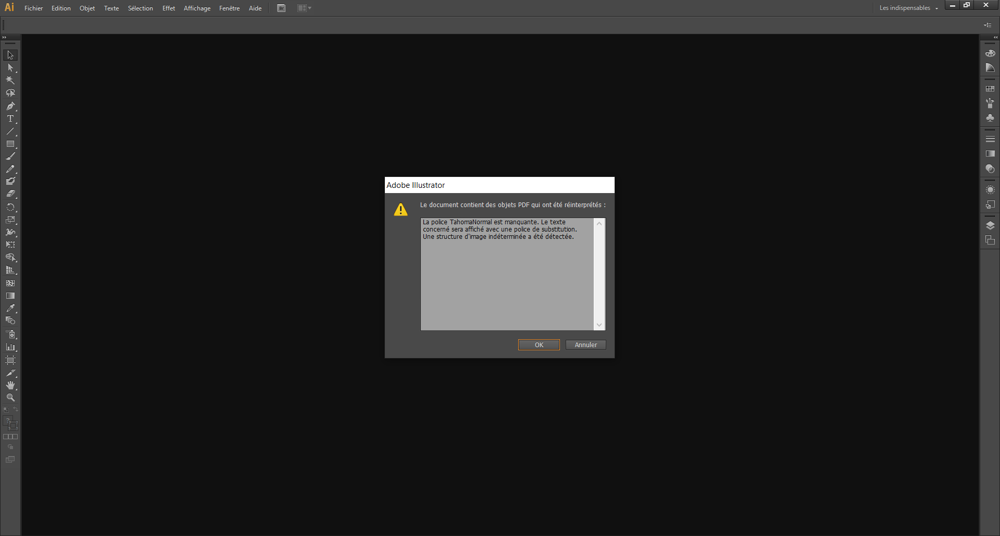
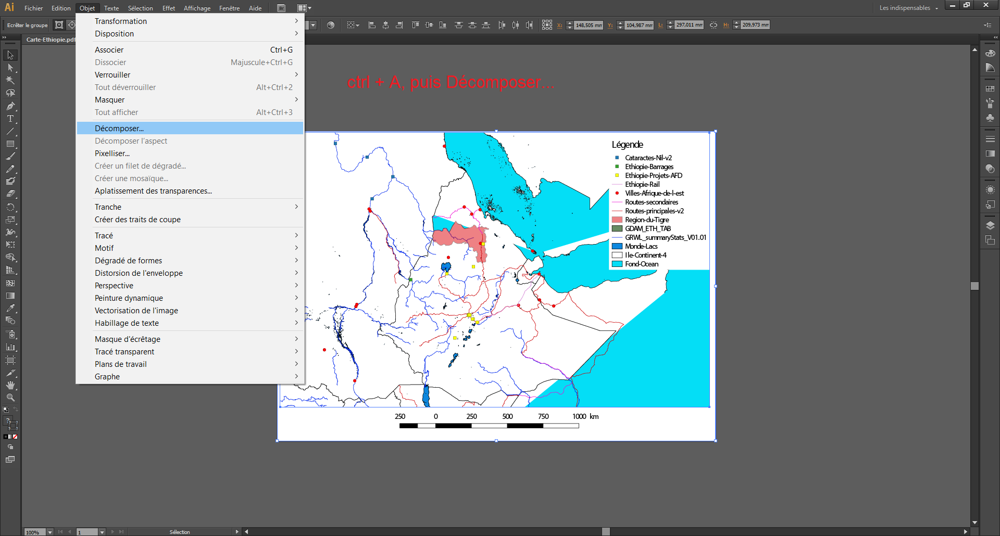
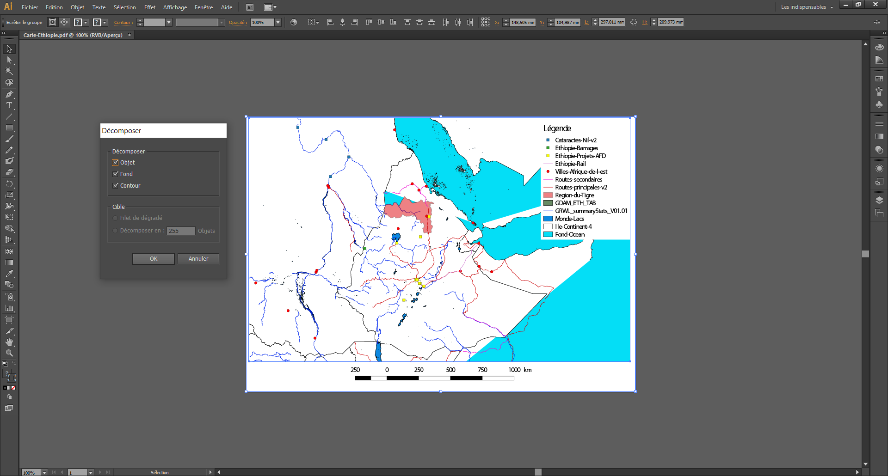
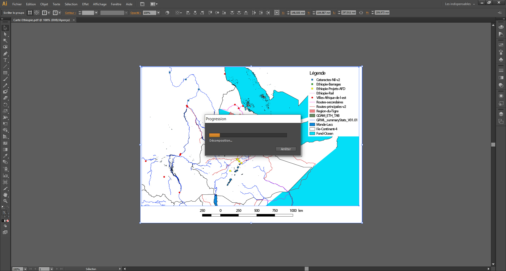
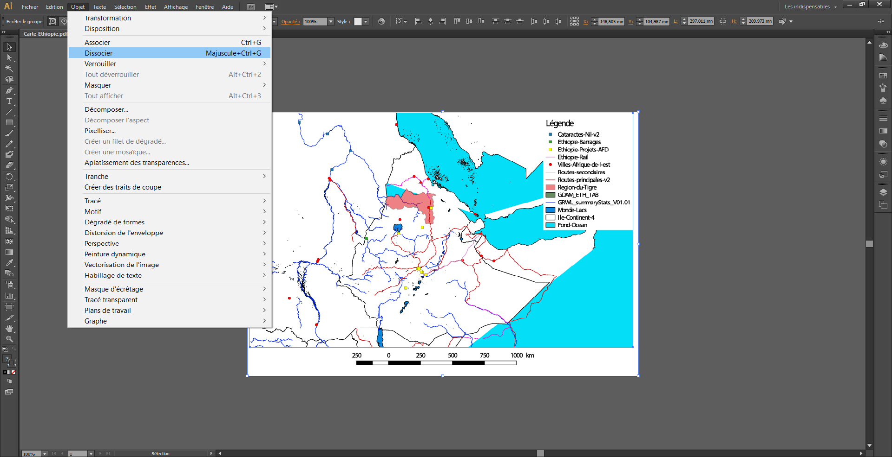

# La cartographie assistée par ordinateur (C.A.O.)

- T.D. La cartographie assistée par ordinateur (C.A.O.)

	- Manipulation sur `Q-GIS`

	- Manipulation sur `ArcGIS Online`

## Gérer les projections

Dans les S.I.G., les systèmes de projection sont codés. C'est l'E.P.S.G. qui s'en est chargé. Pour obtenir les codes, aller sur le site : [https://epsg.io](https://epsg.io).

Les codes les plus utilisés en France et en Europe sont :
- WGS84 : EPSG:4326 (international)
- ED50 : EPSG:4230 (Europe)
- EuroLambert : EPSG:2192 (Europe)
- Lambert 93 : IGNF:LAMB93, EPSG:2156 (version 1), EPSG:9793 (version 2) et EPSG:9794 (version 2b) (France, officiel)
- Lambert I : IGNF:LAMB1 (France, nord)
- Lambert I Carto : IGNF:LAMB1C (France, nord)
- Lambert II : IGNF:LAMB2 (France, centre)
- Lambert II Carto : IGNF:LAMB2C (France, centre)
- Lambert III : IGNF:LAMB3 (France, sud)
- Lambert III Carto : IGNF:LAMB3C (France, sud)
- Lambert IV : IGNF:LAMB4 (France, Corse)
- Lambert IV Carto : IGNF:LAMB4C (France, Corse)
- Lambert II étendu : IGNF:LAMBE (France, compatible avec le système européen)
- RGF93 / CC42 : EPSG:3942 (France, cadastre entre 41°N et 43°N)
- RGF93 / CC43 : EPSG:3943 (France, cadastre entre 42°N et 44°N)
- RGF93 / CC44 : EPSG:3944 (France, cadastre entre 43°N et 45°N)
- RGF93 / CC45 : EPSG:3945 (France, cadastre entre 44°N et 46°N)
- RGF93 / CC46 : EPSG:3946 (France, cadastre entre 45°N et 47°N)
- RGF93 / CC47 : EPSG:3947 (France, cadastre entre 46°N et 48°N)
- RGF93 / CC48 : EPSG:3948 (France, cadastre entre 47°N et 49°N)
- RGF93 / CC49 : EPSG:3949 (France, cadastre entre 48°N et 50°N)
- RGF93 / CC50 : EPSG:3950 (France, cadastre entre 49°N et 51°N)
- *etc*.

La projection figure dans les métadonnées des données que vous avez téléchargées.

> [!TIP]
> Préférez utiliser le **degré décimal** aux degrés, minutes, secondes (D.M.S.) ou aux données métriques (coordonnées du système de projection). En effet, on ne peut bien manipuler les données qu'en degré décimal.

## Exporter une carte composée de plusieurs couches avec :

Officiellement, les S.I.G. ne sont pas des C.A.O. Il existe des logiciels spécifiques pour les pratiquer :
- `Philocarto` ;
- `ScapeToad` ;
- *etc*.

Il faut souvent corriger le dessin sur un D.A.O. comme :
- `Illustrator` ;
- `Inkscape` (gratuit) ;
- *etc*.

### `Q-GIS`

`Q-GIS` offre deux possibilités pour sortir la carte dessinée par les couches :
1. Menu `Projet`, puis `Exporter comme image...` ;
2. Menu `Projet`, puis `Nouveau Compositeur d'impression`.
3. Menu `Projet`, puis `Exporter DXF` (solution non recommandée)

La première solution est inadaptée, car l'image produite n'a pas d'échelle cartographique, pas de légendes, *etc*. Elle est en format raster, donc inexploitable dans un logiciel de D.A.O.

La deuxième solution est complexe, mais elle permet d'obtenir un image vectorielle en `*.pdf` directement exploitable dans un logiciel de D.A.O.

0. Ordonner les couches et réaliser les outils de D.A.O. de `Q-GIS`

1. Menu `Projet`, puis `Nouveau Compositeur d'impression`

2. Fenêtre `Titre du composeur`

3. Fenêtre `Nom du composeur`

- `Ajouter une nouvelle carte` (onglet à gauche), puis dans la zone blanche étirée votre carte à l'endroit désiré

- `Ajouter une nouvelle étiquette` (onglet à gauche), puis dans la zone blanche étirée votre carte à l'endroit désiré

- `Ajouter une nouvelle légende` (onglet à gauche), puis dans la zone blanche étirée votre carte à l'endroit désiré

- `Ajouter une échelle graphique` (onglet à gauche), puis dans la zone blanche étirée votre carte à l'endroit désiré

- `Ajouter une flèche` (onglet à gauche), puis dans la zone blanche étirée votre carte à l'endroit désiré

- *etc*.

> [!TIP]
> Si vous fermez votre composeur, il faudra l'ouvrer avec menu `Projet`, puis `Gestionnaire de composeurs`

- Dans l'onglet de droite, vous réglez le format de votre « impression ».
	- Choisir une taille minimale A3 pour votre feuille
	- Faire attention à la résolution de l'export (supérieure à 300 dpi)

- Dans l'onglet du haut, il y a plein d'options dont `Exporter en PDF`. Une fois votre fichier exporté en P.D.F., vous pourrez le lire sur `Illustrator`, ou un autre logiciel de D.A.O. afin de rendre la carte conforme à la sémiologie graphique, notamment en plaçant l'orientation sur votre carte.

Si on exporte les données en P.D.F., on récupère les données en cinq étapes.

1. Ouvrir le fichier P.D.F., une modification des polices sera peut-être à approuver

2. Tout sélectionner avec `ctrl` + `a`, puis décomposer votre image

3. Tout sélectionner, puis dissocier les objets de votre image

> [!WARNING]
> Le fichier P.D.F. étant une image vectorielle, vous pouvez normalement la lire sous `Illustrator` ou tout autre logiciel de D.A.O. Néanmoins, la récupération des données peut être rendue difficile par la conversion des formats. Il existe d'autres possibilités pour sortir la carte :
> - imprimer en P.D.F. (Menu `Composeur`, puis `Imprimer...`) ;
> - exporter en S.V.G. ;
> - exporter en image. Cette solution sera votre dernier recours si toutes les autres manipulations ont échouée.

> [!TIP]
> Peu importe la méthode de récupération, il faudra retravailler la sortie `Q-GIS` pour obtenir une **carte**.
> - Travailler la légende (supprimer ou ajouter des éléments)
> - Ajouter l'orientation (le nord généralement)
> - *etc*.

### `ArcGIS Online`

[Tutoriel officiel `ArcGIS`](https://learn.arcgis.com/fr/projects/export-a-map/)
